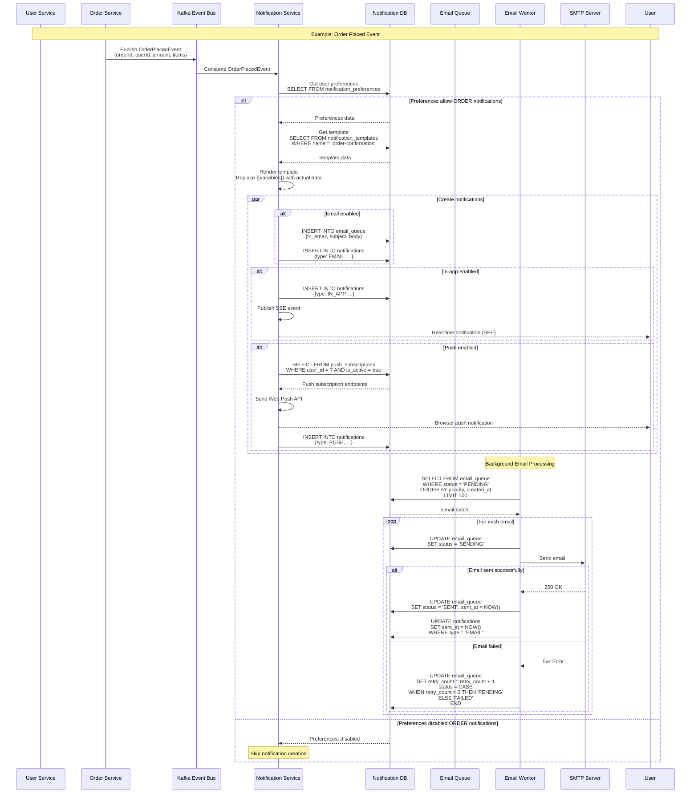
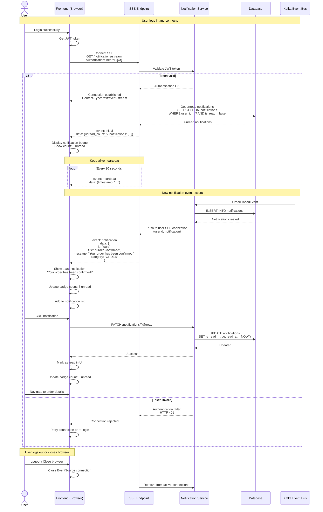
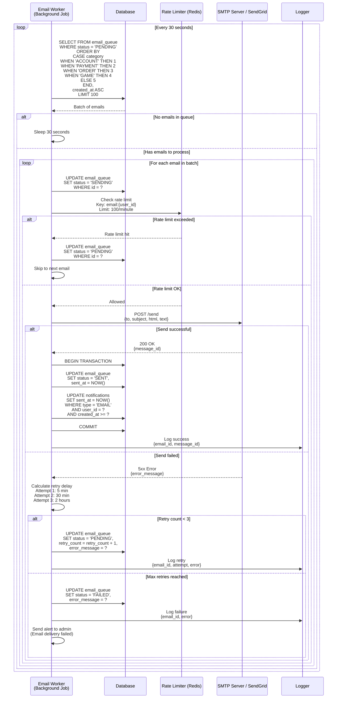
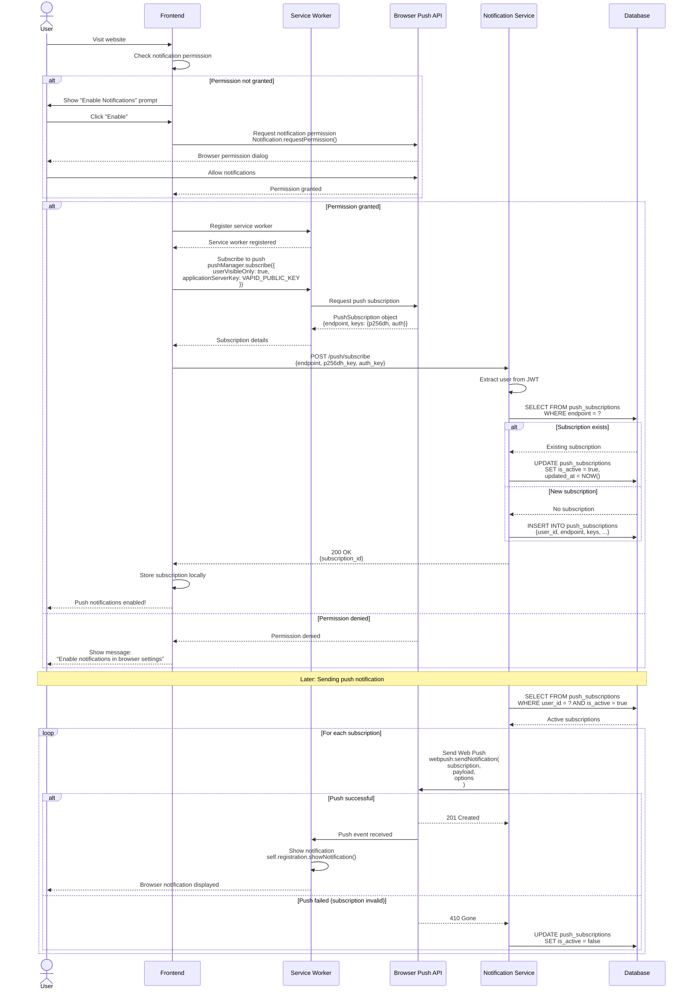
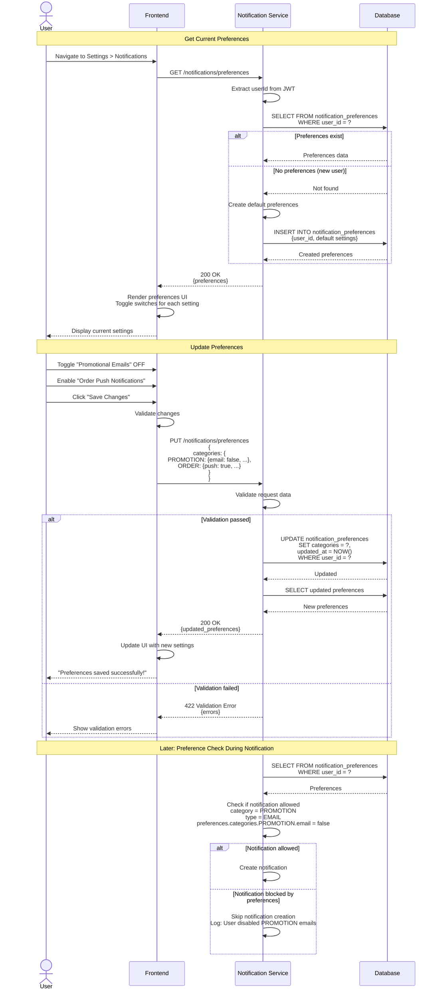
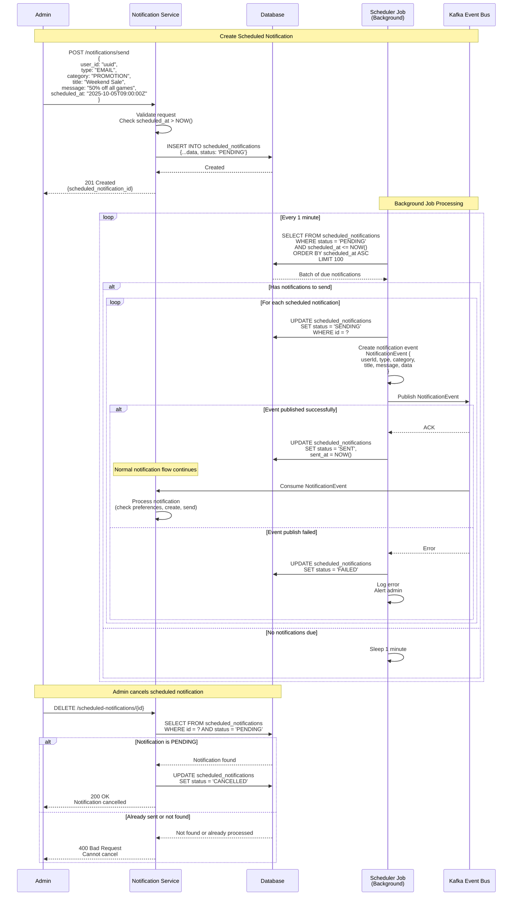

# Notification Service Flows

## 📋 Tổng quan

Tài liệu này mô tả các flow hoạt động chính của Notification Service, bao gồm event-driven notification creation, email processing, push notifications, và preference management.

**Real-time Technology**: Sử dụng **SSE (Server-Sent Events)** thay vì WebSocket vì:

-   ✅ One-way communication đủ cho notifications (server → client)
-   ✅ Tự động reconnect khi mất kết nối
-   ✅ Đơn giản hơn, ít overhead hơn
-   ✅ Firewall friendly (HTTP standard)
-   ✅ Hoạt động tốt với HTTP/2

---

## 📧 1. Event-Driven Notification Flow

### Mô tả

Flow tự động tạo notifications dựa trên events từ các services khác thông qua Kafka.

### Sequence Diagram



### Steps

1. **Event Publishing**

    - Service khác (Order, Payment, User, etc.) publish event lên Kafka
    - Event chứa tất cả data cần thiết cho notification

2. **Event Consumption**

    - Notification Service consume event từ Kafka
    - Parse event data

3. **Preference Check**

    - Load user notification preferences
    - Check nếu user cho phép notification type và category này
    - SYSTEM và ACCOUNT security notifications bypass preferences

4. **Template Rendering**

    - Load notification template từ database
    - Replace template variables với actual event data
    - Generate subject và body

5. **Multi-Channel Notification Creation**

    - **Email**: Add to email_queue cho async processing
    - **In-App**: Create notification record, send SSE event
    - **Push**: Send browser push notification
    - Track trong notifications table

6. **Email Queue Processing** (Background Job)
    - Worker process email queue với priority
    - Retry logic cho failed emails
    - Update status và timestamps

### Event Types & Corresponding Notifications

| Event                | Category | Template           | Channels            |
| -------------------- | -------- | ------------------ | ------------------- |
| UserCreatedEvent     | ACCOUNT  | welcome-email      | EMAIL, IN_APP       |
| OrderPlacedEvent     | ORDER    | order-confirmation | EMAIL, IN_APP, PUSH |
| PaymentSuccessEvent  | PAYMENT  | payment-receipt    | EMAIL, IN_APP       |
| PaymentFailedEvent   | PAYMENT  | payment-failed     | EMAIL, IN_APP       |
| GamePurchasedEvent   | GAME     | game-purchase      | EMAIL, IN_APP       |
| OrderShippedEvent    | ORDER    | order-shipped      | EMAIL, IN_APP, PUSH |
| OrderDeliveredEvent  | ORDER    | order-delivered    | EMAIL, IN_APP       |
| PasswordChangedEvent | ACCOUNT  | password-changed   | EMAIL               |
| LoginFromNewDevice   | ACCOUNT  | new-device-login   | EMAIL               |

---

## 🔔 2. Real-time In-App Notification Flow

### Mô tả

Flow hiển thị real-time notifications trong application UI qua **SSE (Server-Sent Events)**. SSE phù hợp hơn WebSocket vì:

-   Chỉ cần one-way communication (server → client)
-   Tự động reconnect khi mất connection
-   Đơn giản hơn, ít overhead hơn
-   Firewall friendly (sử dụng HTTP standard)

### Sequence Diagram



### Steps

1. **SSE Connection**

    - Frontend tạo EventSource connection sau khi login
    - Send JWT token trong Authorization header
    - Server validate token và establish SSE stream

2. **Initial Sync**

    - Load unread notifications từ database
    - Send initial event với unread count và notifications
    - Display notification badge và list

3. **Keep-Alive Heartbeat**

    - Server gửi heartbeat event mỗi 30 giây
    - Maintain connection và detect disconnection
    - Browser tự động reconnect nếu connection lost

4. **Real-time Push**

    - Khi notification mới được tạo, push qua SSE
    - Client receive event và display toast
    - Update UI (badge count, notification list)

5. **Mark as Read**

    - User click notification
    - Send PATCH request để mark as read
    - Update UI optimistically

6. **Connection Management**
    - Browser tự động reconnect khi disconnect
    - Resume from last known state
    - Close connection on logout

### SSE Event Types

```javascript
// Frontend EventSource implementation
const eventSource = new EventSource("/v1/notifications/stream", {
    headers: {
        Authorization: `Bearer ${token}`,
    },
});

// Initial data event
eventSource.addEventListener("initial", (e) => {
    const data = JSON.parse(e.data);
    updateBadgeCount(data.unread_count);
    displayNotifications(data.notifications);
});

// New notification event
eventSource.addEventListener("notification", (e) => {
    const notification = JSON.parse(e.data);
    showToast(notification);
    updateBadgeCount();
    addToNotificationList(notification);
});

// Heartbeat event (keep connection alive)
eventSource.addEventListener("heartbeat", (e) => {
    console.log("Connection alive:", e.data);
});

// Error handling (auto-reconnect by browser)
eventSource.onerror = (error) => {
    console.error("SSE Error:", error);
    // Browser will automatically reconnect
};
```

### Backend SSE Response Format

```
Content-Type: text/event-stream
Cache-Control: no-cache
Connection: keep-alive

event: initial
data: {"unread_count": 5, "notifications": [...]}

event: heartbeat
data: {"timestamp": "2025-10-03T12:00:00Z"}

event: notification
data: {"id": "uuid", "title": "Order Confirmed", "message": "...", "category": "ORDER"}

event: notification
data: {"id": "uuid2", "title": "Payment Successful", "message": "...", "category": "PAYMENT"}
```

---

## 📩 3. Email Queue Processing Flow

### Mô tả

Background worker process email queue với retry logic và priority.

### Sequence Diagram



### Steps

1. **Batch Processing**

    - Worker chạy mỗi 30 giây
    - Query 100 emails PENDING với priority ordering
    - ACCOUNT > PAYMENT > ORDER > GAME > PROMOTION

2. **Rate Limiting**

    - Check rate limit per user (100 emails/minute)
    - System-wide limit (10,000 emails/minute)
    - Skip email nếu limit exceeded, retry sau

3. **Email Sending**

    - Send qua SMTP server hoặc service (SendGrid, SES)
    - Update status sang SENDING để prevent duplicate
    - Log message_id từ provider

4. **Retry Logic**

    - Failed emails retry with exponential backoff:
        - Attempt 1: 5 minutes
        - Attempt 2: 30 minutes
        - Attempt 3: 2 hours
    - Mark as FAILED sau 3 attempts
    - Alert admin cho failed emails

5. **Success Handling**
    - Update email_queue status to SENT
    - Update notifications table với sent_at timestamp
    - Log for monitoring

---

## 🔔 4. Push Notification Subscription Flow

### Mô tả

Flow đăng ký browser push notifications sử dụng Web Push API.

### Sequence Diagram



### Steps

1. **Permission Request**

    - Check current permission status
    - Request permission nếu chưa có
    - Handle user choice (granted/denied)

2. **Service Worker Registration**

    - Register service worker để handle push events
    - Service worker runs in background

3. **Push Subscription**

    - Use Push API để create subscription
    - Get endpoint và encryption keys từ browser
    - VAPID keys cho authentication

4. **Save Subscription**

    - Send subscription details lên server
    - Store trong database
    - Associate với user account

5. **Send Push Notification**

    - Get active subscriptions từ database
    - Use Web Push library để send
    - Handle expired subscriptions (410 Gone)

6. **Display Notification**
    - Service worker receive push event
    - Show notification với title, body, icon, actions
    - Handle notification click events

---

## ⚙️ 5. Notification Preferences Management Flow

### Mô tả

Flow quản lý notification preferences của user.

### Sequence Diagram



### Steps

1. **Load Preferences**

    - Get preferences từ database
    - Create default preferences nếu user mới
    - Display trong settings UI

2. **Update Preferences**

    - User toggle settings trong UI
    - Validate changes client-side
    - Send PUT request với updated preferences

3. **Save Changes**

    - Validate data server-side
    - Update database
    - Return updated preferences

4. **Apply Preferences**
    - Check preferences trước khi create notification
    - Skip nếu user disabled notification type/category
    - Log skipped notifications for analytics

### Default Preferences

```json
{
    "email_enabled": true,
    "in_app_enabled": true,
    "push_enabled": false,
    "categories": {
        "ORDER": {
            "email": true,
            "in_app": true,
            "push": false
        },
        "PAYMENT": {
            "email": true,
            "in_app": true,
            "push": false
        },
        "GAME": {
            "email": true,
            "in_app": true,
            "push": false
        },
        "ACCOUNT": {
            "email": true,
            "in_app": true,
            "push": false
        },
        "PROMOTION": {
            "email": false,
            "in_app": true,
            "push": false
        },
        "SYSTEM": {
            "email": true,
            "in_app": true,
            "push": false
        }
    }
}
```

---

## 📅 6. Scheduled Notification Flow

### Mô tả

Flow gửi notifications được schedule trước (gửi sau).

### Sequence Diagram



### Steps

1. **Create Scheduled Notification**

    - Admin/System create notification với `scheduled_at` trong tương lai
    - Validate scheduled time
    - Store trong `scheduled_notifications` table với status PENDING

2. **Background Scheduler**

    - Job chạy mỗi 1 phút
    - Query notifications có scheduled_at <= NOW()
    - Process batch of 100 notifications

3. **Send Scheduled Notification**

    - Update status to SENDING
    - Publish event lên Kafka
    - Normal notification flow tiếp tục từ event

4. **Handle Results**

    - Success: Update status to SENT
    - Failed: Update status to FAILED, alert admin

5. **Cancellation**
    - Admin có thể cancel PENDING notifications
    - Cannot cancel đã SENT hoặc SENDING

### Use Cases

-   **Marketing campaigns**: Schedule promotional emails
-   **Event reminders**: Remind users về upcoming events
-   **Subscription renewals**: Notify trước khi subscription expires
-   **Maintenance notifications**: Schedule system maintenance alerts

---

## 📚 Related Documentation

-   [[notification-service-api]] - Notification Service API specification
-   [[notification-db]] - Notification Service database schema
-   [[event-driven-design]] - Event-driven architecture design
-   [[kafka-topics]] - Kafka topics và event schemas
-   [[api-standards]] - API design standards

---

**Version**: 1.0.0  
**Last Updated**: 2025-10-03  
**Maintained by**: Backend Team
