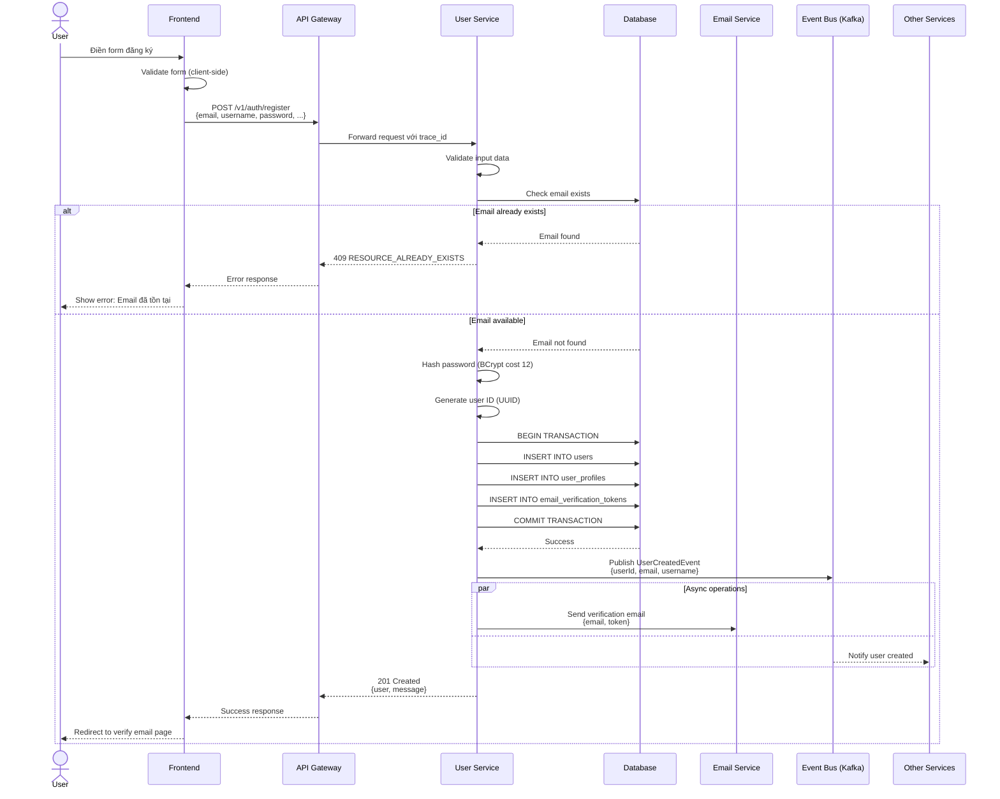
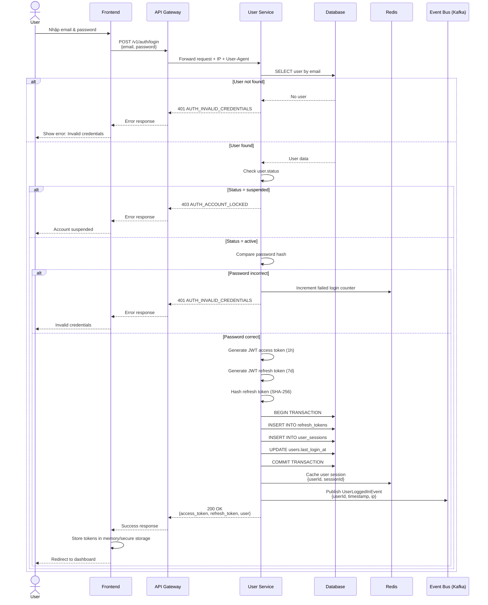
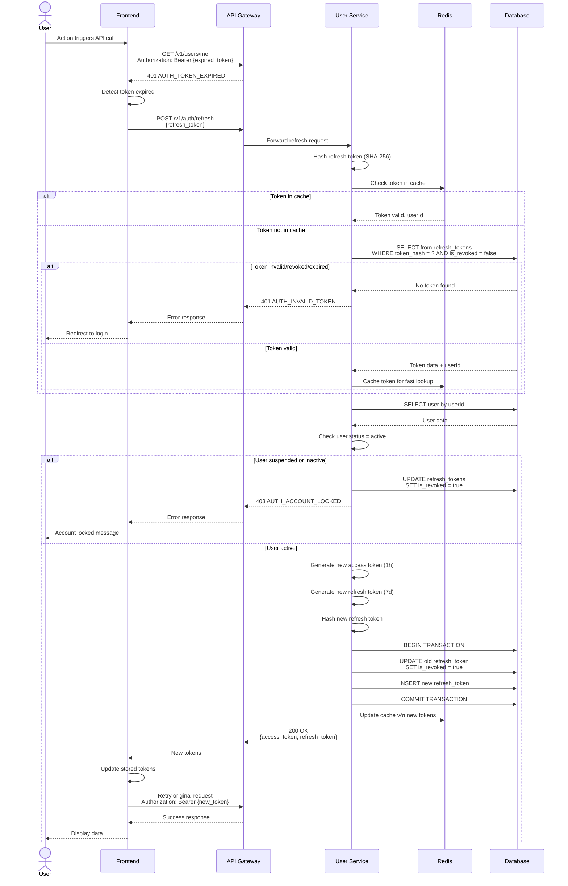
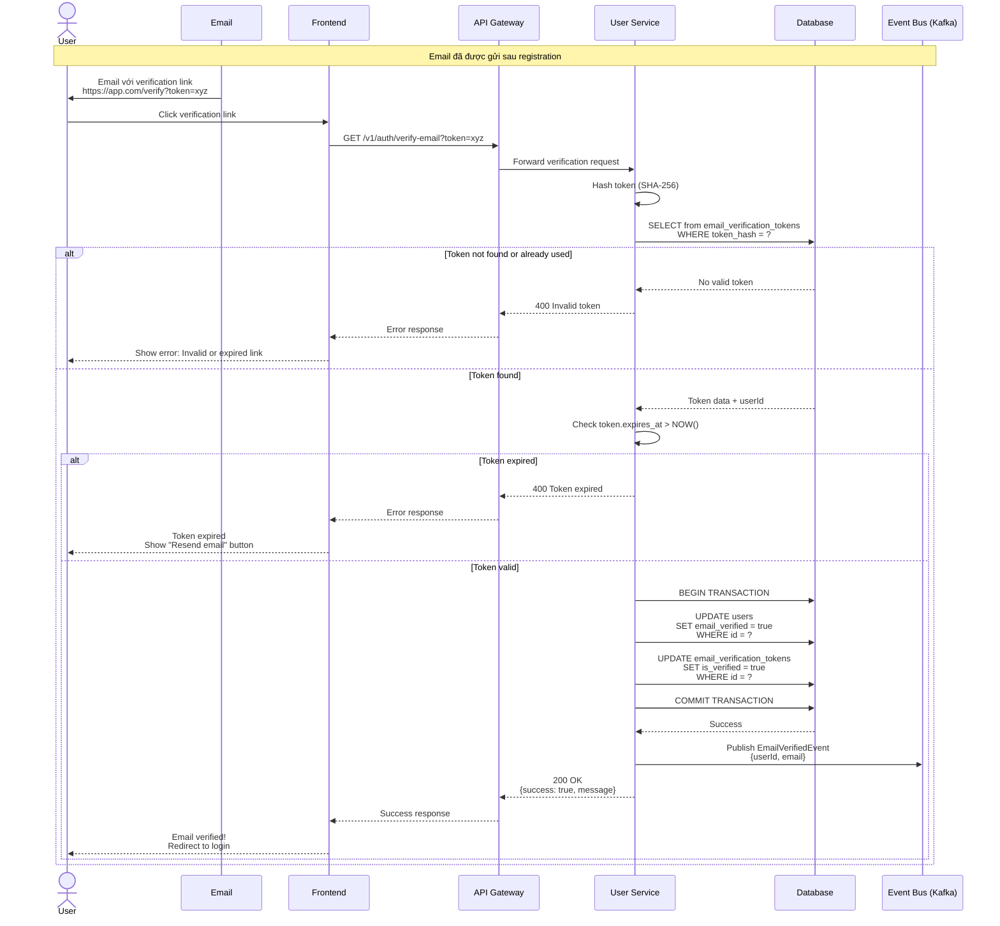
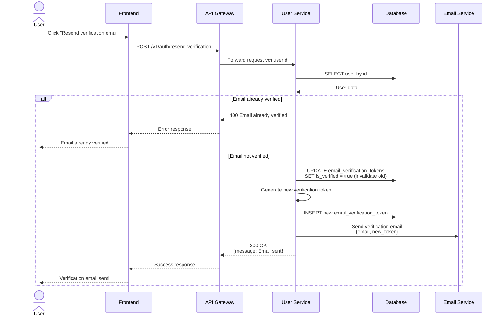
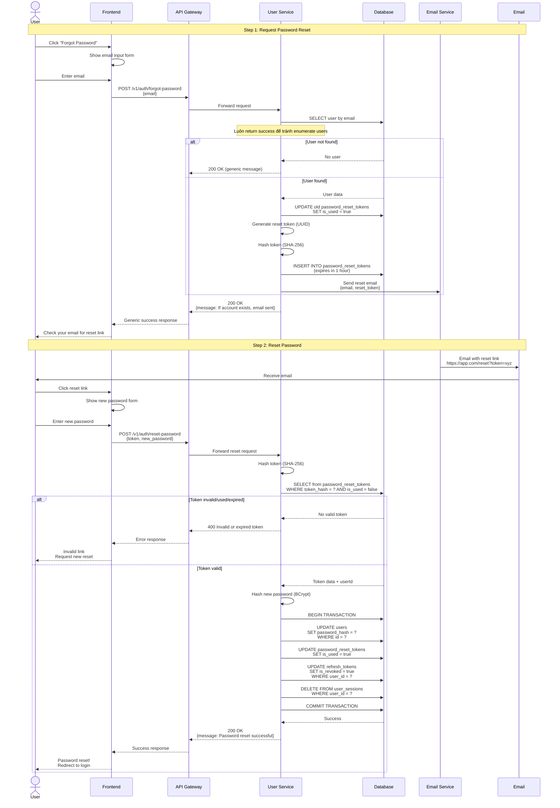
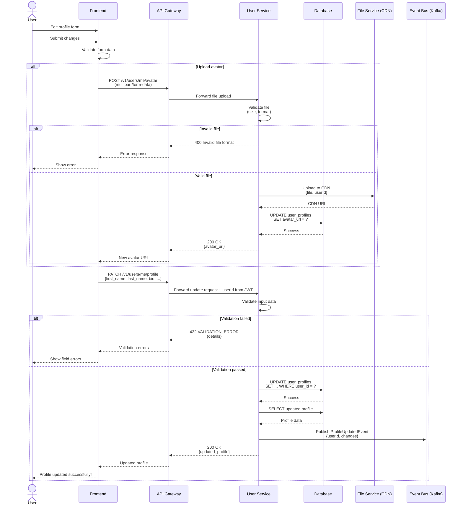
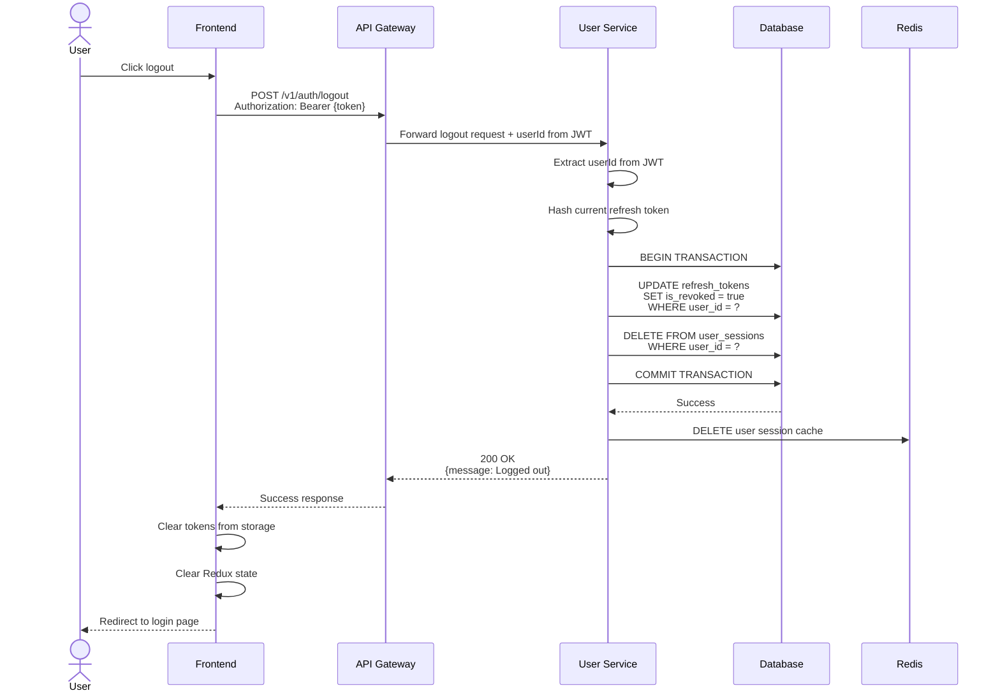
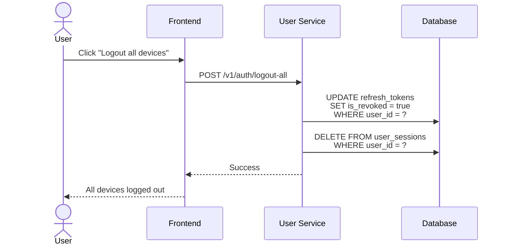

# User Service Flows

## 📋 Tổng quan

Tài liệu này mô tả các flow hoạt động chính của User Service, bao gồm authentication, registration, và các user operations quan trọng.

---

## 🔐 1. User Registration Flow

### Mô tả

Flow đăng ký tài khoản mới cho người dùng.

### Sequence Diagram

### Steps

1. **Client-side Validation**

    - Frontend validate form fields
    - Check password strength
    - Validate email format

2. **Server-side Validation**

    - Validate all required fields
    - Check email uniqueness
    - Check username uniqueness
    - Validate password complexity

3. **User Creation**

    - Hash password với BCrypt (cost factor 12)
    - Generate UUID cho user ID
    - Create transaction để đảm bảo consistency
    - Insert vào `users` table
    - Insert vào `user_profiles` table
    - Generate email verification token

4. **Post-Registration**
    - Publish `UserCreatedEvent` lên Kafka
    - Send verification email (async)
    - Other services listen event và react (analytics, welcome email, etc.)

### Error Scenarios

| Scenario               | HTTP Status | Error Code                | Action                          |
| ---------------------- | ----------- | ------------------------- | ------------------------------- |
| Email exists           | 409         | RESOURCE_ALREADY_EXISTS   | Show error, suggest login       |
| Username exists        | 409         | RESOURCE_ALREADY_EXISTS   | Show error, suggest another     |
| Invalid email format   | 422         | VALIDATION_INVALID_FORMAT | Show validation error           |
| Password too short     | 422         | VALIDATION_MIN_LENGTH     | Show password requirements      |
| Database error         | 500         | SERVER_DATABASE_ERROR     | Show generic error, log details |

---

## 🔓 2. User Login Flow

### Mô tả

Flow authentication cho user đã có tài khoản.

### Sequence Diagram

### Steps

1. **Credential Validation**

    - Get user by email
    - Check user exists
    - Verify account status (active/suspended)
    - Compare password hash

2. **Token Generation**

    - Generate JWT access token (expires 1 hour)
    - Generate JWT refresh token (expires 7 days)
    - Hash refresh token before storing (SHA-256)

3. **Session Management**

    - Store refresh token in database
    - Create user session record
    - Cache session in Redis for fast lookup
    - Update last_login_at timestamp

4. **Event Publishing**
    - Publish `UserLoggedInEvent` to Kafka
    - Analytics service track login patterns
    - Security service monitor suspicious logins

### Error Scenarios

| Scenario                | HTTP Status | Error Code                 | Action                    |
| ----------------------- | ----------- | -------------------------- | ------------------------- |
| User not found          | 401         | AUTH_INVALID_CREDENTIALS   | Show generic error        |
| Wrong password          | 401         | AUTH_INVALID_CREDENTIALS   | Show generic error        |
| Account suspended       | 403         | AUTH_ACCOUNT_LOCKED        | Contact support message   |
| Email not verified      | 403         | AUTH_EMAIL_NOT_VERIFIED    | Resend verification link  |
| Too many failed attempts| 429         | RATE_LIMIT_EXCEEDED        | Wait X minutes            |

---

## 🔄 3. Token Refresh Flow

### Mô tả

Flow refresh access token khi token cũ hết hạn.

### Sequence Diagram

### Steps

1. **Token Validation**

    - Hash refresh token
    - Check in Redis cache first (performance)
    - Validate token not expired và not revoked
    - Check user still active

2. **Token Rotation**

    - Generate new access token
    - Generate new refresh token
    - Revoke old refresh token
    - Store new refresh token

3. **Cache Update**
    - Update Redis cache với new tokens
    - Remove old token from cache

### Security Notes

-   **Token Rotation**: Mỗi lần refresh tạo token mới và revoke token cũ
-   **Revoked Token Check**: Prevent replay attacks
-   **User Status Check**: Ensure user vẫn active
-   **Single Use**: Refresh token chỉ dùng 1 lần

---

## 📧 4. Email Verification Flow

### Mô tả

Flow xác thực email sau khi đăng ký.

### Sequence Diagram

### Steps

1. **Token Validation**

    - Hash token từ URL
    - Lookup trong database
    - Check token chưa used
    - Check token chưa expired (24h)

2. **Email Verification**

    - Update `users.email_verified = true`
    - Mark token as used
    - Transaction để ensure consistency

3. **Event Publishing**
    - Publish `EmailVerifiedEvent`
    - Other services có thể react (welcome bonus, etc.)

### Resend Verification Email Flow

---

## 🔑 5. Password Reset Flow

### Mô tả

Flow reset password khi user quên mật khẩu.

### Sequence Diagram

### Steps

#### Step 1: Request Reset

1. User nhập email
2. Generate reset token (UUID)
3. Hash token và store trong database (expires 1h)
4. Send email với reset link
5. Return generic success message (security: tránh enumerate users)

#### Step 2: Reset Password

1. User click link từ email
2. Validate reset token
3. Check token not expired và not used
4. Hash new password
5. Update password trong database
6. Mark token as used
7. **Security**: Revoke tất cả refresh tokens và sessions
8. User phải login lại

### Security Considerations

-   Token hashed trước khi store
-   Token single-use (is_used flag)
-   Token expires sau 1 giờ
-   Invalidate old tokens khi request mới
-   Generic response để prevent user enumeration
-   Revoke all sessions sau password reset

---

## 👤 6. Update Profile Flow

### Mô tả

Flow cập nhật thông tin profile của user.

### Sequence Diagram

### Steps

1. **File Upload (if avatar changed)**

    - Validate file format (JPEG/PNG)
    - Validate file size (max 5MB)
    - Upload to CDN/S3
    - Get CDN URL
    - Update avatar_url trong database

2. **Profile Update**

    - Validate input fields
    - Check user ownership (JWT userId)
    - Update user_profiles table
    - Publish ProfileUpdatedEvent

3. **Event Publishing**
    - Other services có thể sync profile data nếu cần

---

## 🚪 7. Logout Flow

### Mô tả

Flow logout và invalidate user session.

### Sequence Diagram

### Steps

1. **Session Invalidation**

    - Extract userId từ JWT
    - Revoke tất cả refresh tokens của user
    - Delete tất cả user sessions
    - Clear Redis cache

2. **Client Cleanup**
    - Clear tokens từ local storage/memory
    - Clear application state
    - Redirect về login page

### Logout All Devices

User có thể logout tất cả devices khác:

---

## 📚 Related Documentation

-   [[user-service-api]] - User Service API specification
-   [[user-service-db]] - User Service database schema
-   [[api-standards]] - API design standards
-   [[error-handling]] - Error handling standards
-   [[authentication-design]] - JWT authentication design

---

**Version**: 1.0.0  
**Last Updated**: 2025-10-03  
**Maintained by**: Backend Team
