# Database Architecture Diagrams

Visual representations của database architecture và relationships trong E-Commerce platform.

## 🏗️ Overall Database Architecture

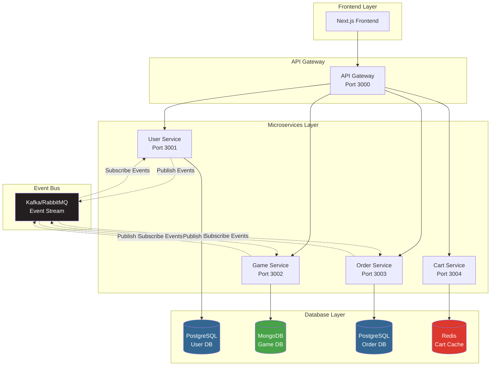

## 📊 Game Service - MongoDB Schema

### Collection Structure

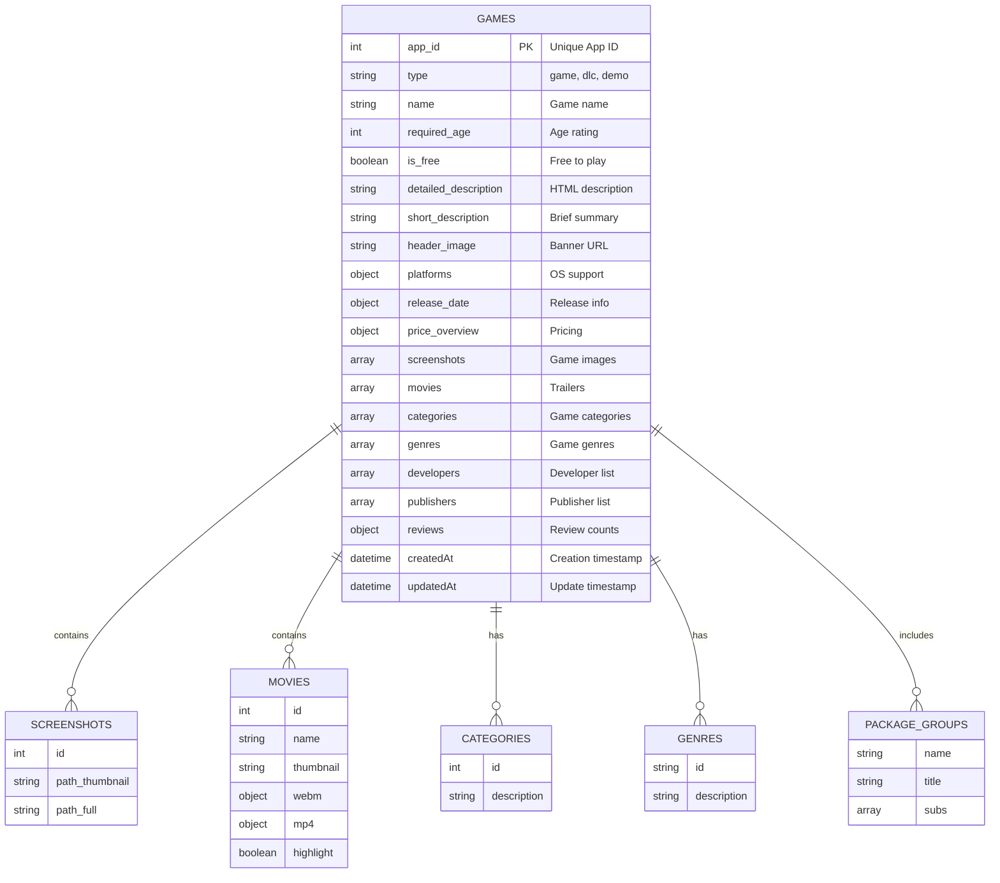

### Document Hierarchy

```mermaid
graph TD
    GAME[Game Document]
    
    GAME --> BASIC[Basic Info]
    GAME --> MEDIA[Media Assets]
    GAME --> META[Metadata]
    GAME --> PRICE[Pricing]
    GAME --> PLATFORM[Platform Support]
    GAME --> ENGAGE[User Engagement]

    BASIC --> B1[app_id]
    BASIC --> B2[type]
    BASIC --> B3[name]
    BASIC --> B4[required_age]
    BASIC --> B5[is_free]

    MEDIA --> M1[screenshots<br/>Array 0-157]
    MEDIA --> M2[movies<br/>Array 0-50]
    MEDIA --> M3[header_image]
    MEDIA --> M4[background]

    META --> MT1[categories<br/>Array 1-29]
    META --> MT2[genres<br/>Array 1-10]
    META --> MT3[developers<br/>Array]
    META --> MT4[publishers<br/>Array]

    PRICE --> P1[price_overview<br/>Object]
    PRICE --> P2[package_groups<br/>Array]
    PRICE --> P3[packages<br/>Array]

    PLATFORM --> PF1[platforms<br/>Object]
    PLATFORM --> PF2[pc_requirements]
    PLATFORM --> PF3[mac_requirements]
    PLATFORM --> PF4[linux_requirements]

    ENGAGE --> E1[reviews<br/>Object]
    ENGAGE --> E2[achievements<br/>Object]

    style GAME fill:#47A248,color:#fff
    style BASIC fill:#4A90E2
    style MEDIA fill:#F5A623
    style META fill:#50E3C2
    style PRICE fill:#B8E986
    style PLATFORM fill:#BD10E0
    style ENGAGE fill:#FF6B6B
```

## 🔄 Event-Driven Data Flow

### Game Price Update Flow

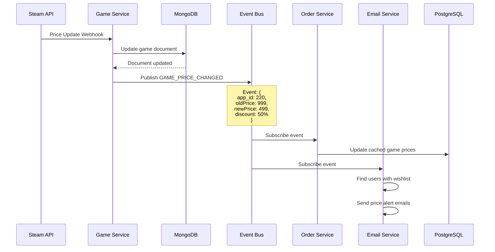

### Order Creation Flow

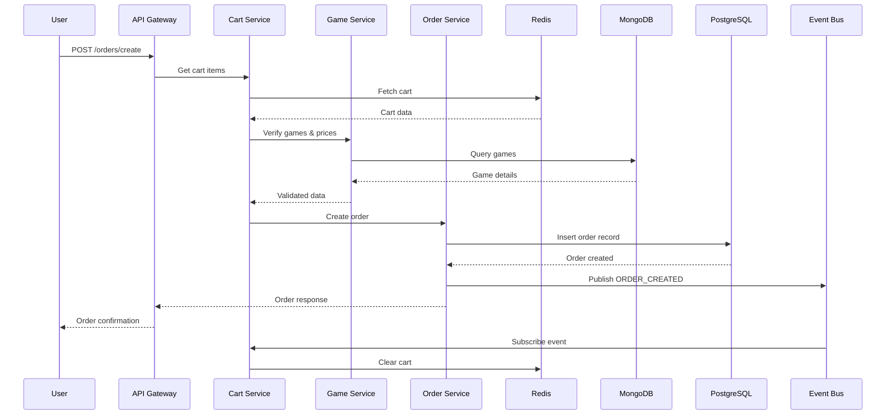

## 📈 Data Growth & Scaling

### Collection Size Projection

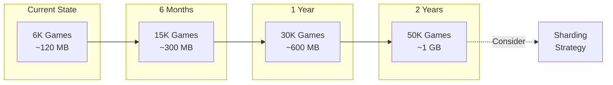

### Scaling Strategy

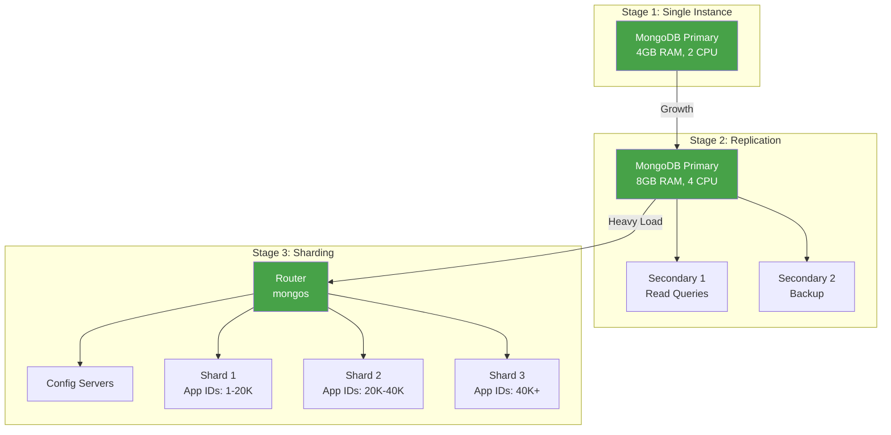

## 🔍 Index Strategy

### Game Service Indexes

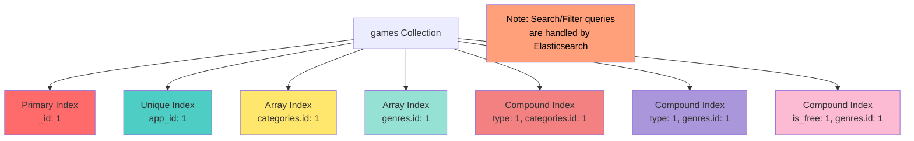

### Query Performance

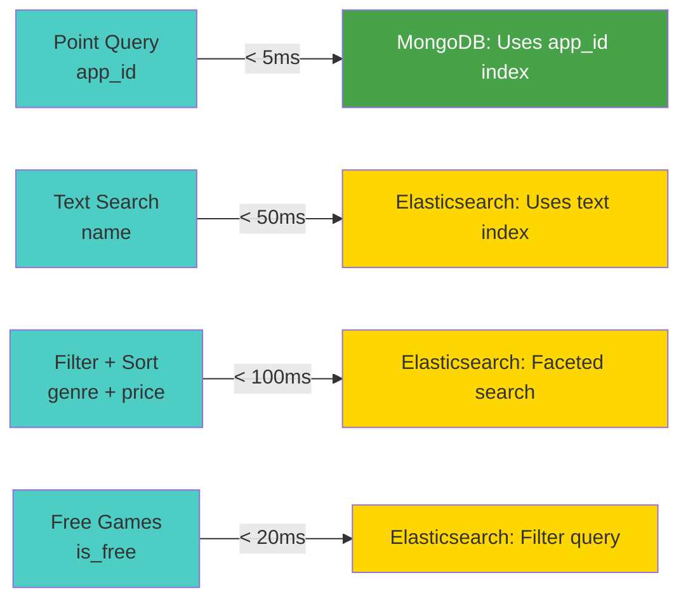

## 🔐 Security Architecture

### Database Access Control

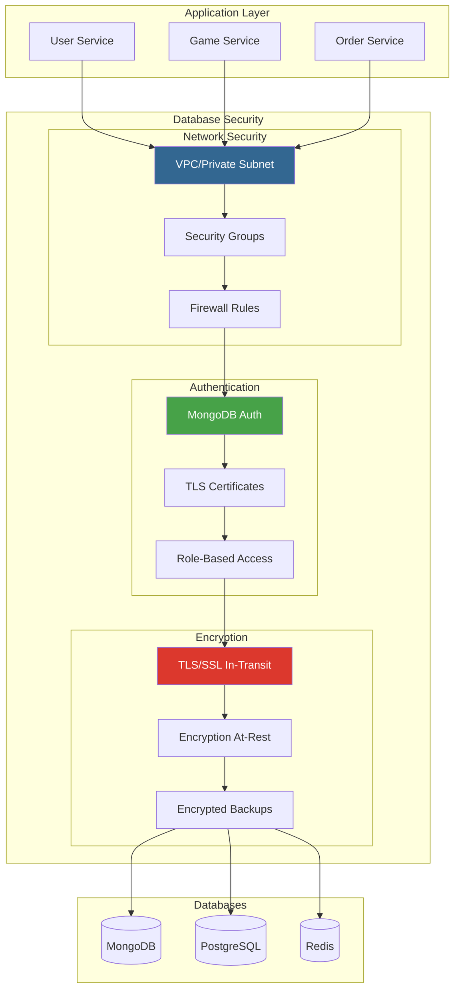

## 📊 Monitoring Dashboard Layout

### Key Metrics Overview

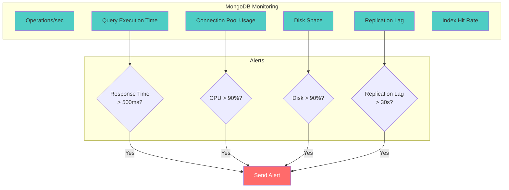

## 🔄 Backup & Recovery Strategy

### Backup Architecture

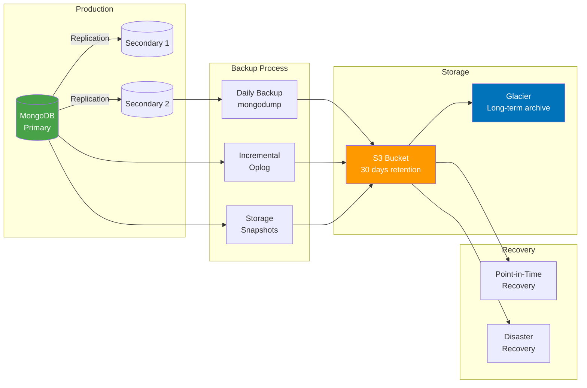

## 📈 Data Flow Diagram

### Complete User Journey

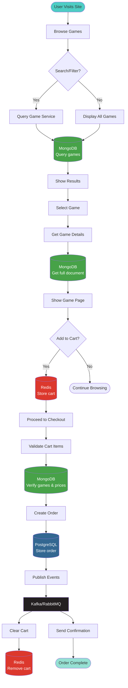

---

**Last Updated**: October 12, 2025  
**Version**: 1.0.0  
**Maintained by**: Backend Development Team
