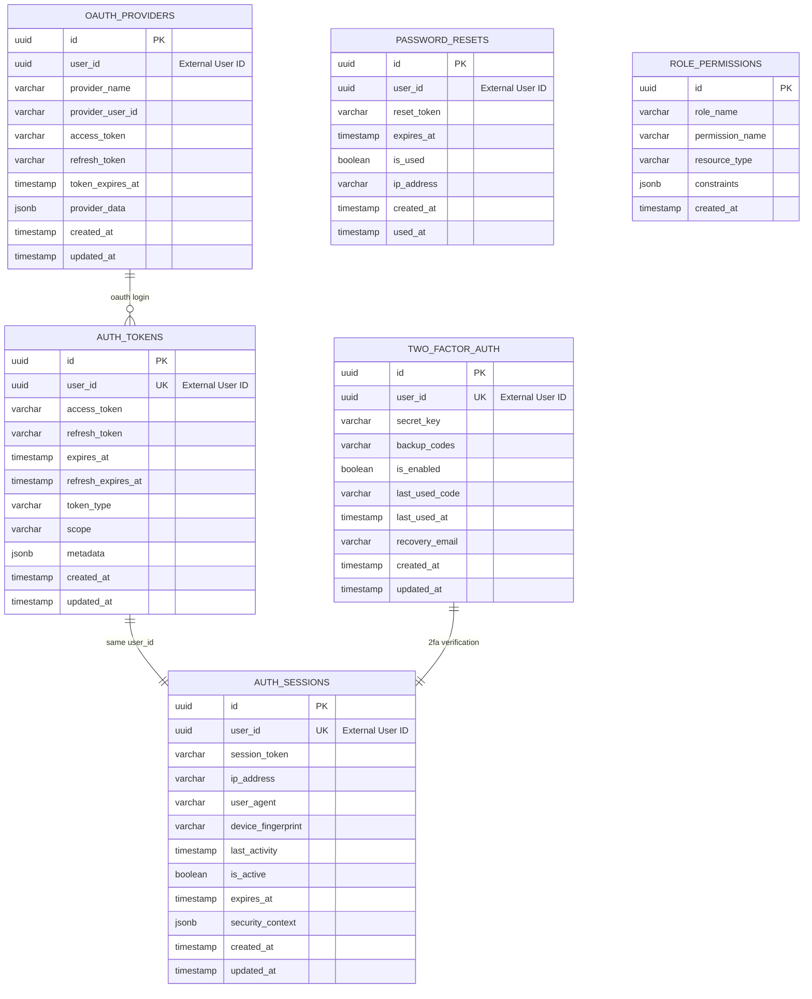

# Auth Service Database Schema

## 📋 Tổng quan

Authentication Service quản lý xác thực và phân quyền trong hệ thống My Digital Collection. **Không có foreign key references đến services khác** - sử dụng Event-Driven Architecture để communication.

Service này quản lý:

-   JWT token lifecycle và refresh tokens
-   OAuth2 integrations (Google, Steam, Discord)
-   Session management và security tracking
-   Two-factor authentication (2FA)
-   Password reset và account recovery
-   Role-based access control (RBAC)

## 🗃️ Database Information

| Property              | Value                |
| --------------------- | -------------------- |
| Database Name         | `auth_service_db`    |
| Schema Version        | 1.0.0                |
| Engine                | PostgreSQL 15.x      |
| Charset               | UTF8                 |
| Collation             | utf8_unicode_ci      |
| **Event Integration** | ✅ Kafka/RabbitMQ    |
| **Security Level**    | HIGH (Encryption)    |

## 📊 Entity Relationship Diagram



## 📋 Table Definitions

### 1. auth_tokens

Quản lý JWT access tokens và refresh tokens cho authentication.

| Column                | Type       | Constraints      | Description                    |
| --------------------- | ---------- | ---------------- | ------------------------------ |
| id                    | UUID       | PRIMARY KEY      | Unique identifier              |
| user_id               | UUID       | NOT NULL, INDEX  | External User Service ID       |
| access_token          | VARCHAR    | NOT NULL, UNIQUE | JWT access token (hashed)      |
| refresh_token         | VARCHAR    | NOT NULL, UNIQUE | JWT refresh token (hashed)     |
| expires_at            | TIMESTAMP  | NOT NULL         | Access token expiration        |
| refresh_expires_at    | TIMESTAMP  | NOT NULL         | Refresh token expiration       |
| token_type            | VARCHAR(50)| DEFAULT 'Bearer' | Token type (Bearer, API, etc.) |
| scope                 | VARCHAR    | NULLABLE         | Token scope permissions        |
| metadata              | JSONB      | NULLABLE         | Additional token metadata      |
| created_at            | TIMESTAMP  | NOT NULL         | Thời gian tạo                  |
| updated_at            | TIMESTAMP  | NULLABLE         | Thời gian cập nhật             |

#### Token Metadata Schema

```json
{
    "client_info": {
        "user_agent": "Mozilla/5.0...",
        "ip_address": "192.168.1.1",
        "device_type": "desktop",
        "location": "Vietnam"
    },
    "token_flags": {
        "is_long_lived": false,
        "requires_2fa": true,
        "elevated_privileges": false
    },
    "application_context": {
        "source": "web_app",
        "version": "1.0.0"
    }
}
```

#### Business Rules

-   Access tokens expire trong 15 minutes, refresh tokens trong 30 days
-   Một user có thể có nhiều active tokens (multi-device support)
-   Tokens bị revoke khi user logout hoặc security breach detected
-   Token rotation: refresh token được replace khi sử dụng

### 2. auth_sessions

Quản lý user sessions và security tracking.

| Column             | Type         | Constraints      | Description                  |
| ------------------ | ------------ | ---------------- | ---------------------------- |
| id                 | UUID         | PRIMARY KEY      | Unique identifier            |
| user_id            | UUID         | NOT NULL, INDEX  | External User Service ID     |
| session_token      | VARCHAR      | NOT NULL, UNIQUE | Session identifier (hashed)  |
| ip_address         | INET         | NOT NULL         | Client IP address            |
| user_agent         | TEXT         | NULLABLE         | Client user agent string     |
| device_fingerprint | VARCHAR      | NULLABLE         | Device fingerprint hash      |
| last_activity      | TIMESTAMP    | NOT NULL         | Last session activity        |
| is_active          | BOOLEAN      | DEFAULT true     | Session status               |
| expires_at         | TIMESTAMP    | NOT NULL         | Session expiration           |
| security_context   | JSONB        | NULLABLE         | Security-related metadata    |
| created_at         | TIMESTAMP    | NOT NULL         | Thời gian tạo                |
| updated_at         | TIMESTAMP    | NULLABLE         | Thời gian cập nhật           |

#### Security Context Schema

```json
{
    "risk_score": 0.2,
    "location": {
        "country": "VN",
        "city": "Ho Chi Minh City",
        "timezone": "Asia/Ho_Chi_Minh"
    },
    "device_trust": {
        "is_trusted": true,
        "trust_score": 0.95,
        "registration_date": "2024-01-15T10:30:00Z"
    },
    "security_flags": {
        "suspicious_activity": false,
        "requires_verification": false,
        "blocked_regions": []
    }
}
```

#### Business Rules

-   Sessions expire after 24 hours of inactivity
-   Maximum 5 concurrent sessions per user
-   Suspicious activity triggers immediate session revocation
-   Device fingerprinting để detect login từ unknown devices

### 3. oauth_providers

Quản lý OAuth2 integrations với external providers.

| Column           | Type        | Constraints     | Description                             |
| ---------------- | ----------- | --------------- | --------------------------------------- |
| id               | UUID        | PRIMARY KEY     | Unique identifier                       |
| user_id          | UUID        | NOT NULL, INDEX | External User Service ID                |
| provider_name    | VARCHAR(50) | NOT NULL        | OAuth provider (google, steam, discord) |
| provider_user_id | VARCHAR     | NOT NULL        | User ID at OAuth provider               |
| access_token     | TEXT        | NULLABLE        | OAuth access token (encrypted)          |
| refresh_token    | TEXT        | NULLABLE        | OAuth refresh token (encrypted)         |
| token_expires_at | TIMESTAMP   | NULLABLE        | OAuth token expiration                  |
| provider_data    | JSONB       | NULLABLE        | Additional provider data                |
| created_at       | TIMESTAMP   | NOT NULL        | Thời gian tạo                           |
| updated_at       | TIMESTAMP   | NULLABLE        | Thời gian cập nhật                      |

#### Business Rules

-   Unique constraint trên (provider_name, provider_user_id)
-   OAuth tokens được encrypt before storage
-   Provider data chứa profile information từ OAuth provider

### 4. two_factor_auth

Quản lý Two-Factor Authentication setup và verification.

| Column        | Type      | Constraints     | Description                 |
| ------------- | --------- | --------------- | --------------------------- |
| id            | UUID      | PRIMARY KEY     | Unique identifier           |
| user_id       | UUID      | NOT NULL, UNIQUE| External User Service ID    |
| secret_key    | VARCHAR   | NOT NULL        | TOTP secret key (encrypted) |
| backup_codes  | TEXT      | NULLABLE        | Recovery codes (encrypted)  |
| is_enabled    | BOOLEAN   | DEFAULT false   | 2FA enablement status       |
| last_used_code| VARCHAR   | NULLABLE        | Last used TOTP code         |
| last_used_at  | TIMESTAMP | NULLABLE        | Last TOTP usage time        |
| recovery_email| VARCHAR   | NULLABLE        | Recovery email for 2FA      |
| created_at    | TIMESTAMP | NOT NULL        | Thời gian tạo               |
| updated_at    | TIMESTAMP | NULLABLE        | Thời gian cập nhật          |

#### Business Rules

-   Secret key và backup codes được encrypt với service-specific key
-   TOTP codes có 30-second window và không thể reuse
-   Backup codes chỉ sử dụng được một lần

### 5. password_resets

Quản lý password reset requests và tokens.

| Column      | Type      | Constraints     | Description               |
| ----------- | --------- | --------------- | ------------------------- |
| id          | UUID      | PRIMARY KEY     | Unique identifier         |
| user_id     | UUID      | NOT NULL, INDEX | External User Service ID  |
| reset_token | VARCHAR   | NOT NULL, UNIQUE| Password reset token      |
| expires_at  | TIMESTAMP | NOT NULL        | Token expiration          |
| is_used     | BOOLEAN   | DEFAULT false   | Token usage status        |
| ip_address  | INET      | NOT NULL        | Request IP address        |
| created_at  | TIMESTAMP | NOT NULL        | Thời gian tạo             |
| used_at     | TIMESTAMP | NULLABLE        | Token usage time          |

#### Business Rules

-   Reset tokens expire trong 1 hour
-   Only one active reset token per user
-   Token bị invalidate sau khi sử dụng

### 6. role_permissions

Quản lý Role-Based Access Control (RBAC).

| Column          | Type        | Constraints  | Description              |
| --------------- | ----------- | ------------ | ------------------------ |
| id              | UUID        | PRIMARY KEY  | Unique identifier        |
| role_name       | VARCHAR(50) | NOT NULL     | Role name (admin, user, moderator) |
| permission_name | VARCHAR(100)| NOT NULL     | Permission name          |
| resource_type   | VARCHAR(50) | NOT NULL     | Resource type            |
| constraints     | JSONB       | NULLABLE     | Permission constraints   |
| created_at      | TIMESTAMP   | NOT NULL     | Thời gian tạo            |

#### Business Rules

-   Unique constraint trên (role_name, permission_name, resource_type)
-   Permission-based authorization thay vì role-based
-   Constraints chứa additional rules cho permissions

## 🔍 Indexes

### Primary Indexes

```sql
-- Auto-created primary key indexes
CREATE UNIQUE INDEX pk_auth_tokens ON auth_tokens(id);
CREATE UNIQUE INDEX pk_auth_sessions ON auth_sessions(id);
CREATE UNIQUE INDEX pk_oauth_providers ON oauth_providers(id);
CREATE UNIQUE INDEX pk_two_factor_auth ON two_factor_auth(id);
CREATE UNIQUE INDEX pk_password_resets ON password_resets(id);
CREATE UNIQUE INDEX pk_role_permissions ON role_permissions(id);
```

### Unique Indexes

```sql
-- Business unique constraints
CREATE UNIQUE INDEX uk_auth_tokens_access_token ON auth_tokens(access_token);
CREATE UNIQUE INDEX uk_auth_tokens_refresh_token ON auth_tokens(refresh_token);
CREATE UNIQUE INDEX uk_auth_sessions_session_token ON auth_sessions(session_token);
CREATE UNIQUE INDEX uk_oauth_providers_provider_user ON oauth_providers(provider_name, provider_user_id);
CREATE UNIQUE INDEX uk_two_factor_auth_user_id ON two_factor_auth(user_id);
CREATE UNIQUE INDEX uk_password_resets_token ON password_resets(reset_token);
CREATE UNIQUE INDEX uk_role_permissions_composite ON role_permissions(role_name, permission_name, resource_type);
```

### Foreign Key Indexes

```sql
-- For better join performance (external user_id references)
CREATE INDEX idx_auth_tokens_user_id ON auth_tokens(user_id);
CREATE INDEX idx_auth_sessions_user_id ON auth_sessions(user_id);
CREATE INDEX idx_oauth_providers_user_id ON oauth_providers(user_id);
CREATE INDEX idx_password_resets_user_id ON password_resets(user_id);
```

### Composite Indexes

```sql
-- For common query patterns
CREATE INDEX idx_auth_tokens_user_expiry ON auth_tokens(user_id, expires_at);
CREATE INDEX idx_auth_sessions_user_activity ON auth_sessions(user_id, last_activity);
CREATE INDEX idx_auth_sessions_active_expiry ON auth_sessions(is_active, expires_at);

-- Security tracking indexes
CREATE INDEX idx_auth_sessions_ip_address ON auth_sessions(ip_address);
CREATE INDEX idx_password_resets_ip_created ON password_resets(ip_address, created_at);

-- JSONB indexes
CREATE INDEX idx_auth_tokens_metadata_gin ON auth_tokens USING gin(metadata);
CREATE INDEX idx_auth_sessions_security_gin ON auth_sessions USING gin(security_context);
CREATE INDEX idx_oauth_providers_data_gin ON oauth_providers USING gin(provider_data);
```

## 🔒 Security Constraints

### Data Validation

```sql
-- Token expiration validation
ALTER TABLE auth_tokens ADD CONSTRAINT chk_auth_tokens_expiry
    CHECK (expires_at > created_at AND refresh_expires_at > expires_at);

-- Session activity validation
ALTER TABLE auth_sessions ADD CONSTRAINT chk_auth_sessions_activity
    CHECK (last_activity >= created_at AND expires_at > created_at);

-- OAuth provider validation
ALTER TABLE oauth_providers ADD CONSTRAINT chk_oauth_providers_name
    CHECK (provider_name IN ('google', 'steam', 'discord', 'github'));

-- Role validation
ALTER TABLE role_permissions ADD CONSTRAINT chk_role_permissions_role
    CHECK (role_name IN ('admin', 'moderator', 'user', 'guest'));
```

## 🚨 Business Rules

### Authentication Token Management

1. **Token Lifecycle**

    - Access tokens có expiry 15 minutes, refresh tokens 30 days
    - Token rotation: mỗi refresh tạo new token pair
    - Concurrent sessions: maximum 5 active sessions per user
    - Token revocation: immediate invalidation khi security breach

2. **Security Monitoring**

    - Failed login attempts tracked và rate limited
    - Suspicious activity detection based on IP, location, device
    - Session fingerprinting để detect device changes
    - Audit trail cho tất cả authentication events

### OAuth Integration

1. **Provider Management**

    - Support multiple OAuth providers per user
    - Token encryption với service-specific keys
    - Provider data sync với rate limiting
    - Graceful degradation khi provider unavailable

### Two-Factor Authentication

1. **2FA Enforcement**

    - Optional cho regular users, required cho admin roles
    - TOTP-based với backup codes
    - Recovery mechanism qua email verification
    - Audit trail cho 2FA setup/disable events

### Data Integrity & Validation

1. **Schema Validation**

    - JSON schema validation cho metadata fields
    - Encryption at rest cho sensitive data (tokens, secrets)
    - Data retention policies cho expired tokens/sessions
    - GDPR compliance với data anonymization

2. **Security Policies**

    - Password reset tokens single-use với short expiry
    - Session timeout policies based on inactivity
    - IP whitelist/blacklist support
    - Rate limiting cho authentication endpoints

## 🔐 Enhanced Security Features

### Data Privacy Views

```sql
-- View for audit logs without sensitive data
CREATE VIEW auth_audit_log AS
SELECT
    id,
    user_id,
    'REDACTED' as access_token,
    expires_at,
    token_type,
    scope,
    created_at
FROM auth_tokens at
WHERE at.created_at >= NOW() - INTERVAL '30 days'
ORDER BY created_at DESC;
```

### Access Control Functions

```sql
-- Function to check token validity
CREATE OR REPLACE FUNCTION is_token_valid(
    p_token_hash VARCHAR,
    p_user_id UUID
)
RETURNS boolean AS $$
DECLARE
    token_record RECORD;
BEGIN
    -- Check token exists and not expired
    SELECT expires_at, user_id
    INTO token_record
    FROM auth_tokens
    WHERE access_token = p_token_hash
    AND user_id = p_user_id;

    IF NOT FOUND THEN
        RETURN FALSE;
    END IF;

    RETURN token_record.expires_at > NOW();
END;
$$ LANGUAGE plpgsql;
```

---

**Last Updated**: 2024-10-02  
**Version**: 1.0.0  
**Schema Migration**: V1.0.0 (Latest)  
**Maintained by**: Backend Development Team

## 📚 Related Documentation

-   [[Auth Service Documentation]] - Service overview và architecture
-   [[Auth Service API Documentation]] - API endpoints và usage
-   [[Auth Service Deployment Guide]] - Deployment instructions
-   [[Migration Guide V1.0.0]] - Initial database schema setup
-   [[Security Best Practices Guide]] - Security implementation guidelines
-   [[OAuth Integration Guide]] - OAuth provider setup và configuration

## 🔄 Migration History

| Version | Date       | Description              | Migration File           |
| ------- | ---------- | ------------------------ | ------------------------ |
| 1.0.0   | 2024-10-02 | Initial schema creation  | V1.0.0__create_auth_schema.sql |

## 🚀 Migration Benefits (1.0.0)

### **Advantages of Event-Driven Authentication**

1. **Microservices Decoupling**

    - No direct database dependencies giữa services
    - Event-based communication qua Kafka/RabbitMQ
    - Independent scaling và deployment capabilities

2. **Enhanced Security Architecture**
    - Token-based authentication với JWT
    - Multi-factor authentication support
    - Session management với device tracking
    - OAuth2 integration với major providers