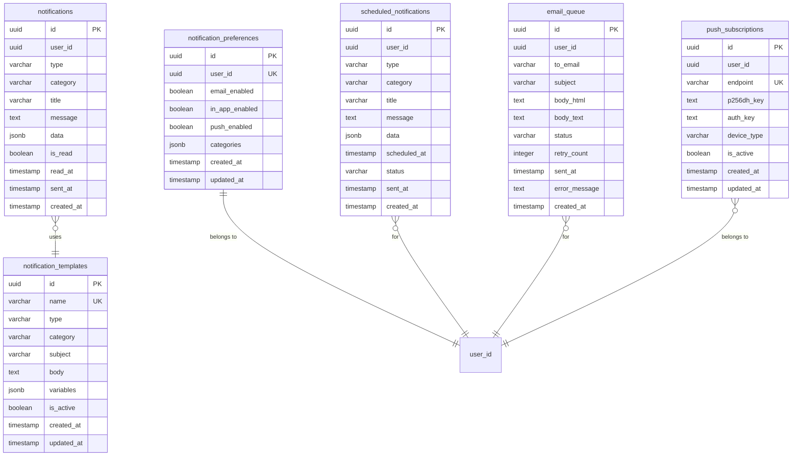

# Notification Service Database Schema

## 📋 Tổng quan

Notification Service quản lý tất cả notifications trong hệ thống, bao gồm email notifications, in-app notifications, và push notifications. **Không có foreign key references đến services khác** - sử dụng Event-Driven Architecture để communication.

Service này quản lý:

-   In-app notifications và notification history
-   Email notifications (transactional & marketing)
-   Push notifications
-   Notification preferences của users
-   Notification templates
-   Scheduled notifications

## 🗃️ Database Information

| Property              | Value                     |
| --------------------- | ------------------------- |
| Database Name         | `notification_service_db` |
| Schema Version        | 1.0.0                     |
| Engine                | PostgreSQL 15.x           |
| Charset               | UTF8                      |
| Collation             | utf8_unicode_ci           |
| **Event Integration** | ✅ Kafka/RabbitMQ         |
| **Security Level**    | 🔒 Medium                 |

## 📊 Entity Relationship Diagram



## 📋 Table Definitions

### 1. notifications

Bảng chính lưu trữ tất cả notifications của users.

| Column     | Type         | Constraints             | Description           |
| ---------- | ------------ | ----------------------- | --------------------- |
| id         | UUID         | PRIMARY KEY             | Unique identifier     |
| user_id    | UUID         | NOT NULL, INDEX         | User ID (không FK)    |
| type       | VARCHAR(20)  | NOT NULL                | Notification type     |
| category   | VARCHAR(50)  | NOT NULL                | Notification category |
| title      | VARCHAR(200) | NOT NULL                | Notification title    |
| message    | TEXT         | NOT NULL                | Notification message  |
| data       | JSONB        | NULLABLE                | Additional data       |
| is_read    | BOOLEAN      | NOT NULL, DEFAULT false | Read status           |
| read_at    | TIMESTAMP    | NULLABLE                | Read timestamp        |
| sent_at    | TIMESTAMP    | NULLABLE                | Sent timestamp        |
| created_at | TIMESTAMP    | NOT NULL                | Creation time         |

#### Enum Values

**type**: `EMAIL`, `IN_APP`, `PUSH`, `SMS`

-   `EMAIL`: Email notification
-   `IN_APP`: Hiển thị trong application UI
-   `PUSH`: Browser push notification
-   `SMS`: SMS notification (future)

**category**: `ORDER`, `PAYMENT`, `GAME`, `ACCOUNT`, `PROMOTION`, `SYSTEM`

-   `ORDER`: Order-related notifications (confirmed, shipped, delivered)
-   `PAYMENT`: Payment notifications (success, failed, refund)
-   `GAME`: Game-related (new releases, updates, achievements)
-   `ACCOUNT`: Account notifications (login, security, profile)
-   `PROMOTION`: Marketing và promotional notifications
-   `SYSTEM`: System announcements và maintenance

#### data Schema Examples

**Order Notification:**

```json
{
    "order_id": "550e8400-e29b-41d4-a716-446655440000",
    "order_number": "ORD-2025-001",
    "amount": 59.99,
    "currency": "USD",
    "items_count": 2,
    "action_url": "/orders/550e8400-e29b-41d4-a716-446655440000"
}
```

**Payment Notification:**

```json
{
    "payment_id": "pay_123456",
    "amount": 59.99,
    "currency": "USD",
    "payment_method": "credit_card",
    "last_4_digits": "4242",
    "receipt_url": "/receipts/pay_123456"
}
```

**Game Notification:**

```json
{
    "game_id": "game-uuid-123",
    "game_name": "Cyberpunk 2077",
    "discount_percent": 50,
    "new_price": 29.99,
    "action_url": "/games/game-uuid-123"
}
```

#### Business Rules

-   User ID không có FK constraint (microservices independence)
-   Notifications tự động expire sau 90 ngày (cleanup job)
-   Read notifications có thể bị xóa bởi user
-   Unread notifications không thể xóa (chỉ có thể mark as read)
-   `sent_at` là timestamp khi notification thực sự được gửi (email sent, push sent)
-   In-app notifications luôn có `sent_at = created_at`

### 2. notification_templates

Bảng lưu templates cho notifications để reuse.

| Column     | Type         | Constraints            | Description                  |
| ---------- | ------------ | ---------------------- | ---------------------------- |
| id         | UUID         | PRIMARY KEY            | Unique identifier            |
| name       | VARCHAR(100) | UNIQUE, NOT NULL       | Template name/identifier     |
| type       | VARCHAR(20)  | NOT NULL               | Notification type            |
| category   | VARCHAR(50)  | NOT NULL               | Category                     |
| subject    | VARCHAR(200) | NOT NULL               | Email subject/title template |
| body       | TEXT         | NOT NULL               | Template body với variables  |
| variables  | JSONB        | NULLABLE               | List of template variables   |
| is_active  | BOOLEAN      | NOT NULL, DEFAULT true | Active status                |
| created_at | TIMESTAMP    | NOT NULL               | Creation time                |
| updated_at | TIMESTAMP    | NULLABLE               | Last update time             |

#### Template Variables

Templates sử dụng placeholders như `{{variable_name}}` để replace với actual data.

**Example Template:**

```json
{
    "name": "order-confirmation-email",
    "type": "EMAIL",
    "category": "ORDER",
    "subject": "Order Confirmation #{{order_number}}",
    "body": "Hi {{username}},\n\nYour order #{{order_number}} has been confirmed!\n\nTotal: ${{amount}}\nItems: {{items_count}}\n\nThank you for your purchase!",
    "variables": ["username", "order_number", "amount", "items_count"]
}
```

#### Business Rules

-   Template name phải unique
-   Variables phải được define trong template
-   Inactive templates không được sử dụng để tạo notifications mới
-   Template body support HTML cho email templates
-   Variables validation khi send notification

### 3. notification_preferences

Bảng lưu notification preferences của mỗi user.

| Column         | Type      | Constraints             | Description                 |
| -------------- | --------- | ----------------------- | --------------------------- |
| id             | UUID      | PRIMARY KEY             | Unique identifier           |
| user_id        | UUID      | UNIQUE, NOT NULL        | User ID (không FK)          |
| email_enabled  | BOOLEAN   | NOT NULL, DEFAULT true  | Enable email notifications  |
| in_app_enabled | BOOLEAN   | NOT NULL, DEFAULT true  | Enable in-app notifications |
| push_enabled   | BOOLEAN   | NOT NULL, DEFAULT false | Enable push notifications   |
| categories     | JSONB     | NOT NULL                | Per-category preferences    |
| created_at     | TIMESTAMP | NOT NULL                | Creation time               |
| updated_at     | TIMESTAMP | NULLABLE                | Last update time            |

#### categories Schema

```json
{
    "ORDER": {
        "email": true,
        "in_app": true,
        "push": false
    },
    "PAYMENT": {
        "email": true,
        "in_app": true,
        "push": false
    },
    "GAME": {
        "email": true,
        "in_app": true,
        "push": false
    },
    "ACCOUNT": {
        "email": true,
        "in_app": true,
        "push": false
    },
    "PROMOTION": {
        "email": false,
        "in_app": true,
        "push": false
    },
    "SYSTEM": {
        "email": true,
        "in_app": true,
        "push": false
    }
}
```

#### Business Rules

-   Default preferences được tạo khi user register (via UserCreatedEvent)
-   Global enabled flags override category preferences
-   SYSTEM category notifications bypass preferences (critical notifications)
-   ACCOUNT security notifications always sent regardless of preferences
-   Users có thể update preferences bất cứ lúc nào

### 4. scheduled_notifications

Bảng quản lý scheduled notifications (gửi sau).

| Column       | Type         | Constraints                 | Description       |
| ------------ | ------------ | --------------------------- | ----------------- |
| id           | UUID         | PRIMARY KEY                 | Unique identifier |
| user_id      | UUID         | NOT NULL                    | Target user ID    |
| type         | VARCHAR(20)  | NOT NULL                    | Notification type |
| category     | VARCHAR(50)  | NOT NULL                    | Category          |
| title        | VARCHAR(200) | NOT NULL                    | Title             |
| message      | TEXT         | NOT NULL                    | Message           |
| data         | JSONB        | NULLABLE                    | Additional data   |
| scheduled_at | TIMESTAMP    | NOT NULL                    | When to send      |
| status       | VARCHAR(20)  | NOT NULL, DEFAULT 'PENDING' | Status            |
| sent_at      | TIMESTAMP    | NULLABLE                    | Actual sent time  |
| created_at   | TIMESTAMP    | NOT NULL                    | Creation time     |

#### Enum Values

**status**: `PENDING`, `SENT`, `FAILED`, `CANCELLED`

-   `PENDING`: Waiting to be sent
-   `SENT`: Successfully sent
-   `FAILED`: Failed to send (will retry)
-   `CANCELLED`: Manually cancelled

#### Business Rules

-   Background job check scheduled_at và gửi notifications
-   Failed notifications retry 3 lần với exponential backoff
-   Scheduled notifications có thể cancelled trước khi sent
-   Sau khi sent, tạo record trong `notifications` table
-   Cleanup sent/cancelled records sau 30 ngày

### 5. email_queue

Bảng queue cho email notifications (async processing).

| Column        | Type         | Constraints                 | Description             |
| ------------- | ------------ | --------------------------- | ----------------------- |
| id            | UUID         | PRIMARY KEY                 | Unique identifier       |
| user_id       | UUID         | NULLABLE                    | User ID (if applicable) |
| to_email      | VARCHAR(255) | NOT NULL                    | Recipient email         |
| subject       | VARCHAR(500) | NOT NULL                    | Email subject           |
| body_html     | TEXT         | NOT NULL                    | HTML email body         |
| body_text     | TEXT         | NULLABLE                    | Plain text fallback     |
| status        | VARCHAR(20)  | NOT NULL, DEFAULT 'PENDING' | Queue status            |
| retry_count   | INTEGER      | NOT NULL, DEFAULT 0         | Retry attempts          |
| sent_at       | TIMESTAMP    | NULLABLE                    | Sent timestamp          |
| error_message | TEXT         | NULLABLE                    | Error details           |
| created_at    | TIMESTAMP    | NOT NULL                    | Creation time           |

#### Enum Values

**status**: `PENDING`, `SENDING`, `SENT`, `FAILED`

-   `PENDING`: Waiting in queue
-   `SENDING`: Currently being sent
-   `SENT`: Successfully delivered
-   `FAILED`: Failed after max retries

#### Business Rules

-   Emails processed by background worker
-   Max 3 retry attempts với exponential backoff
-   Failed emails kept for 7 days for debugging
-   Sent emails archived after 30 days
-   Priority queue: ACCOUNT > PAYMENT > ORDER > GAME > PROMOTION

### 6. push_subscriptions

Bảng lưu push notification subscriptions (Web Push API).

| Column      | Type        | Constraints            | Description                |
| ----------- | ----------- | ---------------------- | -------------------------- |
| id          | UUID        | PRIMARY KEY            | Unique identifier          |
| user_id     | UUID        | NOT NULL               | User ID                    |
| endpoint    | TEXT        | UNIQUE, NOT NULL       | Push subscription endpoint |
| p256dh_key  | TEXT        | NOT NULL               | Public key for encryption  |
| auth_key    | TEXT        | NOT NULL               | Auth secret                |
| device_type | VARCHAR(50) | NULLABLE               | Device/browser type        |
| is_active   | BOOLEAN     | NOT NULL, DEFAULT true | Subscription status        |
| created_at  | TIMESTAMP   | NOT NULL               | Subscription time          |
| updated_at  | TIMESTAMP   | NULLABLE               | Last update time           |

#### Business Rules

-   Mỗi endpoint là unique (mỗi browser/device có 1 subscription)
-   User có thể có nhiều active subscriptions (multi-device)
-   Inactive subscriptions không nhận push notifications
-   Subscriptions tự động deactivated nếu push failed nhiều lần
-   Cleanup inactive subscriptions sau 90 ngày

## 🔍 Indexes

### Primary Indexes

```sql
CREATE UNIQUE INDEX pk_notifications ON notifications(id);
CREATE UNIQUE INDEX pk_notification_templates ON notification_templates(id);
CREATE UNIQUE INDEX pk_notification_preferences ON notification_preferences(id);
CREATE UNIQUE INDEX pk_scheduled_notifications ON scheduled_notifications(id);
CREATE UNIQUE INDEX pk_email_queue ON email_queue(id);
CREATE UNIQUE INDEX pk_push_subscriptions ON push_subscriptions(id);
```

### Unique Indexes

```sql
CREATE UNIQUE INDEX uk_notification_templates_name ON notification_templates(name);
CREATE UNIQUE INDEX uk_notification_preferences_user_id ON notification_preferences(user_id);
CREATE UNIQUE INDEX uk_push_subscriptions_endpoint ON push_subscriptions(endpoint);
```

### Foreign Key Indexes

```sql
-- User ID indexes for filtering (không phải FK vì microservices)
CREATE INDEX idx_notifications_user_id ON notifications(user_id);
CREATE INDEX idx_scheduled_notifications_user_id ON scheduled_notifications(user_id);
CREATE INDEX idx_email_queue_user_id ON email_queue(user_id);
CREATE INDEX idx_push_subscriptions_user_id ON push_subscriptions(user_id);
```

### Composite Indexes

```sql
-- Notifications queries
CREATE INDEX idx_notifications_user_read ON notifications(user_id, is_read);
CREATE INDEX idx_notifications_user_category ON notifications(user_id, category);
CREATE INDEX idx_notifications_user_type ON notifications(user_id, type);
CREATE INDEX idx_notifications_user_created ON notifications(user_id, created_at DESC);
CREATE INDEX idx_notifications_created_read ON notifications(created_at, is_read);

-- Templates queries
CREATE INDEX idx_templates_type_category ON notification_templates(type, category);
CREATE INDEX idx_templates_active ON notification_templates(is_active);

-- Scheduled notifications queries
CREATE INDEX idx_scheduled_status_time ON scheduled_notifications(status, scheduled_at);
CREATE INDEX idx_scheduled_user_status ON scheduled_notifications(user_id, status);

-- Email queue processing
CREATE INDEX idx_email_queue_status_created ON email_queue(status, created_at);
CREATE INDEX idx_email_queue_status_retry ON email_queue(status, retry_count);

-- Push subscriptions
CREATE INDEX idx_push_user_active ON push_subscriptions(user_id, is_active);

-- JSONB indexes
CREATE INDEX idx_notifications_data_gin ON notifications USING gin(data);
CREATE INDEX idx_notification_templates_variables_gin ON notification_templates USING gin(variables);
CREATE INDEX idx_preferences_categories_gin ON notification_preferences USING gin(categories);
```

### Full-text Search Indexes

```sql
-- Search notifications by title and message
CREATE INDEX idx_notifications_search ON notifications
    USING gin(to_tsvector('english', title || ' ' || message));
```

## 🔒 Security Constraints

### Data Validation

```sql
-- Type validation
ALTER TABLE notifications ADD CONSTRAINT chk_notifications_type
    CHECK (type IN ('EMAIL', 'IN_APP', 'PUSH', 'SMS'));

ALTER TABLE notification_templates ADD CONSTRAINT chk_templates_type
    CHECK (type IN ('EMAIL', 'IN_APP', 'PUSH', 'SMS'));

ALTER TABLE scheduled_notifications ADD CONSTRAINT chk_scheduled_type
    CHECK (type IN ('EMAIL', 'IN_APP', 'PUSH', 'SMS'));

-- Category validation
ALTER TABLE notifications ADD CONSTRAINT chk_notifications_category
    CHECK (category IN ('ORDER', 'PAYMENT', 'GAME', 'ACCOUNT', 'PROMOTION', 'SYSTEM'));

ALTER TABLE notification_templates ADD CONSTRAINT chk_templates_category
    CHECK (category IN ('ORDER', 'PAYMENT', 'GAME', 'ACCOUNT', 'PROMOTION', 'SYSTEM'));

-- Status validation
ALTER TABLE scheduled_notifications ADD CONSTRAINT chk_scheduled_status
    CHECK (status IN ('PENDING', 'SENT', 'FAILED', 'CANCELLED'));

ALTER TABLE email_queue ADD CONSTRAINT chk_email_status
    CHECK (status IN ('PENDING', 'SENDING', 'SENT', 'FAILED'));

-- Email format validation
ALTER TABLE email_queue ADD CONSTRAINT chk_email_format
    CHECK (to_email ~* '^[A-Za-z0-9._%+-]+@[A-Za-z0-9.-]+\.[A-Z|a-z]{2,}$');

-- Retry count validation
ALTER TABLE email_queue ADD CONSTRAINT chk_email_retry_count
    CHECK (retry_count >= 0 AND retry_count <= 3);

-- Read_at logic validation
ALTER TABLE notifications ADD CONSTRAINT chk_notifications_read_logic
    CHECK ((is_read = false AND read_at IS NULL) OR (is_read = true AND read_at IS NOT NULL));

-- Scheduled time validation (must be in future when created)
ALTER TABLE scheduled_notifications ADD CONSTRAINT chk_scheduled_time
    CHECK (scheduled_at >= created_at);
```

## 🚨 Business Rules

### Notification Creation

1. **Event-Driven Creation**

    - Notifications tự động tạo từ Kafka events
    - UserCreatedEvent → Welcome notification
    - OrderPlacedEvent → Order confirmation
    - PaymentSuccessEvent → Payment receipt
    - GamePurchasedEvent → Purchase notification

2. **Preference Checking**

    - Check user preferences trước khi send
    - SYSTEM và ACCOUNT security notifications bypass preferences
    - Respect global enabled flags và category preferences

3. **Template Usage**
    - Sử dụng templates để consistency
    - Replace variables với actual data
    - Fallback to default message nếu template không có

### Email Queue Processing

1. **Queue Priority**

    - ACCOUNT: Highest priority (security, verification)
    - PAYMENT: High priority
    - ORDER: Medium priority
    - GAME: Low priority
    - PROMOTION: Lowest priority

2. **Retry Logic**

    - Max 3 retry attempts
    - Exponential backoff: 5 min, 30 min, 2 hours
    - Mark as FAILED sau max retries
    - Log error messages for debugging

3. **Rate Limiting**
    - Max 100 emails/minute per user
    - Max 10,000 emails/minute system-wide
    - Prevent email bombing

### Scheduled Notifications

1. **Background Job**

    - Check every minute for due notifications
    - Process in batches of 100
    - Mark as SENDING before processing
    - Update to SENT or FAILED after

2. **Cancellation**
    - Users có thể cancel PENDING scheduled notifications
    - Cannot cancel SENT hoặc SENDING notifications

### Data Cleanup

1. **Automatic Cleanup**
    - Read notifications > 90 days: deleted
    - Sent scheduled notifications > 30 days: archived/deleted
    - Email queue SENT > 30 days: archived
    - Email queue FAILED > 7 days: deleted
    - Inactive push subscriptions > 90 days: deleted

## 🔐 Enhanced Security Features

### Access Control Functions

```sql
-- Function to check if user can access notification
CREATE OR REPLACE FUNCTION can_user_access_notification(
    p_user_id UUID,
    p_notification_id UUID
)
RETURNS boolean AS $$
DECLARE
    v_notification_user_id UUID;
BEGIN
    SELECT user_id INTO v_notification_user_id
    FROM notifications
    WHERE id = p_notification_id;

    -- User can only access their own notifications
    RETURN v_notification_user_id = p_user_id;
END;
$$ LANGUAGE plpgsql;

-- Function to get unread count
CREATE OR REPLACE FUNCTION get_unread_count(p_user_id UUID)
RETURNS TABLE(
    total_unread BIGINT,
    by_category JSONB
) AS $$
BEGIN
    RETURN QUERY
    SELECT
        COUNT(*)::BIGINT as total_unread,
        jsonb_object_agg(
            category,
            count
        ) as by_category
    FROM (
        SELECT
            category,
            COUNT(*)::INTEGER as count
        FROM notifications
        WHERE user_id = p_user_id
          AND is_read = false
          AND type = 'IN_APP'
        GROUP BY category
    ) sub;
END;
$$ LANGUAGE plpgsql;
```

### Cleanup Triggers

```sql
-- Function to cleanup old notifications
CREATE OR REPLACE FUNCTION cleanup_old_notifications()
RETURNS void AS $$
BEGIN
    -- Delete read notifications older than 90 days
    DELETE FROM notifications
    WHERE is_read = true
      AND created_at < NOW() - INTERVAL '90 days';

    -- Delete sent scheduled notifications older than 30 days
    DELETE FROM scheduled_notifications
    WHERE status = 'SENT'
      AND sent_at < NOW() - INTERVAL '30 days';

    -- Delete cancelled scheduled notifications older than 7 days
    DELETE FROM scheduled_notifications
    WHERE status = 'CANCELLED'
      AND created_at < NOW() - INTERVAL '7 days';

    -- Archive sent emails older than 30 days
    DELETE FROM email_queue
    WHERE status = 'SENT'
      AND sent_at < NOW() - INTERVAL '30 days';

    -- Delete failed emails older than 7 days
    DELETE FROM email_queue
    WHERE status = 'FAILED'
      AND created_at < NOW() - INTERVAL '7 days';

    -- Delete inactive push subscriptions older than 90 days
    DELETE FROM push_subscriptions
    WHERE is_active = false
      AND updated_at < NOW() - INTERVAL '90 days';
END;
$$ LANGUAGE plpgsql;

-- Schedule cleanup (requires pg_cron)
-- SELECT cron.schedule('cleanup-notifications', '0 3 * * *', 'SELECT cleanup_old_notifications()');
```

### Notification Stats Views

```sql
-- View for notification statistics
CREATE VIEW v_notification_stats AS
SELECT
    user_id,
    COUNT(*) as total_notifications,
    COUNT(*) FILTER (WHERE is_read = false) as unread_count,
    COUNT(*) FILTER (WHERE type = 'IN_APP') as in_app_count,
    COUNT(*) FILTER (WHERE type = 'EMAIL') as email_count,
    COUNT(*) FILTER (WHERE category = 'ORDER') as order_count,
    COUNT(*) FILTER (WHERE category = 'PAYMENT') as payment_count,
    MAX(created_at) as last_notification_at
FROM notifications
GROUP BY user_id;
```

---

**Last Updated**: 2025-10-03  
**Version**: 1.0.0  
**Schema Migration**: V001 (Initial Schema)  
**Maintained by**: Backend Team

## 📚 Related Documentation

-   [[notification-service-api]] - Notification Service API specification
-   [[notification-service-flows]] - Notification flow diagrams
-   [[event-driven-design]] - Event-driven architecture
-   [[kafka-topics]] - Kafka topics design
-   [[api-standards]] - API design standards

## 🔄 Migration History

| Version | Date       | Description    | Migration File             |
| ------- | ---------- | -------------- | -------------------------- |
| 1.0.0   | 2025-10-03 | Initial schema | V001\_\_initial_schema.sql |

## 🚀 Migration Benefits (1.0.0)

### **Advantages of Initial Schema Design**

1. **Event-Driven Ready**

    - Seamless integration với Kafka
    - Async notification processing
    - Decoupled from other services

2. **Scalability**

    - Queue-based email processing
    - Scheduled notifications support
    - Efficient indexing for high-volume queries

3. **User Experience**
    - Granular notification preferences
    - Multi-channel notifications (email, in-app, push)
    - Template system for consistency
    - Real-time notifications via WebSocket
