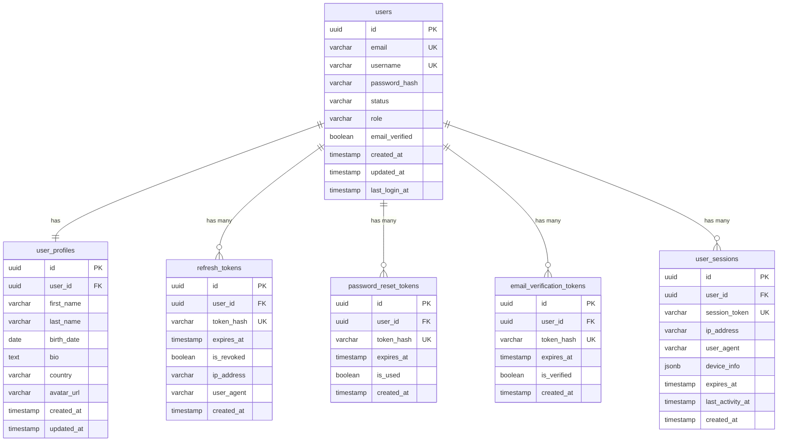

# User Service Database Schema

## 📋 Tổng quan

User Service quản lý tất cả dữ liệu liên quan đến người dùng, authentication, và authorization. **Không có foreign key references đến services khác** - sử dụng Event-Driven Architecture để communication.

Service này quản lý:

-   User accounts và authentication credentials
-   User profiles và personal information
-   User sessions và refresh tokens
-   Password reset tokens
-   Email verification
-   User roles và permissions

## 🗃️ Database Information

| Property              | Value                   |
| --------------------- | ----------------------- |
| Database Name         | `user_service_db`       |
| Schema Version        | 1.0.0                   |
| Engine                | PostgreSQL 15.x         |
| Charset               | UTF8                    |
| Collation             | utf8_unicode_ci         |
| **Event Integration** | ✅ Kafka/RabbitMQ       |
| **Security Level**    | 🔒 High (PII data)      |

## 📊 Entity Relationship Diagram



## 📋 Table Definitions

### 1. users

Bảng chính lưu trữ thông tin authentication của users.

| Column          | Type         | Constraints                 | Description                    |
| --------------- | ------------ | --------------------------- | ------------------------------ |
| id              | UUID         | PRIMARY KEY                 | Unique identifier              |
| email           | VARCHAR(255) | UNIQUE, NOT NULL            | User email address             |
| username        | VARCHAR(50)  | UNIQUE, NOT NULL            | Unique username                |
| password_hash   | VARCHAR(255) | NOT NULL                    | Bcrypt hashed password         |
| status          | VARCHAR(20)  | NOT NULL, DEFAULT 'active'  | User status                    |
| role            | VARCHAR(20)  | NOT NULL, DEFAULT 'customer'| User role                      |
| email_verified  | BOOLEAN      | NOT NULL, DEFAULT false     | Email verification status      |
| created_at      | TIMESTAMP    | NOT NULL                    | Account creation time          |
| updated_at      | TIMESTAMP    | NULLABLE                    | Last update time               |
| last_login_at   | TIMESTAMP    | NULLABLE                    | Last login timestamp           |

#### Enum Values

**status**: `active`, `inactive`, `suspended`

-   `active`: User can login và sử dụng hệ thống
-   `inactive`: User tự deactivate account (có thể reactivate)
-   `suspended`: Admin suspend account (cần admin approval để unlock)

**role**: `customer`, `admin`

-   `customer`: Regular user, có thể mua game và interact
-   `admin`: Full system access, có thể manage users và content

#### Business Rules

-   Email phải unique và valid format
-   Username chỉ chứa alphanumeric và underscore (a-zA-Z0-9\_)
-   Password hash sử dụng BCrypt với cost factor 12
-   Email verified phải true để mua game
-   Suspended users không thể login
-   `last_login_at` được cập nhật mỗi lần login thành công

### 2. user_profiles

Bảng lưu profile information và personal data của users.

| Column     | Type         | Constraints         | Description              |
| ---------- | ------------ | ------------------- | ------------------------ |
| id         | UUID         | PRIMARY KEY         | Unique identifier        |
| user_id    | UUID         | FOREIGN KEY, UNIQUE | Reference to users.id    |
| first_name | VARCHAR(50)  | NOT NULL            | User's first name        |
| last_name  | VARCHAR(50)  | NOT NULL            | User's last name         |
| birth_date | DATE         | NULLABLE            | Date of birth            |
| bio        | TEXT         | NULLABLE            | User biography (max 500) |
| country    | VARCHAR(2)   | NULLABLE            | ISO 3166-1 alpha-2 code  |
| avatar_url | VARCHAR(500) | NULLABLE            | CDN URL to avatar image  |
| created_at | TIMESTAMP    | NOT NULL            | Profile creation time    |
| updated_at | TIMESTAMP    | NULLABLE            | Last update time         |

#### Business Rules

-   Mỗi user chỉ có 1 profile (one-to-one relationship)
-   Profile được tự động tạo khi user register
-   `birth_date` để kiểm tra age restriction khi mua game mature
-   `country` để áp dụng regional pricing và restrictions
-   Avatar image phải <= 5MB, format: JPEG/PNG
-   Bio max 500 characters

### 3. refresh_tokens

Bảng quản lý refresh tokens cho JWT authentication.

| Column      | Type         | Constraints            | Description                   |
| ----------- | ------------ | ---------------------- | ----------------------------- |
| id          | UUID         | PRIMARY KEY            | Unique identifier             |
| user_id     | UUID         | FOREIGN KEY            | Reference to users.id         |
| token_hash  | VARCHAR(255) | UNIQUE, NOT NULL       | SHA-256 hash of refresh token |
| expires_at  | TIMESTAMP    | NOT NULL               | Token expiration time         |
| is_revoked  | BOOLEAN      | NOT NULL, DEFAULT false| Token revocation status       |
| ip_address  | VARCHAR(45)  | NULLABLE               | IP address when token created |
| user_agent  | VARCHAR(500) | NULLABLE               | Browser/device info           |
| created_at  | TIMESTAMP    | NOT NULL               | Token creation time           |

#### Business Rules

-   Refresh token valid trong 7 ngày
-   Token được hash (SHA-256) trước khi store
-   Revoked tokens không thể sử dụng để refresh
-   Mỗi user có thể có nhiều active refresh tokens (multi-device support)
-   Expired hoặc revoked tokens được cleanup sau 30 ngày
-   Khi user logout hoặc change password, revoke tất cả tokens

### 4. password_reset_tokens

Bảng quản lý tokens cho password reset flow.

| Column      | Type         | Constraints            | Description                 |
| ----------- | ------------ | ---------------------- | --------------------------- |
| id          | UUID         | PRIMARY KEY            | Unique identifier           |
| user_id     | UUID         | FOREIGN KEY            | Reference to users.id       |
| token_hash  | VARCHAR(255) | UNIQUE, NOT NULL       | SHA-256 hash of reset token |
| expires_at  | TIMESTAMP    | NOT NULL               | Token expiration (1 hour)   |
| is_used     | BOOLEAN      | NOT NULL, DEFAULT false| Token usage status          |
| created_at  | TIMESTAMP    | NOT NULL               | Token creation time         |

#### Business Rules

-   Reset token valid trong 1 giờ
-   Token chỉ sử dụng được 1 lần (single-use)
-   Token được hash trước khi store
-   Mỗi user chỉ có 1 active reset token (tạo mới invalidate token cũ)
-   Used hoặc expired tokens tự động cleanup sau 24 giờ

### 5. email_verification_tokens

Bảng quản lý tokens cho email verification.

| Column       | Type         | Constraints              | Description                      |
| ------------ | ------------ | ------------------------ | -------------------------------- |
| id           | UUID         | PRIMARY KEY              | Unique identifier                |
| user_id      | UUID         | FOREIGN KEY              | Reference to users.id            |
| token_hash   | VARCHAR(255) | UNIQUE, NOT NULL         | SHA-256 hash of verify token     |
| expires_at   | TIMESTAMP    | NOT NULL                 | Token expiration (24 hours)      |
| is_verified  | BOOLEAN      | NOT NULL, DEFAULT false  | Verification status              |
| created_at   | TIMESTAMP    | NOT NULL                 | Token creation time              |

#### Business Rules

-   Verification token valid trong 24 giờ
-   Token chỉ sử dụng được 1 lần
-   Sau verify thành công, update `users.email_verified = true`
-   User có thể request resend verification email
-   Verified tokens cleanup sau 7 ngày

### 6. user_sessions

Bảng tracking active user sessions (optional, để monitor và security).

| Column            | Type         | Constraints     | Description                  |
| ----------------- | ------------ | --------------- | ---------------------------- |
| id                | UUID         | PRIMARY KEY     | Unique identifier            |
| user_id           | UUID         | FOREIGN KEY     | Reference to users.id        |
| session_token     | VARCHAR(255) | UNIQUE, NOT NULL| Unique session identifier    |
| ip_address        | VARCHAR(45)  | NULLABLE        | User's IP address            |
| user_agent        | VARCHAR(500) | NULLABLE        | Browser/device information   |
| device_info       | JSONB        | NULLABLE        | Additional device metadata   |
| expires_at        | TIMESTAMP    | NOT NULL        | Session expiration time      |
| last_activity_at  | TIMESTAMP    | NOT NULL        | Last activity timestamp      |
| created_at        | TIMESTAMP    | NOT NULL        | Session creation time        |

#### device_info Schema

```json
{
	"device_type": "desktop", // desktop, mobile, tablet
	"os": "Windows 10",
	"browser": "Chrome",
	"browser_version": "120.0.0",
	"location": {
		"country": "US",
		"city": "San Francisco"
	}
}
```

#### Business Rules

-   Session valid trong 12 giờ without activity
-   `last_activity_at` được cập nhật mỗi request
-   User có thể xem và revoke active sessions
-   Expired sessions tự động cleanup
-   Admin có thể force logout user bằng cách revoke sessions

## 🔍 Indexes

### Primary Indexes

```sql
-- Auto-created primary key indexes
CREATE UNIQUE INDEX pk_users ON users(id);
CREATE UNIQUE INDEX pk_user_profiles ON user_profiles(id);
CREATE UNIQUE INDEX pk_refresh_tokens ON refresh_tokens(id);
CREATE UNIQUE INDEX pk_password_reset_tokens ON password_reset_tokens(id);
CREATE UNIQUE INDEX pk_email_verification_tokens ON email_verification_tokens(id);
CREATE UNIQUE INDEX pk_user_sessions ON user_sessions(id);
```

### Unique Indexes

```sql
-- Business unique constraints
CREATE UNIQUE INDEX uk_users_email ON users(email);
CREATE UNIQUE INDEX uk_users_username ON users(username);
CREATE UNIQUE INDEX uk_user_profiles_user_id ON user_profiles(user_id);
CREATE UNIQUE INDEX uk_refresh_tokens_token_hash ON refresh_tokens(token_hash);
CREATE UNIQUE INDEX uk_password_reset_tokens_token_hash ON password_reset_tokens(token_hash);
CREATE UNIQUE INDEX uk_email_verification_tokens_token_hash ON email_verification_tokens(token_hash);
CREATE UNIQUE INDEX uk_user_sessions_session_token ON user_sessions(session_token);
```

### Foreign Key Indexes

```sql
-- For better join performance
CREATE INDEX idx_user_profiles_user_id ON user_profiles(user_id);
CREATE INDEX idx_refresh_tokens_user_id ON refresh_tokens(user_id);
CREATE INDEX idx_password_reset_tokens_user_id ON password_reset_tokens(user_id);
CREATE INDEX idx_email_verification_tokens_user_id ON email_verification_tokens(user_id);
CREATE INDEX idx_user_sessions_user_id ON user_sessions(user_id);
```

### Composite Indexes

```sql
-- For common query patterns
CREATE INDEX idx_users_status_role ON users(status, role);
CREATE INDEX idx_users_email_status ON users(email, status);

-- For token validation queries
CREATE INDEX idx_refresh_tokens_user_expires ON refresh_tokens(user_id, expires_at, is_revoked);
CREATE INDEX idx_password_reset_tokens_expires_used ON password_reset_tokens(expires_at, is_used);
CREATE INDEX idx_email_verification_tokens_expires_verified ON email_verification_tokens(expires_at, is_verified);

-- For session queries
CREATE INDEX idx_user_sessions_user_expires ON user_sessions(user_id, expires_at);
CREATE INDEX idx_user_sessions_last_activity ON user_sessions(last_activity_at);

-- For search functionality
CREATE INDEX idx_users_username_trgm ON users USING gin(username gin_trgm_ops);
CREATE INDEX idx_users_email_trgm ON users USING gin(email gin_trgm_ops);

-- JSONB indexes
CREATE INDEX idx_user_sessions_device_info_gin ON user_sessions USING gin(device_info);
```

## 🔒 Security Constraints

### Data Validation

```sql
-- Email format validation
ALTER TABLE users ADD CONSTRAINT chk_users_email_format
    CHECK (email ~* '^[A-Za-z0-9._%+-]+@[A-Za-z0-9.-]+\.[A-Z|a-z]{2,}$');

-- Username format validation (alphanumeric + underscore only)
ALTER TABLE users ADD CONSTRAINT chk_users_username_format
    CHECK (username ~* '^[a-zA-Z0-9_]{3,50}$');

-- Status enum validation
ALTER TABLE users ADD CONSTRAINT chk_users_status
    CHECK (status IN ('active', 'inactive', 'suspended'));

-- Role enum validation
ALTER TABLE users ADD CONSTRAINT chk_users_role
    CHECK (role IN ('customer', 'admin'));

-- Password hash length (bcrypt produces 60 characters)
ALTER TABLE users ADD CONSTRAINT chk_users_password_hash_length
    CHECK (LENGTH(password_hash) = 60);

-- Country code validation (ISO 3166-1 alpha-2)
ALTER TABLE user_profiles ADD CONSTRAINT chk_user_profiles_country_format
    CHECK (country IS NULL OR LENGTH(country) = 2);

-- Bio length validation
ALTER TABLE user_profiles ADD CONSTRAINT chk_user_profiles_bio_length
    CHECK (bio IS NULL OR LENGTH(bio) <= 500);

-- Birth date validation (must be in past, at least 13 years old)
ALTER TABLE user_profiles ADD CONSTRAINT chk_user_profiles_birth_date
    CHECK (birth_date IS NULL OR birth_date < CURRENT_DATE - INTERVAL '13 years');
```

## 🚨 Business Rules

### Authentication & Authorization

1. **User Registration**

    - Email phải unique và verified trước khi mua game
    - Username phải unique, alphanumeric + underscore
    - Password minimum 8 characters, hash với BCrypt cost 12
    - Tự động tạo user_profile khi register
    - Gửi verification email sau register thành công

2. **Login & Session Management**

    - Check status = 'active' và email_verified = true
    - Update last_login_at mỗi lần login
    - Generate access token (expire 1h) và refresh token (expire 7d)
    - Track session với IP, user_agent và device_info

3. **Password Reset Flow**

    - Generate reset token, hash và store trong database
    - Gửi email với reset link (token trong URL)
    - Token valid 1 giờ, single-use only
    - Sau reset success, revoke tất cả refresh tokens

### Data Integrity & Validation

1. **Email & Username Uniqueness**

    - Email case-insensitive unique (convert lowercase before store)
    - Username case-sensitive unique
    - Không cho phép change email nếu đã verified (phải verify lại)

2. **Profile Data Validation**

    - Avatar upload: max 5MB, JPEG/PNG only
    - Bio max 500 characters
    - Birth date validation: must be 13+ years old
    - Country code: ISO 3166-1 alpha-2 format

3. **Token Management**

    - Hash tokens (SHA-256) before store
    - Regular cleanup của expired tokens
    - Revoke tokens on password change hoặc user logout
    - Single active password reset token per user

## 🔐 Enhanced Security Features

### Data Privacy Views

```sql
-- View for safe user display (không expose sensitive data)
CREATE VIEW v_users_public AS
SELECT
    u.id,
    u.username,
    u.status,
    u.email_verified,
    u.created_at,
    p.first_name,
    p.last_name,
    p.avatar_url,
    p.bio,
    p.country
FROM users u
LEFT JOIN user_profiles p ON u.id = p.user_id
WHERE u.status = 'active'
ORDER BY u.created_at DESC;

-- View for admin user management
CREATE VIEW v_users_admin AS
SELECT
    u.id,
    u.email,
    u.username,
    u.status,
    u.role,
    u.email_verified,
    u.created_at,
    u.updated_at,
    u.last_login_at,
    p.first_name,
    p.last_name,
    p.country,
    COUNT(DISTINCT s.id) as active_sessions
FROM users u
LEFT JOIN user_profiles p ON u.id = p.user_id
LEFT JOIN user_sessions s ON u.id = s.user_id AND s.expires_at > NOW()
GROUP BY u.id, p.id
ORDER BY u.created_at DESC;
```

### Access Control Functions

```sql
-- Function to check if user can access resource
CREATE OR REPLACE FUNCTION can_user_access_profile(
    p_user_id UUID,
    p_target_user_id UUID
)
RETURNS boolean AS $$
DECLARE
    v_user_role VARCHAR(20);
BEGIN
    -- Get user role
    SELECT role INTO v_user_role FROM users WHERE id = p_user_id;

    -- Admin can access all profiles
    IF v_user_role = 'admin' THEN
        RETURN TRUE;
    END IF;

    -- User can access own profile
    IF p_user_id = p_target_user_id THEN
        RETURN TRUE;
    END IF;

    RETURN FALSE;
END;
$$ LANGUAGE plpgsql;

-- Function to validate token expiration
CREATE OR REPLACE FUNCTION is_token_valid(
    p_token_hash VARCHAR(255),
    p_token_type VARCHAR(50)
)
RETURNS boolean AS $$
DECLARE
    v_expires_at TIMESTAMP;
    v_is_used BOOLEAN;
    v_is_revoked BOOLEAN;
BEGIN
    IF p_token_type = 'refresh' THEN
        SELECT expires_at, is_revoked INTO v_expires_at, v_is_revoked
        FROM refresh_tokens
        WHERE token_hash = p_token_hash;

        RETURN v_expires_at > NOW() AND NOT v_is_revoked;

    ELSIF p_token_type = 'password_reset' THEN
        SELECT expires_at, is_used INTO v_expires_at, v_is_used
        FROM password_reset_tokens
        WHERE token_hash = p_token_hash;

        RETURN v_expires_at > NOW() AND NOT v_is_used;

    ELSIF p_token_type = 'email_verification' THEN
        SELECT expires_at, is_verified INTO v_expires_at, v_is_used
        FROM email_verification_tokens
        WHERE token_hash = p_token_hash;

        RETURN v_expires_at > NOW() AND NOT v_is_used;
    END IF;

    RETURN FALSE;
END;
$$ LANGUAGE plpgsql;
```

### Automatic Cleanup Triggers

```sql
-- Trigger to cleanup expired tokens
CREATE OR REPLACE FUNCTION cleanup_expired_tokens()
RETURNS void AS $$
BEGIN
    -- Cleanup refresh tokens
    DELETE FROM refresh_tokens
    WHERE (expires_at < NOW() - INTERVAL '30 days')
       OR (is_revoked = true AND created_at < NOW() - INTERVAL '30 days');

    -- Cleanup password reset tokens
    DELETE FROM password_reset_tokens
    WHERE expires_at < NOW() - INTERVAL '24 hours';

    -- Cleanup email verification tokens
    DELETE FROM email_verification_tokens
    WHERE (is_verified = true AND created_at < NOW() - INTERVAL '7 days')
       OR (expires_at < NOW() - INTERVAL '7 days');

    -- Cleanup expired sessions
    DELETE FROM user_sessions
    WHERE expires_at < NOW();
END;
$$ LANGUAGE plpgsql;

-- Schedule cleanup to run daily (requires pg_cron extension)
-- SELECT cron.schedule('cleanup-tokens', '0 2 * * *', 'SELECT cleanup_expired_tokens()');
```

---

**Last Updated**: 2025-10-03  
**Version**: 1.0.0  
**Schema Migration**: V001 (Initial Schema)  
**Maintained by**: Backend Team

## 📚 Related Documentation

-   [[user-service-api]] - User Service API specification
-   [[authentication-design]] - Authentication & JWT implementation
-   [[api-standards]] - API design standards
-   [[error-handling]] - Error handling standards
-   [[User Service Flow]] - User authentication flow diagrams

## 🔄 Migration History

| Version | Date       | Description          | Migration File           |
| ------- | ---------- | -------------------- | ------------------------ |
| 1.0.0   | 2025-10-03 | Initial schema       | V001__initial_schema.sql |

## 🚀 Migration Benefits (1.0.0)

### **Advantages of Initial Schema Design**

1. **Security First**

    - Password hashing với BCrypt
    - Token hashing với SHA-256
    - PII data protection
    - Row-level security considerations

2. **Scalability**

    - UUID primary keys cho distributed systems
    - Efficient indexing strategy
    - JSONB for flexible metadata
    - Event-driven architecture ready

3. **User Experience**
    - Multi-device support với refresh tokens
    - Active session management
    - Email verification flow
    - Password reset flow
