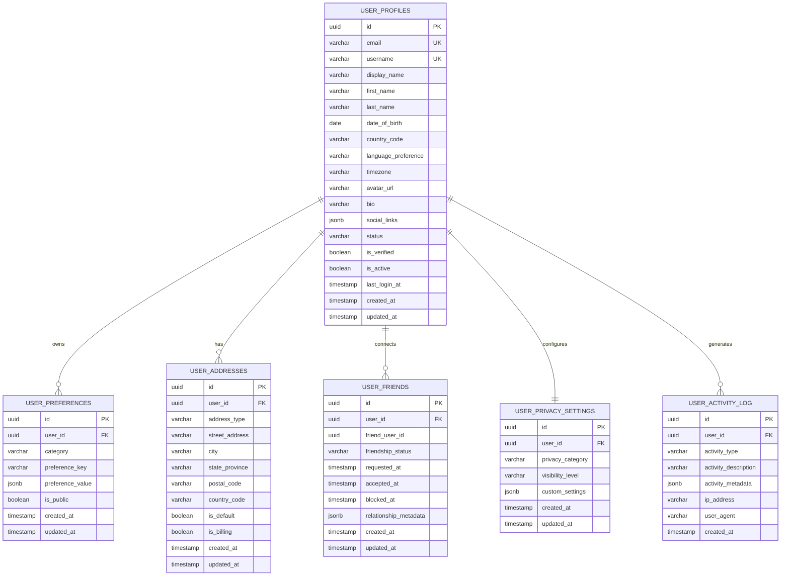

# User Service Database Schema

## 📋 Tổng quan

User Service quản lý thông tin profile người dùng và user preferences trong hệ thống My Digital Collection. **Không có foreign key references đến services khác** - sử dụng Event-Driven Architecture để communication.

Service này quản lý:

-   User profiles và personal information
-   User preferences và settings
-   Avatar và profile customization
-   Social connections và friend relationships
-   User activity history và statistics
-   Privacy settings và data consent

## 🗃️ Database Information

| Property              | Value                |
| --------------------- | -------------------- |
| Database Name         | `user_service_db`    |
| Schema Version        | 1.0.0                |
| Engine                | PostgreSQL 15.x      |
| Charset               | UTF8                 |
| Collation             | utf8_unicode_ci      |
| **Event Integration** | ✅ Kafka/RabbitMQ    |
| **Security Level**    | MEDIUM (PII Protection) |

## 📊 Entity Relationship Diagram



## 📋 Table Definitions

### 1. user_profiles

Core user profile information và public data.

| Column               | Type         | Constraints      | Description                    |
| -------------------- | ------------ | ---------------- | ------------------------------ |
| id                   | UUID         | PRIMARY KEY      | Unique identifier              |
| email                | VARCHAR(255) | NOT NULL, UNIQUE | User email address             |
| username             | VARCHAR(50)  | NOT NULL, UNIQUE | Unique username                |
| display_name         | VARCHAR(100) | NOT NULL         | Public display name            |
| first_name           | VARCHAR(50)  | NULLABLE         | First name                     |
| last_name            | VARCHAR(50)  | NULLABLE         | Last name                      |
| date_of_birth        | DATE         | NULLABLE         | Birth date (privacy protected) |
| country_code         | VARCHAR(2)   | NULLABLE         | ISO country code               |
| language_preference  | VARCHAR(10)  | DEFAULT 'en'     | Preferred language (ISO code)  |
| timezone             | VARCHAR(50)  | NULLABLE         | User timezone                  |
| avatar_url           | TEXT         | NULLABLE         | Profile avatar URL             |
| bio                  | TEXT         | NULLABLE         | User biography                 |
| social_links         | JSONB        | NULLABLE         | Social media links             |
| status               | VARCHAR(20)  | DEFAULT 'active' | Account status                 |
| is_verified          | BOOLEAN      | DEFAULT false    | Email verification status      |
| is_active            | BOOLEAN      | DEFAULT true     | Account active status          |
| last_login_at        | TIMESTAMP    | NULLABLE         | Last login timestamp           |
| created_at           | TIMESTAMP    | NOT NULL         | Thời gian tạo                  |
| updated_at           | TIMESTAMP    | NULLABLE         | Thời gian cập nhật             |

#### Social Links Schema

```json
{
    "steam": "https://steamcommunity.com/id/username",
    "discord": "username#1234",
    "twitter": "https://twitter.com/username",
    "youtube": "https://youtube.com/c/username",
    "twitch": "https://twitch.tv/username",
    "custom_links": [
        {
            "name": "Personal Website",
            "url": "https://example.com",
            "icon": "globe"
        }
    ]
}
```

#### Business Rules

-   Email phải unique across entire system
-   Username format: alphanumeric + underscore, 3-50 characters
-   Display name có thể trùng nhau, allow Unicode characters
-   Date of birth optional nhưng required for age-restricted features

### 2. user_preferences

User customizable preferences và settings.

| Column           | Type        | Constraints      | Description                  |
| ---------------- | ----------- | ---------------- | ---------------------------- |
| id               | UUID        | PRIMARY KEY      | Unique identifier            |
| user_id          | UUID        | NOT NULL, FK     | Reference to user_profiles   |
| category         | VARCHAR(50) | NOT NULL         | Preference category          |
| preference_key   | VARCHAR(100)| NOT NULL         | Specific preference key      |
| preference_value | JSONB       | NOT NULL         | Preference value (flexible)  |
| is_public        | BOOLEAN     | DEFAULT false    | Public visibility setting    |
| created_at       | TIMESTAMP   | NOT NULL         | Thời gian tạo                |
| updated_at       | TIMESTAMP   | NULLABLE         | Thời gian cập nhật           |

#### Preference Categories

```json
{
    "ui_preferences": {
        "theme": "dark",
        "language": "en",
        "compact_mode": true,
        "sidebar_collapsed": false
    },
    "notification_preferences": {
        "email_notifications": true,
        "push_notifications": false,
        "friend_requests": true,
        "game_updates": false,
        "promotional_emails": false
    },
    "privacy_preferences": {
        "profile_visibility": "friends",
        "library_visibility": "private",
        "activity_visibility": "public",
        "show_online_status": true
    },
    "gaming_preferences": {
        "favorite_genres": ["action", "rpg", "strategy"],
        "platform_preferences": ["pc", "console"],
        "content_filters": {
            "mature_content": false,
            "violence_level": "moderate"
        }
    }
}
```

#### Business Rules

-   Unique constraint trên (user_id, category, preference_key)
-   Default preferences tự động tạo khi user đăng ký
-   Public preferences có thể được share với friends
-   Sensitive preferences luôn private

### 3. user_addresses

User địa chỉ cho billing và shipping purposes.

| Column         | Type        | Constraints      | Description               |
| -------------- | ----------- | ---------------- | ------------------------- |
| id             | UUID        | PRIMARY KEY      | Unique identifier         |
| user_id        | UUID        | NOT NULL, FK     | Reference to user_profiles|
| address_type   | VARCHAR(20) | NOT NULL         | Address type              |
| street_address | TEXT        | NOT NULL         | Street address            |
| city           | VARCHAR(100)| NOT NULL         | City name                 |
| state_province | VARCHAR(100)| NULLABLE         | State/Province            |
| postal_code    | VARCHAR(20) | NULLABLE         | Postal/ZIP code           |
| country_code   | VARCHAR(2)  | NOT NULL         | ISO country code          |
| is_default     | BOOLEAN     | DEFAULT false    | Default address flag      |
| is_billing     | BOOLEAN     | DEFAULT false    | Billing address flag      |
| created_at     | TIMESTAMP   | NOT NULL         | Thời gian tạo             |
| updated_at     | TIMESTAMP   | NULLABLE         | Thời gian cập nhật        |

#### Business Rules

-   Address types: 'shipping', 'billing', 'both'
-   Only one default address per user
-   Address validation based on country_code format
-   Encrypted storage for sensitive address data

### 4. user_friends

Social connections và friend relationships.

| Column                | Type        | Constraints  | Description                  |
| --------------------- | ----------- | ------------ | ---------------------------- |
| id                    | UUID        | PRIMARY KEY  | Unique identifier            |
| user_id               | UUID        | NOT NULL, FK | User sending/owning relation |
| friend_user_id        | UUID        | NOT NULL     | Friend user ID               |
| friendship_status     | VARCHAR(20) | NOT NULL     | Current friendship status    |
| requested_at          | TIMESTAMP   | NOT NULL     | Friend request time          |
| accepted_at           | TIMESTAMP   | NULLABLE     | Acceptance time              |
| blocked_at            | TIMESTAMP   | NULLABLE     | Block time                   |
| relationship_metadata | JSONB       | NULLABLE     | Additional relationship data |
| created_at            | TIMESTAMP   | NOT NULL     | Thời gian tạo                |
| updated_at            | TIMESTAMP   | NULLABLE     | Thời gian cập nhật           |

#### Friendship Status Values

-   `pending`: Friend request sent, waiting for response
-   `accepted`: Friendship established
-   `blocked`: User has blocked the friend
-   `declined`: Friend request was declined

#### Relationship Metadata Schema

```json
{
    "friendship_source": "game_match",
    "mutual_friends_count": 5,
    "shared_games": ["game_id_1", "game_id_2"],
    "interaction_score": 0.85,
    "last_interaction": "2024-10-01T15:30:00Z",
    "friendship_tags": ["gaming_buddy", "close_friend"]
}
```

#### Business Rules

-   Unique constraint trên (user_id, friend_user_id)
-   Reciprocal friendship: cần 2 records cho bidirectional friendship
-   Block relationship overrides friendship
-   Automatic cleanup của declined requests after 30 days

### 5. user_privacy_settings

Granular privacy controls cho user data.

| Column           | Type        | Constraints      | Description                |
| ---------------- | ----------- | ---------------- | -------------------------- |
| id               | UUID        | PRIMARY KEY      | Unique identifier          |
| user_id          | UUID        | NOT NULL, FK     | Reference to user_profiles |
| privacy_category | VARCHAR(50) | NOT NULL         | Privacy setting category   |
| visibility_level | VARCHAR(20) | NOT NULL         | Visibility level           |
| custom_settings  | JSONB       | NULLABLE         | Custom privacy rules       |
| created_at       | TIMESTAMP   | NOT NULL         | Thời gian tạo              |
| updated_at       | TIMESTAMP   | NULLABLE         | Thời gian cập nhật         |

#### Privacy Categories & Visibility Levels

```json
{
    "profile_information": {
        "visibility": "friends", // public, friends, private
        "exceptions": ["specific_user_id"]
    },
    "game_library": {
        "visibility": "private",
        "show_playtime": false,
        "show_achievements": true
    },
    "activity_feed": {
        "visibility": "public",
        "hide_specific_games": ["mature_game_id"],
        "allow_mentions": true
    },
    "contact_information": {
        "visibility": "private",
        "allow_friend_requests": true,
        "show_online_status": "friends"
    }
}
```

#### Business Rules

-   Unique constraint trên (user_id, privacy_category)
-   Default privacy settings applied khi user đăng ký
-   Granular controls override general visibility settings
-   GDPR compliance với data export/deletion options

### 6. user_activity_log

Activity tracking và audit trail cho user actions.

| Column              | Type        | Constraints      | Description              |
| ------------------- | ----------- | ---------------- | ------------------------ |
| id                  | UUID        | PRIMARY KEY      | Unique identifier        |
| user_id             | UUID        | NOT NULL, FK     | Reference to user_profiles |
| activity_type       | VARCHAR(50) | NOT NULL         | Type of activity         |
| activity_description| TEXT        | NOT NULL         | Human-readable description |
| activity_metadata   | JSONB       | NULLABLE         | Additional activity data |
| ip_address          | INET        | NULLABLE         | Client IP address        |
| user_agent          | TEXT        | NULLABLE         | Client user agent        |
| created_at          | TIMESTAMP   | NOT NULL         | Activity timestamp       |

#### Activity Types

-   `profile_update`: Profile information changes
-   `preference_change`: User preference updates
-   `friend_request`: Social interaction activities
-   `privacy_change`: Privacy setting modifications
-   `login_activity`: Authentication events
-   `game_interaction`: Gaming-related activities

#### Activity Metadata Schema

```json
{
    "changed_fields": ["display_name", "bio"],
    "old_values": {
        "display_name": "Old Name"
    },
    "new_values": {
        "display_name": "New Name"
    },
    "context": {
        "source": "web_app",
        "session_id": "session_uuid"
    }
}
```

#### Business Rules

-   Activity log retention: 90 days for regular activities, 1 year cho security events
-   Sensitive data không được log trong activity_metadata
-   Automatic cleanup của old activity records
-   Rate limiting để prevent activity log spam

## 🔍 Indexes

### Primary Indexes

```sql
-- Auto-created primary key indexes
CREATE UNIQUE INDEX pk_user_profiles ON user_profiles(id);
CREATE UNIQUE INDEX pk_user_preferences ON user_preferences(id);
CREATE UNIQUE INDEX pk_user_addresses ON user_addresses(id);
CREATE UNIQUE INDEX pk_user_friends ON user_friends(id);
CREATE UNIQUE INDEX pk_user_privacy_settings ON user_privacy_settings(id);
CREATE UNIQUE INDEX pk_user_activity_log ON user_activity_log(id);
```

### Unique Indexes

```sql
-- Business unique constraints
CREATE UNIQUE INDEX uk_user_profiles_email ON user_profiles(email);
CREATE UNIQUE INDEX uk_user_profiles_username ON user_profiles(username);
CREATE UNIQUE INDEX uk_user_preferences_composite ON user_preferences(user_id, category, preference_key);
CREATE UNIQUE INDEX uk_user_friends_relationship ON user_friends(user_id, friend_user_id);
CREATE UNIQUE INDEX uk_user_privacy_category ON user_privacy_settings(user_id, privacy_category);
```

### Foreign Key Indexes

```sql
-- For better join performance
CREATE INDEX idx_user_preferences_user_id ON user_preferences(user_id);
CREATE INDEX idx_user_addresses_user_id ON user_addresses(user_id);
CREATE INDEX idx_user_friends_user_id ON user_friends(user_id);
CREATE INDEX idx_user_friends_friend_user_id ON user_friends(friend_user_id);
CREATE INDEX idx_user_privacy_user_id ON user_privacy_settings(user_id);
CREATE INDEX idx_user_activity_user_id ON user_activity_log(user_id);
```

### Composite Indexes

```sql
-- For common query patterns
CREATE INDEX idx_user_profiles_status_active ON user_profiles(status, is_active);
CREATE INDEX idx_user_profiles_country_lang ON user_profiles(country_code, language_preference);
CREATE INDEX idx_user_friends_status ON user_friends(friendship_status, requested_at);
CREATE INDEX idx_user_activity_type_created ON user_activity_log(activity_type, created_at);

-- Search indexes
CREATE INDEX idx_user_profiles_search ON user_profiles USING gin(to_tsvector('english', 
    COALESCE(display_name, '') || ' ' || COALESCE(username, '') || ' ' || COALESCE(bio, '')));

-- JSONB indexes
CREATE INDEX idx_user_preferences_value_gin ON user_preferences USING gin(preference_value);
CREATE INDEX idx_user_friends_metadata_gin ON user_friends USING gin(relationship_metadata);
CREATE INDEX idx_user_activity_metadata_gin ON user_activity_log USING gin(activity_metadata);
```

## 🔒 Security Constraints

### Data Validation

```sql
-- Email format validation
ALTER TABLE user_profiles ADD CONSTRAINT chk_user_profiles_email
    CHECK (email ~* '^[A-Za-z0-9._%+-]+@[A-Za-z0-9.-]+\.[A-Za-z]{2,}$');

-- Username format validation
ALTER TABLE user_profiles ADD CONSTRAINT chk_user_profiles_username
    CHECK (username ~* '^[a-zA-Z0-9_]{3,50}$');

-- Status validation
ALTER TABLE user_profiles ADD CONSTRAINT chk_user_profiles_status
    CHECK (status IN ('active', 'inactive', 'suspended', 'deleted'));

-- Country code validation
ALTER TABLE user_profiles ADD CONSTRAINT chk_user_profiles_country
    CHECK (country_code IS NULL OR LENGTH(country_code) = 2);

-- Friendship status validation
ALTER TABLE user_friends ADD CONSTRAINT chk_user_friends_status
    CHECK (friendship_status IN ('pending', 'accepted', 'blocked', 'declined'));

-- Privacy visibility validation
ALTER TABLE user_privacy_settings ADD CONSTRAINT chk_privacy_visibility
    CHECK (visibility_level IN ('public', 'friends', 'private'));
```

## 🚨 Business Rules

### User Profile Management

1. **Profile Validation**

    - Email addresses phải unique và verified
    - Username format restrictions: alphanumeric + underscore only
    - Display name có thể contain Unicode characters
    - Profile completeness score based on filled fields

2. **Account Status Management**

    - Active users có thể login và use all features
    - Inactive users temporarily disabled
    - Suspended users blocked từ specific actions
    - Deleted users soft-deleted với data retention policies

### Social Features

1. **Friend Relationship Rules**

    - Bidirectional friendship requires mutual acceptance
    - Block relationship overrides existing friendship
    - Friend limit: maximum 500 friends per user
    - Automatic unfriend after 1 year of inactivity

2. **Privacy Control**

    - Granular privacy settings per data category
    - Default privacy levels for new users
    - Privacy inheritance rules for related data
    - GDPR-compliant data export và deletion

### Data Integrity & Validation

1. **Schema Validation**

    - JSON schema validation cho JSONB preference fields
    - Data encryption cho sensitive PII fields
    - Regular data consistency checks
    - Automated data quality monitoring

2. **Activity Tracking**

    - Comprehensive audit trail cho all user actions
    - Rate limiting để prevent activity log spam
    - Data retention policies for activity logs
    - Privacy-compliant activity tracking

## 🔐 Enhanced Security Features

### Data Privacy Views

```sql
-- View for public profile information
CREATE VIEW user_public_profiles AS
SELECT
    id,
    username,
    display_name,
    avatar_url,
    bio,
    country_code,
    is_verified,
    created_at
FROM user_profiles up
WHERE up.is_active = true 
AND up.status = 'active'
ORDER BY username;
```

### Access Control Functions

```sql
-- Function to check profile visibility
CREATE OR REPLACE FUNCTION can_view_profile(
    p_viewer_user_id UUID,
    p_target_user_id UUID
)
RETURNS boolean AS $$
DECLARE
    privacy_level VARCHAR(20);
    is_friend BOOLEAN := false;
BEGIN
    -- Get profile privacy setting
    SELECT visibility_level INTO privacy_level
    FROM user_privacy_settings
    WHERE user_id = p_target_user_id
    AND privacy_category = 'profile_information';

    -- Default to friends if no setting found
    privacy_level := COALESCE(privacy_level, 'friends');

    -- Check if public
    IF privacy_level = 'public' THEN
        RETURN TRUE;
    END IF;

    -- Check if private
    IF privacy_level = 'private' THEN
        RETURN p_viewer_user_id = p_target_user_id;
    END IF;

    -- Check friendship for friends-only visibility
    SELECT EXISTS(
        SELECT 1 FROM user_friends
        WHERE user_id = p_viewer_user_id
        AND friend_user_id = p_target_user_id
        AND friendship_status = 'accepted'
    ) INTO is_friend;

    RETURN is_friend OR p_viewer_user_id = p_target_user_id;
END;
$$ LANGUAGE plpgsql;
```

---

**Last Updated**: 2024-10-02  
**Version**: 1.0.0  
**Schema Migration**: V1.0.0 (Latest)  
**Maintained by**: Backend Development Team

## 📚 Related Documentation

-   [[User Service Documentation]] - Service overview và architecture
-   [[User Service API Documentation]] - API endpoints và usage
-   [[User Service Deployment Guide]] - Deployment instructions
-   [[Migration Guide V1.0.0]] - Initial database schema setup
-   [[Privacy & GDPR Compliance Guide]] - Privacy implementation guidelines
-   [[Social Features Guide]] - Friend system và social interactions

## 🔄 Migration History

| Version | Date       | Description              | Migration File           |
| ------- | ---------- | ------------------------ | ------------------------ |
| 1.0.0   | 2024-10-02 | Initial schema creation  | V1.0.0__create_user_schema.sql |

## 🚀 Migration Benefits (1.0.0)

### **Advantages of Event-Driven User Management**

1. **Microservices Decoupling**

    - No direct database dependencies giữa services
    - Event-based communication qua Kafka/RabbitMQ
    - Independent scaling based on user activity patterns

2. **Enhanced Privacy Architecture**
    - Granular privacy controls cho all user data
    - GDPR-compliant data management
    - Flexible social features với privacy protection
    - Comprehensive activity tracking với privacy safeguards