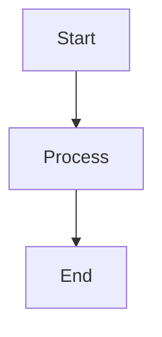

# Documentation Templates - Master Index

> [!abstract] Template Collection Overview
> Bộ sưu tập templates tối ưu cho Obsidian để tạo tài liệu nhất quán và chất lượng cao trong dự án My Digital Collection.

## 📚 Các Template Có Sẵn

> [!tip] Hướng Dẫn Chọn Template
> Chọn template phù hợp dựa trên loại tài liệu bạn cần tạo.

### 🏠 Template Section

| Template                    | Mục Đích                   | Khi Nào Sử Dụng            | Tính Năng Obsidian    |
| --------------------------- | -------------------------- | -------------------------- | --------------------- |
| [[Section README Template]] | README cho mỗi thư mục con | Tạo thư mục mới trong docs | Tags, Links, Dataview |

### 🔧 Tài Liệu Kỹ Thuật

| Template                           | Mục Đích              | Khi Nào Sử Dụng            | Obsidian Features            |
| ---------------------------------- | --------------------- | -------------------------- | ---------------------------- |
| [[API Documentation Template]]     | Tài liệu API chi tiết | Tạo/cập nhật API endpoints | Frontmatter, Callouts, Links |
| [[Service Documentation Template]] | Tài liệu microservice | Tạo service mới            | Templates, Graph View        |
| [[Deployment Guide Template]]      | Hướng dẫn triển khai  | Setup deployment process   | Mermaid, Checklists          |

### 📖 Tài Liệu Hướng Người Dùng

| Template                     | Mục Đích               | Khi Nào Sử Dụng         | Tính Năng Obsidian        |
| ---------------------------- | ---------------------- | ----------------------- | ------------------------- |
| [[Guide Tutorial Template]]  | Hướng dẫn step-by-step | Tạo tutorial hoặc guide | Progressive Summarization |
| [[Troubleshooting Template]] | Khắc phục sự cố        | Debug và fix issues     | Search, Quick Switcher    |

## 🎯 Cách Sử Dụng Templates

> [!example] Template Usage Workflow
> Quy trình sử dụng templates với Obsidian.

### 1. Choose Appropriate Template

```dataview
TABLE choice AS "Recommended Template"
FROM "templates"
WHERE contains(tags, "template")
SORT file.name ASC
```

### 2. Using Templates in Obsidian

> [!note] Template Plugin Setup
>
> 1. Install **Templater** plugin
> 2. Set template folder: `docs/assets/templates`
> 3. Configure hotkeys for quick access

#### Quick Template Insertion

-   **Hotkey**: `Ctrl/Cmd + T`
-   **Command**: `Templater: Insert Template`
-   **Location**: Templates menu in Command Palette

### 3. Customize Content

> [!warning] Template Variables
> Tất cả templates sử dụng `{{variable}}` syntax cho Templater plugin.

1. **Replace variables**: `{{Template Variable}}` với nội dung thực tế
2. **Update metadata**: Frontmatter YAML
3. **Add tags**: Để categorize và link
4. **Create connections**: Sử dụng `[[]]` links

## 🔧 Obsidian-Specific Features

> [!info] Why These Templates Work Great with Obsidian
> Templates được thiết kế tận dụng các tính năng mạnh của Obsidian.

### YAML Frontmatter

```yaml
---
title: "Document Title"
type: document-type
tags: [tag1, tag2]
aliases: [alias1, alias2]
created: 2024-01-01
updated: 2024-01-01
---
```

### Obsidian Callouts

```markdown
> [!info] Information
> Important information here

> [!tip] Pro Tip
> Helpful suggestions

> [!warning] Warning
> Important warnings

> [!example] Example
> Code examples and demonstrations
```

### Wiki-Style Links

```markdown
# Internal links

[[Document Name]]
[[Document Name|Display Text]]
[[Document Name#Section]]

# Links with embeds

![[Image.png]]
![[Document#Section]]
```

### Mermaid Diagrams



## 📝 Template Standards

> [!note] Documentation Standards
> Tất cả templates tuân theo standards sau.

### Naming Convention

-   **Files**: `kebab-case-template.md`
-   **Titles**: `Title Case Documentation`
-   **IDs**: `lowercase-id`

### Required Sections

1. **YAML Frontmatter** - Metadata
2. **Template Variables Info** - Hướng dẫn sử dụng
3. **Table of Contents** - Navigation
4. **Content Sections** - Main content
5. **Related Links** - Connections

### Tagging Strategy

```yaml
tags:
    - primary-category # Main document type
    - secondary-category # Sub-category
    - technology-stack # Tech used
    - status-indicator # Current status
```

## 🚀 Getting Started

> [!example] Quick Start Guide
> 3 bước để bắt đầu sử dụng templates.

### Step 1: Setup Obsidian

1. Install Obsidian
2. Open vault tại folder `docs/`
3. Install essential plugins:
    - **Templater** (templates)
    - **Dataview** (dynamic content)
    - **Advanced Tables** (table editing)

### Step 2: Configure Templates

1. Settings → Templater → Template folder path: `assets/templates`
2. Enable Templater trigger on new file creation
3. Set hotkeys for frequent templates

### Step 3: Create Your First Document

1. `Ctrl/Cmd + N` (new note)
2. `Ctrl/Cmd + T` (insert template)
3. Choose appropriate template
4. Fill in template variables
5. Save and enjoy!

## 🔗 Useful Resources

> [!info] Learning Resources
> Tài liệu để học thêm về Obsidian và templates.

### Official Documentation

-   [Obsidian Help](https://help.obsidian.md/) - Official documentation
-   [Templater Plugin](https://silentvoid13.github.io/Templater/) - Template engine

### Community Resources

-   [Obsidian Forum](https://forum.obsidian.md/) - Community support
-   [Template Examples](https://github.com/obsidianmd/obsidian-releases/releases) - Community templates

### Best Practices

-   [[Documentation Best Practices]] - Internal guidelines
-   [[Obsidian Workflow]] - Our team workflow
-   [[Knowledge Management]] - Information architecture

---

> [!info] Template Maintenance
> **Created**: {{date}}  
> **Last Updated**: {{date}}  
> **Maintained by**: {{maintainer}}  
> **Version**: v2.0 (Obsidian-optimized) 2. **Remove unused sections**: Xóa sections không cần thiết 3. **Add project-specific content**: Thêm nội dung riêng cho dự án 4. **Update metadata**: Dates, versions, maintainers

### 4. Review and Validate

-   [ ] All placeholders replaced
-   [ ] Links work correctly
-   [ ] Code examples tested
-   [ ] Grammar and spelling checked
-   [ ] Consistent formatting

## 📝 Template Structure Guidelines

### Common Elements

Tất cả templates bao gồm:

-   **📋 Mục Lục**: Navigation structure
-   **🎯 Tổng Quan**: Purpose and scope
-   **Prerequisites**: Required knowledge/tools
-   **Main Content**: Core information
-   **Examples**: Practical demonstrations
-   **References**: Related documentation
-   **Metadata**: Last updated, version, maintainer

### Writing Style

-   **Clear and Concise**: Avoid unnecessary complexity
-   **Action-Oriented**: Use imperative mood for instructions
-   **Consistent Terminology**: Use project glossary
-   **Visual Elements**: Use emojis, tables, code blocks
-   **Scannable**: Headers, lists, short paragraphs

### Code Examples

```markdown
# Always include:

-   Language specification
-   Complete, runnable examples
-   Expected output
-   Error handling
-   Comments explaining key concepts
```

## 🔄 Template Maintenance

### Version Control

| Version | Date       | Changes           | Maintainer  |
| ------- | ---------- | ----------------- | ----------- |
| 1.0     | 2024-01-15 | Initial templates | @maintainer |

### Review Schedule

-   **Monthly**: Check for outdated information
-   **Quarterly**: Review template effectiveness
-   **Per Release**: Update with new patterns/practices

### Feedback Process

1. **Identify Issues**: Collect feedback from template users
2. **Evaluate Impact**: Assess need for template updates
3. **Update Templates**: Make necessary improvements
4. **Communicate Changes**: Notify documentation team

## 🎨 Customization Guidelines

### Project-Specific Adaptations

#### Branding

-   Update company/project names
-   Add project-specific logos
-   Use consistent color schemes

#### Technology Stack

-   Replace technology examples
-   Update tool versions
-   Add project-specific configurations

#### Processes

-   Adapt to team workflows
-   Include company-specific procedures
-   Reference internal tools and systems

### Template Extensions

#### Adding Sections

```markdown
## 🆕 New Section

Content for project-specific needs

### Subsection

Detailed information
```

#### Custom Templates

For specialized documentation needs:

1. Start with closest existing template
2. Adapt structure and content
3. Document customizations
4. Share with team for reuse

## 📊 Template Metrics

### Usage Statistics

| Template              | Usage Count | Last Used  | Feedback Score |
| --------------------- | ----------- | ---------- | -------------- |
| API Documentation     | 15          | 2024-01-15 | 4.5/5          |
| Service Documentation | 8           | 2024-01-14 | 4.8/5          |
| Guide/Tutorial        | 12          | 2024-01-13 | 4.2/5          |
| Troubleshooting       | 6           | 2024-01-12 | 4.6/5          |
| Section README        | 25          | 2024-01-15 | 4.3/5          |

### Quality Metrics

-   **Completion Rate**: 95% (docs created from templates)
-   **Consistency Score**: 4.4/5 (team feedback)
-   **Update Frequency**: 2 weeks average between updates
-   **Template Effectiveness**: 87% reduction in documentation creation time

## 🚀 Quick Start

### For New Team Members

1. **Read this index** to understand available templates
2. **Review examples** in existing documentation
3. **Start with Section README** for new areas
4. **Use API/Service templates** for technical documentation
5. **Ask for review** before publishing

### For Experienced Users

```bash
# Quick template deployment
./scripts/create-doc.sh --template=api --output=docs/api/new-service.md
./scripts/create-doc.sh --template=service --output=docs/services/new-service.md
```

## 📞 Support

### Getting Help

-   **Documentation Team**: #docs-team
-   **Template Issues**: [GitHub Issues](https://github.com/project/docs/issues)
-   **Best Practices**: [Internal Wiki](https://wiki.company.com/docs)

### Contributing

-   **Template Improvements**: Submit PR with changes
-   **New Templates**: Discuss in #docs-team first
-   **Examples**: Share good documentation examples

---

## 📚 Related Resources

### Internal

-   [Writing Style Guide](../contributing/writing-style-guide.md)
-   [Documentation Standards](../contributing/documentation-standards.md)
-   [Review Process](../contributing/review-process.md)

### External

-   [Markdown Guide](https://www.markdownguide.org/)
-   [Documentation Best Practices](https://www.writethedocs.org/guide/)
-   [Technical Writing Course](https://developers.google.com/tech-writing)

---

**Maintainer**: Documentation Team  
**Last Updated**: 2024-01-15  
**Next Review**: 2024-04-15  
**Version**: 1.0
