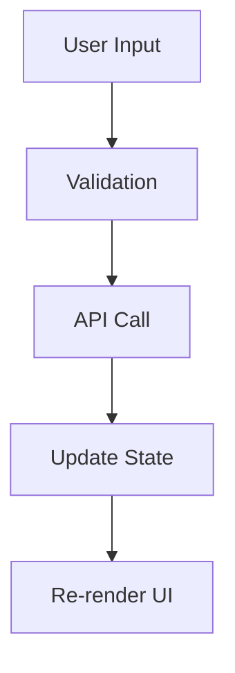

# 📋 Frontend Templates - Obsidian

> **Mục đích**: Tập hợp các templates chuẩn cho việc tạo tài liệu frontend trong Obsidian  
> **Ngôn ngữ**: Tiếng Việt  
> **Dự án**: ECommerce

## 🎯 Tổng Quan Templates

Bộ templates này được thiết kế để hỗ trợ việc tạo tài liệu có cấu trúc cho dự án frontend Next.js với TypeScript. Tất cả templates đều được viết bằng tiếng Việt và tối ưu hóa cho Obsidian.

## 📚 Danh Sách Templates

### 🧩 Component Development
- **[Component Template](./component-template.md)** - Tài liệu cho React components
  - Thiết kế và UI requirements
  - Props interface và type definitions
  - Testing strategy và examples
  - Accessibility và responsive design

### 📄 Page Documentation  
- **[Page Template](./page-template.md)** - Tài liệu cho Next.js pages
  - Route và navigation flow
  - Data requirements và API integration
  - SEO và metadata configuration
  - Performance optimization

### 🎣 Custom Hooks
- **[Hook Template](./hook-template.md)** - Tài liệu cho custom React hooks
  - API definition và parameters
  - Usage examples và best practices
  - Testing strategies
  - Performance considerations

### 🔄 State Management
- **[Store Template](./store-template.md)** - Tài liệu cho Redux slices
  - State structure và entity adapters
  - Actions và reducers
  - Selectors và custom hooks
  - Testing và debugging

### 🛠️ Utilities
- **[Utility Template](./utility-template.md)** - Tài liệu cho helper functions
  - Function signatures và type definitions
  - Error handling và validation
  - Performance optimization
  - Testing và monitoring

## 🚀 Cách Sử Dụng

### Cài Đặt Templates trong Obsidian

1. **Copy templates vào thư mục Templates**:
   ```
   .obsidian/
   └── templates/
       └── frontend/
           ├── component-template.md
           ├── page-template.md
           ├── hook-template.md
           ├── store-template.md
           └── utility-template.md
   ```

2. **Cấu hình Templater Plugin** (khuyến nghị):
   - Cài đặt Templater plugin
   - Cấu hình template folder: `templates/frontend`
   - Enable auto-completion cho template variables

3. **Cấu hình Core Templates Plugin**:
   - Settings → Core plugins → Templates
   - Template folder location: `templates/frontend`

### Tạo Tài Liệu Mới

#### Sử dụng Command Palette
1. `Ctrl/Cmd + P` → "Templates: Insert template"
2. Chọn template phù hợp
3. Điền thông tin vào các placeholder

#### Sử dụng Templater (Advanced)
1. `Ctrl/Cmd + P` → "Templater: Create new note from template"
2. Chọn template và tên file
3. Template sẽ tự động điền một số thông tin

### Template Variables

Các templates sử dụng các biến sau (Templater syntax):

```javascript
// Thông tin cơ bản
{{title}}           // Tên component/page/hook
{{date:YYYY-MM-DD}} // Ngày hiện tại
{{author}}          // Tác giả

// Component specific
{{ComponentName}}   // Tên component (PascalCase)
{{componentName}}   // Tên component (camelCase)
{{hookName}}        // Tên hook (use + PascalCase)

// Store specific  
{{sliceName}}       // Tên slice (camelCase)
{{SliceName}}       // Tên slice (PascalCase)
{{EntityType}}      // Type của entity
{{entityName}}      // Tên entity (camelCase)

// API specific
{{endpoint}}        // API endpoint
{{apiService}}      // Tên service API
```

## 🎨 Styling và Formatting

### Obsidian-specific Features

#### Callouts
```markdown
> [!info] Thông tin quan trọng
> Nội dung callout

> [!warning] Cảnh báo
> Lưu ý về performance hoặc breaking changes

> [!tip] Mẹo hữu ích  
> Best practices và optimization tips
```

#### Internal Links
```markdown
[[Component/Button]]           # Link đến component Button
[[Hook/useApi]]               # Link đến custom hook
[[Store/userSlice]]           # Link đến Redux slice
[[API/users]]                 # Link đến API documentation
```

#### Tags
```markdown
#frontend #component #react #nextjs #typescript
#bug #feature #performance #accessibility
```

#### Mermaid Diagrams


### Naming Conventions

#### File Names
- Components: `Button.md`, `UserProfile.md`
- Pages: `HomePage.md`, `UserDashboard.md`  
- Hooks: `useApi.md`, `useLocalStorage.md`
- Stores: `userSlice.md`, `collectionSlice.md`
- Utils: `formatDate.md`, `validateEmail.md`

#### Folder Structure trong Obsidian
```
📁 Frontend/
├── 📁 Components/
│   ├── Button.md
│   ├── UserProfile.md
│   └── Navigation.md
├── 📁 Pages/
│   ├── HomePage.md
│   └── UserDashboard.md
├── 📁 Hooks/
│   ├── useApi.md
│   └── useLocalStorage.md
├── 📁 Store/
│   ├── userSlice.md
│   └── collectionSlice.md
└── 📁 Utils/
    ├── formatDate.md
    └── validateEmail.md
```

## 🔗 Liên Kết và Tham Chiếu

### Internal Documentation Links
- [[Frontend/Setup]] - Hướng dẫn setup project
- [[Frontend/Architecture]] - Kiến trúc frontend
- [[Frontend/Guidelines]] - Coding guidelines
- [[API/Reference]] - API documentation

### External Resources
- [Next.js Documentation](https://nextjs.org/docs)
- [React Documentation](https://react.dev)
- [TypeScript Handbook](https://www.typescriptlang.org/docs)
- [Tailwind CSS](https://tailwindcss.com/docs)

## 📋 Checklist cho Template Mới

Khi tạo tài liệu mới từ template:

### Pre-work
- [ ] Xác định loại tài liệu cần tạo
- [ ] Chọn template phù hợp
- [ ] Chuẩn bị thông tin cần thiết

### During Creation
- [ ] Điền đầy đủ thông tin cơ bản
- [ ] Thay thế tất cả placeholder variables
- [ ] Tạo internal links phù hợp
- [ ] Thêm tags và categories

### Post-creation
- [ ] Review và edit content
- [ ] Tạo links từ tài liệu khác
- [ ] Update index pages nếu cần
- [ ] Share với team để review

## 🎯 Best Practices

### Viết Tài Liệu Hiệu Quả

1. **Clarity First**: Viết rõ ràng, dễ hiểu
2. **Code Examples**: Luôn có ví dụ code thực tế
3. **Visual Aids**: Sử dụng diagrams và screenshots
4. **Keep Updated**: Cập nhật khi code thay đổi

### Sử Dụng Obsidian Tối Ưu

1. **Linking**: Tạo nhiều internal links
2. **Tagging**: Sử dụng tags có hệ thống
3. **Search**: Optimize cho search functionality  
4. **Graph View**: Tận dụng knowledge graph

### Team Collaboration

1. **Naming**: Nhất quán trong naming convention
2. **Structure**: Giữ cấu trúc thư mục có tổ chức
3. **Reviews**: Peer review tài liệu quan trọng
4. **Updates**: Thông báo khi có changes lớn

## 🔄 Maintenance

### Cập Nhật Templates

Templates cần được cập nhật khi:
- Có thay đổi trong tech stack
- Phát hiện pattern mới cần document
- Feedback từ team về template usage
- Cải thiện structure hoặc content

### Version Control

Nếu sử dụng git để sync Obsidian vault:
```gitignore
.obsidian/workspace
.obsidian/cache/
.trash/
```

### Backup Strategy

1. **Git sync**: Sync vault với repository
2. **Export**: Regular exports sang other formats
3. **Cloud backup**: Sử dụng Obsidian Sync hoặc cloud storage

## 📞 Support

### Troubleshooting

**Template không load được**:
- Kiểm tra đường dẫn template folder
- Verify Templater plugin settings
- Restart Obsidian

**Variables không được replace**:
- Sử dụng Templater thay vì core Templates
- Kiểm tra syntax của template variables
- Verify plugin activation

**Links không hoạt động**:
- Kiểm tra file name matching
- Verify folder structure
- Update link paths

### Resources

- [Obsidian Help](https://help.obsidian.md/)
- [Templater Documentation](https://silentvoid13.github.io/Templater/)
- [Community Forums](https://forum.obsidian.md/)

---

**Tạo bởi**: Frontend Team  
**Cập nhật lần cuối**: {{date:YYYY-MM-DD}}  
**Version**: 1.0.0

**Tags**: #frontend #templates #obsidian #documentation
**Category**: [[Frontend/Documentation]]
