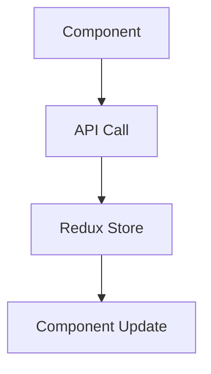

# {{title}}

> **Ngày tạo**: {{date:YYYY-MM-DD}}  
> **Tác giả**: {{author}}  
> **Loại**: Component  
> **Trạng thái**: [[Draft]] / [[In Progress]] / [[Review]] / [[Done]]

## 📝 Mô Tả

### Mục đích
Mô tả ngắn gọn về mục đích và chức năng của component này.

### Tình huống sử dụng
- Sử dụng khi nào?
- Giải quyết vấn đề gì?
- Phù hợp với use case nào?

## 🎯 Yêu Cầu Chức Năng

### Props Interface
```typescript
interface {{ComponentName}}Props {
  // Định nghĩa các props
}
```

### Chức năng chính
- [ ] Chức năng 1
- [ ] Chức năng 2
- [ ] Chức năng 3

## 🔗 Dependencies

### Internal Dependencies
- [[Component/{{RelatedComponent1}}]]
- [[Component/{{RelatedComponent2}}]]

### External Dependencies
- Package 1: Mục đích sử dụng
- Package 2: Mục đích sử dụng

## 🎨 Design & UI

### Wireframe/Mockup
![[{{wireframe-image}}]]

### Style Requirements
- **Breakpoints**: Mobile, Tablet, Desktop
- **Theme**: Light/Dark mode support
- **Accessibility**: WCAG 2.1 AA

### CSS Classes/Variants
```css
/* Primary variant */
.component-primary {
  /* styles */
}

/* Secondary variant */
.component-secondary {
  /* styles */
}
```

## 💻 Implementation

### File Structure
```
src/components/{{ComponentName}}/
├── index.ts              # Export file
├── {{ComponentName}}.tsx # Main component
├── {{ComponentName}}.test.tsx # Unit tests
├── {{ComponentName}}.stories.tsx # Storybook stories
└── types.ts              # Type definitions
```

### Code Example
```typescript
import React from 'react';

interface {{ComponentName}}Props {
  // Props definition
}

export const {{ComponentName}}: React.FC<{{ComponentName}}Props> = ({
  // Destructure props
}) => {
  return (
    <div>
      {/* Component JSX */}
    </div>
  );
};

export default {{ComponentName}};
```

## 📚 Usage Examples

### Basic Usage
```tsx
import { {{ComponentName}} } from '@/components/{{ComponentName}}';

function App() {
  return (
    <{{ComponentName}}
      prop1="value1"
      prop2="value2"
    />
  );
}
```

### Advanced Usage
```tsx
// Advanced example with hooks and context
```

## 🔄 State Management

### Local State
- State 1: Mục đích
- State 2: Mục đích

### Global State (Redux)
- Store slice: [[Store/{{SliceName}}]]
- Actions: `action1`, `action2`
- Selectors: `selector1`, `selector2`

## 🌐 API Integration

### API Endpoints
- `GET /api/{{endpoint}}` - Mô tả
- `POST /api/{{endpoint}}` - Mô tả

### Data Flow


## 📱 Responsive Design

### Breakpoints
- **Mobile** (< 768px): Behavior description
- **Tablet** (768px - 1024px): Behavior description  
- **Desktop** (> 1024px): Behavior description

### Media Queries
```css
@media (max-width: 768px) {
  /* Mobile styles */
}

@media (min-width: 769px) and (max-width: 1024px) {
  /* Tablet styles */
}
```

## 🔧 Performance

### Optimization Techniques
- [ ] React.memo for unnecessary re-renders
- [ ] useMemo for expensive calculations
- [ ] useCallback for event handlers
- [ ] Code splitting with lazy loading

### Bundle Analysis
- Bundle size impact: XXkB
- Performance metrics: LCP, FID, CLS

## 🐛 Known Issues

### Current Issues
- Issue 1: Mô tả và workaround
- Issue 2: Mô tả và workaround

### Future Improvements
- [ ] Improvement 1
- [ ] Improvement 2

## 📖 Related Documentation

### Internal Links
- [[Frontend/Setup]]
- [[Component/{{RelatedComponent}}]]
- [[Store/{{RelatedStore}}]]

### External Resources
- [React Documentation](https://react.dev)
- [Next.js Documentation](https://nextjs.org/docs)
- [Tailwind CSS](https://tailwindcss.com)

## 📅 Changelog

### Version 1.0.0 - {{date:YYYY-MM-DD}}
- Initial implementation
- Basic functionality

### Version 1.1.0 - {{date:YYYY-MM-DD}}
- Added feature X
- Fixed bug Y

---

**Tags**: #frontend #component #react #nextjs #typescript
**Category**: [[Frontend/Components]]
**Priority**: High/Medium/Low
