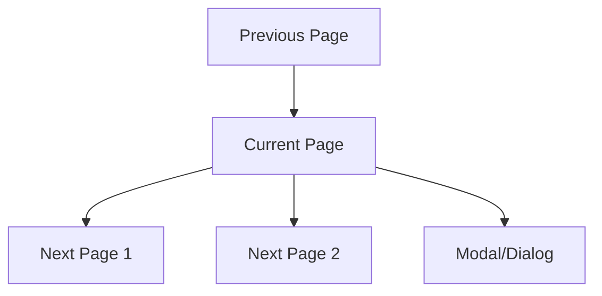

# {{title}}

> **Ngày tạo**: {{date:YYYY-MM-DD}}  
> **Tác giả**: {{author}}  
> **Loại**: Page  
> **Route**: /{{route}}  
> **Trạng thái**: [[Draft]] / [[In Progress]] / [[Review]] / [[Done]]

## 📝 Mô Tả

### Mục đích trang
Mô tả chi tiết về mục đích, chức năng và vai trò của trang trong ứng dụng.

### User Stories
- **Là** {{user-type}}, **tôi muốn** {{action}}, **để** {{benefit}}
- **Là** {{user-type}}, **tôi muốn** {{action}}, **để** {{benefit}}

## 🗺️ Navigation & Routing

### Route Information
- **Path**: `/{{route-path}}`
- **Dynamic Routes**: `[id]`, `[slug]`
- **Query Parameters**: `?param1=value&param2=value`

### Navigation Flow


### Breadcrumb
```
Home > {{Parent Category}} > {{Current Page}}
```

## 🎨 UI/UX Design

### Layout Structure
```
┌─────────────────────────────────┐
│ Header Navigation               │
├─────────────────────────────────┤
│ Page Title & Actions            │
├─────────────────────────────────┤
│ Main Content Area               │
│ ┌─────────┐ ┌─────────────────┐ │
│ │ Sidebar │ │ Primary Content │ │
│ │         │ │                 │ │
│ │         │ │                 │ │
│ └─────────┘ └─────────────────┘ │
├─────────────────────────────────┤
│ Footer                          │
└─────────────────────────────────┘
```

### Wireframe/Mockup
![[{{wireframe-image}}]]

### Design Tokens
- **Colors**: Primary, Secondary, Accent
- **Typography**: Heading levels, body text
- **Spacing**: Margins, padding, gaps
- **Shadows**: Card shadows, hover effects

## 🧩 Components Used

### Page-specific Components
- [[Component/{{Component1}}]] - Mục đích sử dụng
- [[Component/{{Component2}}]] - Mục đích sử dụng
- [[Component/{{Component3}}]] - Mục đích sử dụng

### Shared Components
- [[Component/Header]] - Navigation header
- [[Component/Footer]] - Page footer
- [[Component/Sidebar]] - Navigation sidebar

## 📡 Data Requirements

### API Endpoints
- `GET /api/{{endpoint1}}` - Lấy dữ liệu chính
- `POST /api/{{endpoint2}}` - Tạo mới
- `PUT /api/{{endpoint3}}` - Cập nhật
- `DELETE /api/{{endpoint4}}` - Xóa

### Data Models
```typescript
interface {{PageData}} {
  id: string;
  title: string;
  // Other properties
}

interface {{FormData}} {
  field1: string;
  field2: number;
  // Other fields
}
```

### Loading States
- [ ] Initial page load
- [ ] Data fetching
- [ ] Form submission
- [ ] Navigation transitions

## 🔄 State Management

### Page State
```typescript
interface {{PageName}}State {
  data: {{DataType}}[];
  loading: boolean;
  error: string | null;
  filters: {{FilterType}};
  pagination: {
    page: number;
    limit: number;
    total: number;
  };
}
```

### Redux Integration
- **Slice**: [[Store/{{SliceName}}]]
- **Actions**: 
  - `fetch{{DataType}}s`
  - `create{{DataType}}`
  - `update{{DataType}}`
  - `delete{{DataType}}`
- **Selectors**:
  - `select{{DataType}}s`
  - `select{{DataType}}Loading`
  - `select{{DataType}}Error`

## 💻 Implementation

### File Structure
```
src/app/{{route-path}}/
├── page.tsx              # Main page component
├── loading.tsx           # Loading UI
├── error.tsx             # Error UI
├── not-found.tsx         # 404 UI
├── layout.tsx            # Page layout (if needed)
├── components/           # Page-specific components
│   ├── {{Component1}}.tsx
│   └── {{Component2}}.tsx
└── types.ts              # Page-specific types
```

### Page Component
```typescript
import { Metadata } from 'next';

export const metadata: Metadata = {
  title: '{{Page Title}}',
  description: '{{Page Description}}',
};

interface {{PageName}}Props {
  params: { id: string };
  searchParams: { [key: string]: string | string[] | undefined };
}

export default async function {{PageName}}Page({
  params,
  searchParams,
}: {{PageName}}Props) {
  // Server-side data fetching
  const data = await fetch{{DataType}}s();

  return (
    <div className="{{page-container-classes}}">
      <PageHeader title="{{Page Title}}" />
      <PageContent data={data} />
      <PageFooter />
    </div>
  );
}
```

## 📱 Responsive Design

### Breakpoint Behavior
- **Mobile** (< 768px):
  - Stack layout vertically
  - Hide secondary content
  - Simplified navigation
  
- **Tablet** (768px - 1024px):
  - Two-column layout
  - Condensed sidebar
  - Touch-optimized interactions
  
- **Desktop** (> 1024px):
  - Full multi-column layout
  - Expanded sidebar
  - Mouse/keyboard interactions

### Responsive Components
```tsx
// Mobile-first responsive component
<div className="
  grid grid-cols-1 gap-4
  md:grid-cols-2 md:gap-6
  lg:grid-cols-3 lg:gap-8
">
  {/* Content */}
</div>
```

## 🔐 Authentication & Authorization

### Access Control
- **Public**: Accessible without login
- **Protected**: Requires authentication
- **Role-based**: Specific roles required

### Auth Checks
```typescript
// Server-side auth check
const session = await getServerSession();
if (!session) {
  redirect('/login');
}

// Client-side auth check
const { user, loading } = useAuth();
if (loading) return <LoadingSpinner />;
if (!user) return <LoginPrompt />;
```

## ⚡ Performance Optimization

### Next.js Features
- [ ] Static Generation (SSG)
- [ ] Server-Side Rendering (SSR)
- [ ] Incremental Static Regeneration (ISR)
- [ ] Client-side Navigation

### Optimization Techniques
- [ ] Image optimization with next/image
- [ ] Font optimization with next/font
- [ ] Code splitting with dynamic imports
- [ ] Prefetching with Link component

### Caching Strategy
- Static content: Edge caching
- Dynamic content: SWR/React Query
- API responses: Redis cache

## 🧪 Testing Strategy

### Test Types
- [ ] Unit tests for components
- [ ] Integration tests for data flow
- [ ] E2E tests for user journeys
- [ ] Visual regression tests

### Test Cases
```typescript
describe('{{PageName}} Page', () => {
  it('should render page content', () => {
    // Test implementation
  });
  
  it('should handle navigation', () => {
    // Test implementation
  });
  
  it('should display loading state', () => {
    // Test implementation
  });
  
  it('should handle error states', () => {
    // Test implementation
  });
});
```

## 🌐 SEO & Metadata

### Meta Tags
```typescript
export const metadata: Metadata = {
  title: '{{Page Title}} | My Digital Collection',
  description: '{{Page Description}}',
  keywords: ['{{keyword1}}', '{{keyword2}}', '{{keyword3}}'],
  openGraph: {
    title: '{{Page Title}}',
    description: '{{Page Description}}',
    images: ['/og-image.jpg'],
  },
  twitter: {
    card: 'summary_large_image',
    title: '{{Page Title}}',
    description: '{{Page Description}}',
  },
};
```

### Structured Data
```json
{
  "@context": "https://schema.org",
  "@type": "WebPage",
  "name": "{{Page Title}}",
  "description": "{{Page Description}}",
  "url": "{{Page URL}}"
}
```

## ♿ Accessibility

### WCAG Compliance
- [ ] Level A requirements
- [ ] Level AA requirements
- [ ] Level AAA requirements (where applicable)

### Accessibility Features
- **Semantic HTML**: Proper heading hierarchy
- **ARIA Labels**: Screen reader support
- **Keyboard Navigation**: Tab order and shortcuts
- **Focus Management**: Visible focus indicators
- **Color Contrast**: WCAG AA compliance

### Screen Reader Testing
- [ ] NVDA testing
- [ ] JAWS testing
- [ ] VoiceOver testing

## 🐛 Error Handling

### Error Boundaries
```typescript
// Error boundary for page-level errors
class {{PageName}}ErrorBoundary extends React.Component {
  // Error boundary implementation
}
```

### Error States
- **Network Errors**: Connection issues
- **API Errors**: Server-side errors
- **Validation Errors**: Form validation
- **Not Found**: Missing resources

### Error Recovery
- Retry mechanisms
- Fallback content
- Error reporting

## 📊 Analytics & Tracking

### Events to Track
- Page views
- User interactions
- Form submissions
- Error occurrences

### Analytics Implementation
```typescript
// Google Analytics 4
gtag('event', 'page_view', {
  page_title: '{{Page Title}}',
  page_location: window.location.href,
});

// Custom events
gtag('event', 'user_action', {
  action_type: 'button_click',
  element_id: 'submit_button',
});
```

## 🔧 Development Tools

### Development Commands
```bash
# Start development server
npm run dev

# Build for production
npm run build

# Run tests
npm run test

# Run linting
npm run lint
```

### Debugging
- React DevTools
- Redux DevTools
- Next.js debugging
- Network tab inspection

## 📖 Related Documentation

### Internal Links
- [[Frontend/Setup]]
- [[Frontend/Components]]
- [[Frontend/Store]]
- [[API/{{RelatedAPI}}]]

### External Resources
- [Next.js App Router](https://nextjs.org/docs/app)
- [React Server Components](https://react.dev/reference/react/use-server)
- [TypeScript Handbook](https://www.typescriptlang.org/docs/)

## 📅 Changelog

### Version 1.0.0 - {{date:YYYY-MM-DD}}
- Initial page implementation
- Basic functionality and styling

### Version 1.1.0 - {{date:YYYY-MM-DD}}
- Added feature X
- Improved performance
- Fixed accessibility issues

---

**Tags**: #frontend #page #nextjs #routing #ui-ux
**Category**: [[Frontend/Pages]]
**Priority**: High/Medium/Low
