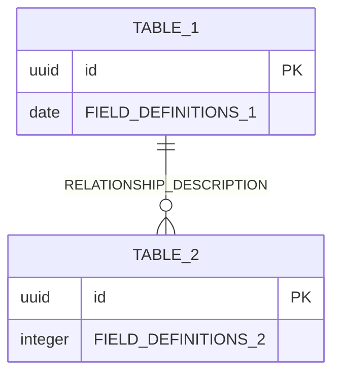

# {{SERVICE_NAME}} Database Schema

## 📋 Tổng quan

{{SERVICE_DESCRIPTION}}. **Không có foreign key references đến services khác** - sử dụng Event-Driven Architecture để communication.

Service này quản lý:

-   {{FEATURE_1}}
-   {{FEATURE_2}}
-   {{FEATURE_3}}
-   {{FEATURE_4}}
-   {{FEATURE_5}}
-   {{FEATURE_6}}

## 🗃️ Database Information

| Property              | Value               |
| --------------------- | ------------------- |
| Database Name         | `{{DATABASE_NAME}}` |
| Schema Version        | {{SCHEMA_VERSION}}  |
| Engine                | PostgreSQL 15.x     |
| Charset               | UTF8                |
| Collation             | utf8_unicode_ci     |
| **Event Integration** | ✅ Kafka/RabbitMQ   |
| **Security Level**    | {{SECURITY_LEVEL}}  |

## 📊 Entity Relationship Diagram



## 📋 Table Definitions

### 1. {{primary_table_name}}

{{TABLE_DESCRIPTION}}

| Column       | Type       | Constraints      | Description        |
| ------------ | ---------- | ---------------- | ------------------ |
| id           | UUID       | PRIMARY KEY      | Unique identifier  |
| {{COLUMN_1}} | {{TYPE_1}} | {{CONSTRAINT_1}} | {{DESC_1}}         |
| {{COLUMN_2}} | {{TYPE_2}} | {{CONSTRAINT_2}} | {{DESC_2}}         |
| {{COLUMN_3}} | {{TYPE_3}} | {{CONSTRAINT_3}} | {{DESC_3}}         |
| created_at   | TIMESTAMP  | NOT NULL         | Thời gian tạo      |
| updated_at   | TIMESTAMP  | NULLABLE         | Thời gian cập nhật |

#### {{CUSTOM_SECTION_NAME}} Schema

```json
{
    "{{json_field}}": {
        "{{property_1}}": "{{value_1}}",
        "{{property_2}}": "{{value_2}}",
        "{{nested_object}}": {
            "{{nested_prop}}": "{{nested_value}}"
        }
    }
}
```

#### Business Rules

-   {{BUSINESS_RULE_1}}
-   {{BUSINESS_RULE_2}}
-   {{BUSINESS_RULE_3}}
-   {{BUSINESS_RULE_4}}

### 2. {{secondary_table_name}}

{{SECONDARY_TABLE_DESCRIPTION}}

| Column        | Type       | Constraints      | Description        |
| ------------- | ---------- | ---------------- | ------------------ |
| id            | UUID       | PRIMARY KEY      | Unique identifier  |
| {{FK_COLUMN}} | UUID       | FOREIGN KEY      | {{FK_DESCRIPTION}} |
| {{COLUMN_A}}  | {{TYPE_A}} | {{CONSTRAINT_A}} | {{DESC_A}}         |
| {{COLUMN_B}}  | {{TYPE_B}} | {{CONSTRAINT_B}} | {{DESC_B}}         |
| created_at    | TIMESTAMP  | NOT NULL         | Thời gian tạo      |

#### Business Rules

-   {{SECONDARY_RULE_1}}
-   {{SECONDARY_RULE_2}}

## 🔍 Indexes

### Primary Indexes

```sql
-- Auto-created primary key indexes
CREATE UNIQUE INDEX pk_{{table_1}} ON {{table_1}}(id);
CREATE UNIQUE INDEX pk_{{table_2}} ON {{table_2}}(id);
```

### Unique Indexes

```sql
-- Business unique constraints
CREATE UNIQUE INDEX uk_{{table_1}}_{{unique_field}} ON {{table_1}}({{unique_columns}});
```

### Foreign Key Indexes

```sql
-- For better join performance
CREATE INDEX idx_{{table_1}}_{{fk_field}} ON {{table_1}}({{fk_field}});
```

### Composite Indexes

```sql
-- For common query patterns
CREATE INDEX idx_{{table_1}}_{{composite_name}} ON {{table_1}}({{field_1}}, {{field_2}});

-- Search indexes
CREATE INDEX idx_{{table_1}}_search ON {{table_1}} USING gin(to_tsvector('english', {{search_field}}));

-- JSONB indexes
CREATE INDEX idx_{{table_1}}_{{jsonb_field}}_gin ON {{table_1}} USING gin({{jsonb_field}});
```

## 🔒 Security Constraints

### Data Validation

```sql
-- {{validation_description}}
ALTER TABLE {{table_name}} ADD CONSTRAINT chk_{{table_name}}_{{field_name}}
    CHECK ({{validation_condition}});

-- {{validation_description_2}}
ALTER TABLE {{table_name}} ADD CONSTRAINT chk_{{table_name}}_{{field_name_2}}
    CHECK ({{validation_condition_2}});
```

## 🚨 Business Rules

### {{BUSINESS_DOMAIN_1}}

1. **{{RULE_CATEGORY_1}}**

    - {{RULE_1_DETAIL_1}}
    - {{RULE_1_DETAIL_2}}
    - {{RULE_1_DETAIL_3}}

2. **{{RULE_CATEGORY_2}}**

    - {{RULE_2_DETAIL_1}}
    - {{RULE_2_DETAIL_2}}
    - {{RULE_2_DETAIL_3}}

### {{BUSINESS_DOMAIN_2}}

1. **{{RULE_CATEGORY_3}}**

    - {{RULE_3_DETAIL_1}}
    - {{RULE_3_DETAIL_2}}
    - {{RULE_3_DETAIL_3}}

### Data Integrity & Validation

1. **Schema Validation**

    - {{SCHEMA_RULE_1}}
    - {{SCHEMA_RULE_2}}
    - {{SCHEMA_RULE_3}}

2. **{{VALIDATION_CATEGORY}}**

    - {{VALIDATION_RULE_1}}
    - {{VALIDATION_RULE_2}}
    - {{VALIDATION_RULE_3}}

## 🔐 Enhanced Security Features

### Data Privacy Views

```sql
-- View for {{view_purpose}}
CREATE VIEW {{view_name}} AS
SELECT
    {{view_columns}}
FROM {{source_table}} {{alias}}
WHERE {{privacy_conditions}}
ORDER BY {{order_criteria}};
```

### Access Control Functions

```sql
-- Function to check {{access_type}}
CREATE OR REPLACE FUNCTION {{access_check_function}}(
    {{parameters}}
)
RETURNS boolean AS $$
DECLARE
    {{variable_declarations}}
BEGIN
    -- {{access_logic_description}}
    {{access_check_logic}}

    RETURN {{return_condition}};
END;
$$ LANGUAGE plpgsql;
```

---

**Last Updated**: {{LAST_UPDATED_DATE}}  
**Version**: {{CURRENT_VERSION}}  
**Schema Migration**: {{MIGRATION_VERSION}} (Latest)  
**Maintained by**: {{TEAM_NAME}}

## 📚 Related Documentation

-   [[{{SERVICE_NAME}} Documentation]] - Service overview và architecture
-   [[{{SERVICE_NAME}} API Documentation]] - API endpoints và usage
-   [[{{SERVICE_NAME}} Deployment Guide]] - Deployment instructions
-   [[Migration Guide {{MIGRATION_VERSION}}]] - {{MIGRATION_DESCRIPTION}}
-   [[{{GUIDE_NAME_1}}]] - {{GUIDE_DESCRIPTION_1}}
-   [[{{GUIDE_NAME_2}}]] - {{GUIDE_DESCRIPTION_2}}

## 🔄 Migration History

| Version | Date       | Description          | Migration File       |
| ------- | ---------- | -------------------- | -------------------- |
| 1.0.0   | {{DATE_1}} | {{MIGRATION_DESC_1}} | {{MIGRATION_FILE_1}} |
| 1.0.1   | {{DATE_2}} | {{MIGRATION_DESC_2}} | {{MIGRATION_FILE_2}} |
| {{VER}} | {{DATE_N}} | {{MIGRATION_DESC_N}} | {{MIGRATION_FILE_N}} |

## 🚀 Migration Benefits ({{LATEST_VERSION}})

### **Advantages of {{LATEST_FEATURE}}**

1. **{{BENEFIT_CATEGORY_1}}**

    - {{BENEFIT_1_DETAIL_1}}
    - {{BENEFIT_1_DETAIL_2}}

2. **{{BENEFIT_CATEGORY_2}}**
    - {{BENEFIT_2_DETAIL_1}}
    - {{BENEFIT_2_DETAIL_2}}
