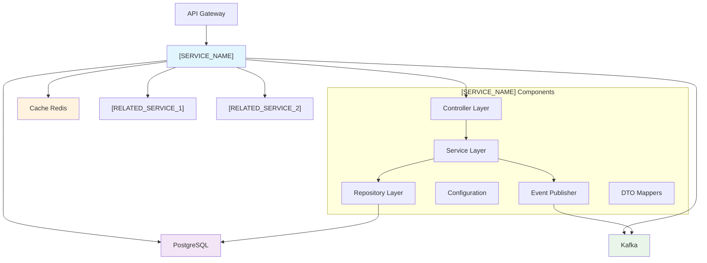
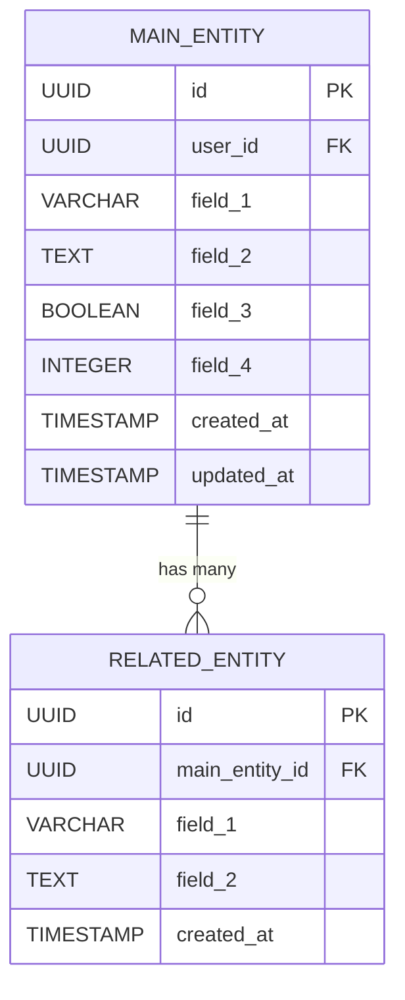

# [SERVICE_NAME] - Service Documentation

> [!warning] 📝 Hướng Dẫn Sử Dụng Template
> **Để sử dụng template này:**
>
> 1. Thay thế tất cả các placeholder `[VARIABLE_NAME]` bằng giá trị thực tế
> 2. Xóa hoặc cập nhật các section không cần thiết
> 3. Cập nhật diagrams và code examples cho phù hợp
> 4. Remove hướng dẫn này sau khi hoàn thành
>
> > **Template Variables:**
>
> -   `[SERVICE_NAME]`: Tên service (ví dụ: Collection Service)
> -   `[SERVICE_ID]`: ID service (ví dụ: collection-service)
> -   `[PORT]`: Port chạy service (ví dụ: 8082)
> -   `[YYYY-MM-DD]`: Ngày tháng theo format ISO (ví dụ: 2025-09-06)
> -   `[MAIN_ENTITY]`: Entity chính của service (ví dụ: Collection)
> -   `[RESOURCE]`: Resource API (ví dụ: collections)
> -   `[DATABASE_NAME]`: Tên database (ví dụ: mydc_collections)

## 📋 Mục Lục

-   [[#🎯 Tổng Quan]]
-   [[#🏗️ Kiến Trúc]]
-   [[#⚙️ Cấu Hình]]
-   [[#📡 APIs]]
-   [[#🗄️ Cơ Sở Dữ Liệu]]
-   [[#📦 Phụ Thuộc]]
-   [[#🚀 Triển Khai]]
-   [[#📊 Giám Sát]]
-   [[#🔧 Khắc Phục Sự Cố]]
-   [[#📚 Tài Liệu Liên Quan]]

## 🎯 Tổng Quan

> [!abstract] Service Information
> **Service Name**: [SERVICE_NAME]  
> **Service ID**: [SERVICE_ID]  
> **Version**: v1.0.0  
> **Port**: [PORT]  
> **Health Check**: `/actuator/health`  
> **Maintainer**: @huy1235588  
> **Repository**: [[SERVICE_ID Repository]]  
> **Status**: development

### Mô Tả

[SERVICE_NAME] là microservice chịu trách nhiệm [MAIN_RESPONSIBILITY] trong hệ thống My Digital Collection. Service này [SERVICE_PURPOSE_DESCRIPTION].

Service giải quyết các vấn đề business chính:

-   [BUSINESS_PROBLEM_1]
-   [BUSINESS_PROBLEM_2]
-   [BUSINESS_PROBLEM_3]

### Chức Năng Chính

-   [x] **[MAIN_FEATURE_1]** - [FEATURE_DESCRIPTION_1]
-   [x] **[MAIN_FEATURE_2]** - [FEATURE_DESCRIPTION_2]
-   [x] **[MAIN_FEATURE_3]** - [FEATURE_DESCRIPTION_3]
-   [x] **[MAIN_FEATURE_4]** - [FEATURE_DESCRIPTION_4]
-   [ ] **[FUTURE_FEATURE_1]** - [FUTURE_DESCRIPTION_1] (🚧 Đang phát triển)
-   [ ] **[FUTURE_FEATURE_2]** - [FUTURE_DESCRIPTION_2] (📝 Trong kế hoạch)

### Business Logic Overview

[SERVICE_NAME] quản lý toàn bộ lifecycle của [MAIN_ENTITY] từ lúc [LIFECYCLE_START] đến [LIFECYCLE_END]. Service này tích hợp chặt chẽ với [RELATED_SERVICE_1] để [INTEGRATION_PURPOSE_1] và với [RELATED_SERVICE_2] để [INTEGRATION_PURPOSE_2]. Khi có thay đổi quan trọng, service sẽ publish events thông qua Kafka để các service khác có thể phản ứng phù hợp.

> [!tip] Quick Links
>
> -   [[SERVICE_NAME API Documentation]] - API documentation chi tiết
> -   [[SERVICE_NAME Deployment Guide]] - Hướng dẫn deploy
> -   [[SERVICE_NAME Troubleshooting]] - Khắc phục sự cố
> -   [[Service Architecture Overview]] - Tổng quan architecture

## 🏗️ Kiến Trúc

> [!note] 📐 Architecture Overview
> [SERVICE_NAME] được thiết kế theo kiến trúc microservice với responsibility rõ ràng cho việc [SERVICE_RESPONSIBILITY]. Service tương tác đồng bộ với [SYNC_SERVICES] qua REST API, đồng thời sử dụng Kafka để publish events bất đồng bộ.

### Sơ Đồ Kiến Trúc Service

> Cập nhật diagram này với các component thực tế của service:



### Technology Stack

| Component     | Technology        | Version | Notes                           |
| ------------- | ----------------- | ------- | ------------------------------- |
| Runtime       | Eclipse Temurin   | 21      | Java Virtual Machine            |
| Framework     | Spring Boot       | 3.1.0   | Microservice framework          |
| Database      | PostgreSQL        | 15.0    | Primary data storage            |
| Cache         | Redis             | 7.0     | Session và performance caching  |
| Message Queue | Apache Kafka      | 3.4     | Event streaming platform        |
| Auth          | Spring Security   | 6.1     | Authentication và authorization |
| ORM           | Spring Data JPA   | 3.1.0   | Object-relational mapping       |
| Documentation | SpringDoc OpenAPI | 2.1.0   | API documentation               |

### Project Structure

```
[SERVICE_ID]/
├── src/
│   ├── main/
│   │   ├── java/
│   │   │   └── org/ha/[SERVICE_ID]/
│   │   │       ├── [SERVICE_ID]Application.java
│   │   │       ├── config/
│   │   │       │   ├── DatabaseConfig.java
│   │   │       │   ├── KafkaConfig.java
│   │   │       │   └── SecurityConfig.java
│   │   │       ├── controller/
│   │   │       │   └── [MAIN_ENTITY]Controller.java
│   │   │       ├── service/
│   │   │       │   └── [MAIN_ENTITY]Service.java
│   │   │       ├── repository/
│   │   │       │   └── [MAIN_ENTITY]Repository.java
│   │   │       ├── model/
│   │   │       │   └── [MAIN_ENTITY].java
│   │   │       ├── dto/
│   │   │       │   └── [MAIN_ENTITY]DTO.java
│   │   │       ├── event/
│   │   │       │   ├── [MAIN_ENTITY]CreatedEvent.java
│   │   │       │   └── [MAIN_ENTITY]UpdatedEvent.java
│   │   │       └── exception/
│   │   │           └── [MAIN_ENTITY]NotFoundException.java
│   │   └── resources/
│   │       ├── application.yml
│   │       ├── db/migration/
│   │       │   └── V001__create_[RESOURCE]_table.sql
│   │       └── static/
│   └── test/
│       └── java/
│           └── org/ha/[SERVICE_ID]/
│               ├── service/
│               ├── controller/
│               └── integration/
├── pom.xml
├── docker-compose.yml
├── Dockerfile
└── README.md
```

## ⚙️ Cấu Hình

> [!gear] Configuration Guide
> Hướng dẫn cấu hình chi tiết cho [SERVICE_NAME].

### Environment Variables

| Variable                         | Description                   | Default                      | Required | Example                                     |
| -------------------------------- | ----------------------------- | ---------------------------- | -------- | ------------------------------------------- |
| `SERVER_PORT`                    | Port chạy service             | [PORT]                       | No       | [PORT]                                      |
| `SPRING_DATASOURCE_URL`          | Database connection URL       | -                            | Yes      | jdbc:postgresql://localhost/[DATABASE_NAME] |
| `SPRING_DATASOURCE_USERNAME`     | Database username             | -                            | Yes      | postgres                                    |
| `SPRING_DATASOURCE_PASSWORD`     | Database password             | -                            | Yes      | password123                                 |
| `SPRING_REDIS_HOST`              | Redis host                    | localhost                    | No       | redis                                       |
| `SPRING_REDIS_PORT`              | Redis port                    | 6379                         | No       | 6379                                        |
| `SPRING_KAFKA_BOOTSTRAP_SERVERS` | Kafka bootstrap servers       | localhost:9092               | No       | kafka:9092                                  |
| `EUREKA_CLIENT_SERVICE_URL`      | Eureka discovery server URL   | http://localhost:8761/eureka | No       | http://discovery-service:8761/eureka        |
| `[EXTERNAL_SERVICE_1]_URL`       | [External service 1] base URL | http://localhost:[PORT]      | Yes      | http://[external-service]:8081              |
| `LOGGING_LEVEL_ORG_HA`           | Logging level                 | INFO                         | No       | DEBUG                                       |

### Configuration Files

#### application.yml (Primary Config)

```yaml
server:
    port: ${SERVER_PORT:[PORT]}

spring:
    application:
        name: [SERVICE_ID]
    datasource:
        url: ${SPRING_DATASOURCE_URL}
        username: ${SPRING_DATASOURCE_USERNAME}
        password: ${SPRING_DATASOURCE_PASSWORD}
        driver-class-name: org.postgresql.Driver
    jpa:
        hibernate:
            ddl-auto: validate
        properties:
            hibernate:
                dialect: org.hibernate.dialect.PostgreSQLDialect
                format_sql: true
        show-sql: false
    flyway:
        enabled: true
        locations: classpath:db/migration
    redis:
        host: ${SPRING_REDIS_HOST:localhost}
        port: ${SPRING_REDIS_PORT:6379}
        timeout: 2000ms
    kafka:
        bootstrap-servers: ${SPRING_KAFKA_BOOTSTRAP_SERVERS:localhost:9092}
        producer:
            key-serializer: org.apache.kafka.common.serialization.StringSerializer
            value-serializer: org.springframework.kafka.support.serializer.JsonSerializer

eureka:
    client:
        service-url:
            defaultZone: ${EUREKA_CLIENT_SERVICE_URL:http://localhost:8761/eureka}
    instance:
        prefer-ip-address: true

management:
    endpoints:
        web:
            exposure:
                include: health,info,metrics,prometheus
    endpoint:
        health:
            show-details: always

# External Services Configuration
external-services:
    [external-service-1]:
        url: ${[EXTERNAL_SERVICE_1]_URL:http://localhost:[PORT]}

logging:
    level:
        org.ha: ${LOGGING_LEVEL_ORG_HA:INFO}
        org.springframework.web: DEBUG
```

### Runtime Configuration

```bash
# JVM Configuration
JAVA_OPTS=-Xmx1g -Xms512m -XX:+UseG1GC -XX:MaxGCPauseMillis=100

# Resource Limits (Docker/K8s)
resources:
  requests:
    memory: "512Mi"
    cpu: "250m"
  limits:
    memory: "1Gi"
    cpu: "500m"
```

## 📡 APIs

> [!api] API Documentation
> Chi tiết về các endpoints và interfaces mà [SERVICE_NAME] cung cấp.

### REST Endpoints

| Method | Path                      | Description              | Auth Required | Rate Limit |
| ------ | ------------------------- | ------------------------ | ------------- | ---------- |
| GET    | `/actuator/health`        | Health check             | No            | -          |
| GET    | `/actuator/info`          | Service info             | No            | -          |
| GET    | `/api/v1/[RESOURCE]`      | List [RESOURCE]          | Yes           | 100/min    |
| POST   | `/api/v1/[RESOURCE]`      | Create new [MAIN_ENTITY] | Yes           | 20/min     |
| GET    | `/api/v1/[RESOURCE]/{id}` | Get [MAIN_ENTITY] by ID  | Yes           | 100/min    |
| PUT    | `/api/v1/[RESOURCE]/{id}` | Update [MAIN_ENTITY]     | Yes           | 50/min     |
| DELETE | `/api/v1/[RESOURCE]/{id}` | Delete [MAIN_ENTITY]     | Yes           | 10/min     |

### API Schemas

#### [MAIN_ENTITY] Model

```json
{
    "id": "uuid",
    "[FIELD_1]": "string",
    "[FIELD_2]": "string",
    "[FIELD_3]": "boolean",
    "[FIELD_4]": "number",
    "createdAt": "datetime",
    "updatedAt": "datetime"
}
```

### Event Publishing

```yaml
# Message Queue Topics/Events
published_events:
  - name: [SERVICE_ID].[MAIN_ENTITY].created
    description: Triggered when [MAIN_ENTITY] is created
    schema: [MAIN_ENTITY]CreatedEvent

  - name: [SERVICE_ID].[MAIN_ENTITY].updated
    description: Triggered when [MAIN_ENTITY] is updated
    schema: [MAIN_ENTITY]UpdatedEvent

  - name: [SERVICE_ID].[MAIN_ENTITY].deleted
    description: Triggered when [MAIN_ENTITY] is deleted
    schema: [MAIN_ENTITY]DeletedEvent
```

### Event Consuming

```yaml
# Message Queue Consumers
consumed_events:
  - topic: [EXTERNAL_SERVICE_1].[EVENT_TYPE]
    description: Handle [EVENT_DESCRIPTION]
    handler: [EVENT_TYPE]EventHandler
    retry_policy: exponential_backoff

  - topic: [EXTERNAL_SERVICE_2].[EVENT_TYPE]
    description: Handle [EVENT_DESCRIPTION]
    handler: [EVENT_TYPE]EventHandler
    retry_policy: fixed_delay
```

### OpenAPI/Swagger

-   **Swagger UI**: `http://localhost:[PORT]/swagger-ui.html`
-   **OpenAPI Spec**: `http://localhost:[PORT]/v3/api-docs`
-   **API Documentation**: [[SERVICE_NAME API Reference]]

### OpenAPI/Swagger

-   **Swagger UI**: `http://localhost:[PORT]/swagger-ui.html`
-   **OpenAPI Spec**: `http://localhost:[PORT]/v3/api-docs`
-   **API Documentation**: [[SERVICE_NAME API Reference]]

## 🗄️ Cơ Sở Dữ Liệu

> [!database] Database Design
> Chi tiết về thiết kế cơ sở dữ liệu và schema cho [SERVICE_NAME].

### Database Overview

| Property        | Value                          |
| --------------- | ------------------------------ |
| Database Type   | PostgreSQL                     |
| Version         | 15.0                           |
| Host            | localhost                      |
| Port            | 5432                           |
| Database Name   | [DATABASE_NAME]                |
| Connection Pool | HikariCP (default Spring Boot) |

### Entity Relationship Diagram



### Schema Definition

#### [MAIN_ENTITY]S Table

```sql
-- [MAIN_ENTITY]S - Main [MAIN_ENTITY] table
CREATE TABLE [RESOURCE] (
    id UUID PRIMARY KEY DEFAULT gen_random_uuid(),
    user_id UUID NOT NULL,
    [field_1] VARCHAR(255) NOT NULL,
    [field_2] TEXT,
    [field_3] BOOLEAN NOT NULL DEFAULT FALSE,
    [field_4] INTEGER NOT NULL DEFAULT 0,
    created_at TIMESTAMP DEFAULT CURRENT_TIMESTAMP,
    updated_at TIMESTAMP DEFAULT CURRENT_TIMESTAMP
);

-- Indexes for [MAIN_ENTITY]S
CREATE INDEX idx_[RESOURCE]_user_id ON [RESOURCE](user_id);
CREATE INDEX idx_[RESOURCE]_created_at ON [RESOURCE](created_at);
```

### Migration Strategy

| Property           | Value                             |
| ------------------ | --------------------------------- |
| Migration Tool     | Flyway                            |
| Migration Location | `src/main/resources/db/migration` |
| Naming Convention  | `V{version}__{description}.sql`   |
| Rollback Strategy  | Manual rollback scripts           |

#### Migration Files Example

```
src/main/resources/db/migration/
├── V001__create_[RESOURCE]_table.sql
├── V002__create_[related_table]_table.sql
├── V003__add_indexes.sql
└── V004__add_constraints.sql
```

### Backup & Recovery

| Aspect                         | Configuration |
| ------------------------------ | ------------- |
| Backup Frequency               | Daily         |
| Backup Retention               | 30 days       |
| Backup Location                | AWS S3        |
| Recovery Time Objective (RTO)  | 1 hour        |
| Recovery Point Objective (RPO) | 24 hours      |

```bash
# Backup Commands
pg_dump -h localhost -U postgres -d [DATABASE_NAME] > backup_$(date +%Y%m%d).sql

# Restore Commands
psql -h localhost -U postgres -d [DATABASE_NAME] < backup_20250906.sql
```

## 📦 Phụ Thuộc

> [!dependencies] 🔗 Dependencies Overview
> Các service và hệ thống mà [SERVICE_NAME] phụ thuộc vào để hoạt động.

### 🏢 Internal Dependencies

> [!info] Microservices Dependencies
> Các service nội bộ trong hệ thống My Digital Collection

| Service           | Purpose                     | Communication | Fallback Strategy   | Status |
| ----------------- | --------------------------- | ------------- | ------------------- | ------ |
| [SERVICE_1]       | [SERVICE_1_PURPOSE]         | REST API      | [FALLBACK_STRATEGY] | ✅     |
| [SERVICE_2]       | [SERVICE_2_PURPOSE]         | REST API      | [FALLBACK_STRATEGY] | ✅     |
| Discovery Service | Service registration        | Eureka        | Direct URL fallback | ✅     |
| Config Service    | Configuration management    | Spring Cloud  | Local config files  | ✅     |
| API Gateway       | Request routing & filtering | REST API      | Direct service call | ✅     |

### 🌐 External Dependencies

> [!warning] Third-party Dependencies
> Các hệ thống bên ngoài cần thiết cho service hoạt động

| Dependency | Purpose              | SLA   | Fallback Strategy | Circuit Breaker | Health Check |
| ---------- | -------------------- | ----- | ----------------- | --------------- | ------------ |
| PostgreSQL | Primary data storage | 99.9% | Read-only mode    | ✅ Enabled      | ✅ Active    |
| Redis      | Caching & sessions   | 99.5% | Direct DB access  | ✅ Enabled      | ✅ Active    |
| Kafka      | Event messaging      | 99.5% | Store & replay    | ✅ Enabled      | ✅ Active    |

### 🏗️ Infrastructure Dependencies

> [!note] Infrastructure Components
> Các component hạ tầng cần thiết để service hoạt động

| Component  | Type              | Purpose                  | High Availability | Version | Notes            |
| ---------- | ----------------- | ------------------------ | ----------------- | ------- | ---------------- |
| PostgreSQL | Database          | Primary data storage     | Single Instance   | 15.0    | Production ready |
| Redis      | Cache             | Performance optimization | Single Instance   | 7.0     | Optional for dev |
| Kafka      | Message Broker    | Async communication      | Single Instance   | 3.4     | Event streaming  |
| Eureka     | Service Discovery | Service registration     | Single Instance   | 2022.0  | Netflix OSS      |

### ⚡ Spring Framework Dependencies

> [!gear] Spring Boot & Cloud Dependencies
> Chi tiết các Spring dependencies và configuration

#### 📋 Core Dependencies Matrix

| Category              | Dependency                                   | Version | Required | Purpose                       |
| --------------------- | -------------------------------------------- | ------- | -------- | ----------------------------- |
| **Core Spring**       | `spring-boot-starter-web`                    | 3.1.0   | ✅ Yes   | Web framework & REST API      |
|                       | `spring-boot-starter-data-jpa`               | 3.1.0   | ✅ Yes   | JPA/Hibernate data access     |
|                       | `spring-boot-starter-security`               | 3.1.0   | ✅ Yes   | Security framework            |
|                       | `spring-boot-starter-actuator`               | 3.1.0   | ✅ Yes   | Monitoring & health checks    |
|                       | `spring-boot-starter-validation`             | 3.1.0   | ✅ Yes   | Request validation            |
| **Cloud**             | `spring-cloud-starter-netflix-eureka-client` | 4.0.0   | ✅ Yes   | Service discovery client      |
|                       | `spring-cloud-starter-config`                | 4.0.0   | ✅ Yes   | External configuration        |
|                       | `spring-cloud-starter-openfeign`             | 4.0.0   | ⚠️ No    | HTTP client for microservices |
|                       | `spring-cloud-starter-circuit-breaker`       | 3.0.0   | ⚠️ No    | Circuit breaker pattern       |
| **Data & Cache**      | `spring-boot-starter-cache`                  | 3.1.0   | ⚠️ No    | Caching abstraction           |
|                       | `spring-boot-starter-data-redis`             | 3.1.0   | ⚠️ No    | Redis integration             |
|                       | `postgresql`                                 | 42.6.0  | ✅ Yes   | PostgreSQL JDBC driver        |
|                       | `flyway-core`                                | 9.16.0  | ✅ Yes   | Database migration tool       |
| **Messaging**         | `spring-kafka`                               | 3.0.0   | ⚠️ No    | Kafka integration             |
| **Documentation**     | `springdoc-openapi-starter-webmvc-ui`        | 2.1.0   | ✅ Yes   | OpenAPI/Swagger documentation |
| **Development Tools** | `org.projectlombok:lombok`                   | 1.18.40 | ✅ Yes   | Boilerplate code reduction    |

> [!example]+ Maven Dependencies Configuration
> Click để xem configuration chi tiết
>
> ```xml
> <properties>
>     <java.version>21</java.version>
>     <spring-boot.version>3.1.0</spring-boot.version>
>     <spring-cloud.version>2022.0.3</spring-cloud.version>
>     <postgresql.version>42.6.0</postgresql.version>
>     <flyway.version>9.16.0</flyway.version>
>     <springdoc.version>2.1.0</springdoc.version>
>     <lombok.version>1.18.40</lombok.version>
> </properties>
>
> <dependencies>
>     <!-- Spring Boot Core Starters -->
>     <dependency>
>         <groupId>org.springframework.boot</groupId>
>         <artifactId>spring-boot-starter-web</artifactId>
>     </dependency>
>
>     <dependency>
>         <groupId>org.springframework.boot</groupId>
>         <artifactId>spring-boot-starter-data-jpa</artifactId>
>     </dependency>
>
>     <dependency>
>         <groupId>org.springframework.boot</groupId>
>         <artifactId>spring-boot-starter-security</artifactId>
>     </dependency>
>
>     <dependency>
>         <groupId>org.springframework.boot</groupId>
>         <artifactId>spring-boot-starter-actuator</artifactId>
>     </dependency>
>
>     <dependency>
>         <groupId>org.springframework.boot</groupId>
>         <artifactId>spring-boot-starter-validation</artifactId>
>     </dependency>
>
>     <!-- Development Tools -->
>     <dependency>
>         <groupId>org.projectlombok</groupId>
>         <artifactId>lombok</artifactId>
>         <version>${lombok.version}</version>
>         <optional>true</optional>
>     </dependency>
>
>     <!-- Spring Cloud Dependencies -->
>     <dependency>
>         <groupId>org.springframework.cloud</groupId>
>         <artifactId>spring-cloud-starter-netflix-eureka-client</artifactId>
>     </dependency>
>
>     <dependency>
>         <groupId>org.springframework.cloud</groupId>
>         <artifactId>spring-cloud-starter-config</artifactId>
>     </dependency>
>
>     <!-- Database Dependencies -->
>     <dependency>
>         <groupId>org.postgresql</groupId>
>         <artifactId>postgresql</artifactId>
>         <version>${postgresql.version}</version>
>         <scope>runtime</scope>
>     </dependency>
>
>     <dependency>
>         <groupId>org.flywaydb</groupId>
>         <artifactId>flyway-core</artifactId>
>         <version>${flyway.version}</version>
>     </dependency>
>
>     <!-- Documentation -->
>     <dependency>
>         <groupId>org.springdoc</groupId>
>         <artifactId>springdoc-openapi-starter-webmvc-ui</artifactId>
>         <version>${springdoc.version}</version>
>     </dependency>
>
>     <!-- Optional Dependencies (uncomment if needed) -->
>     <!--
>     <dependency>
>         <groupId>org.springframework.boot</groupId>
>         <artifactId>spring-boot-starter-cache</artifactId>
>     </dependency>
>
>     <dependency>
>         <groupId>org.springframework.boot</groupId>
>         <artifactId>spring-boot-starter-data-redis</artifactId>
>     </dependency>
>
>     <dependency>
>         <groupId>org.springframework.kafka</groupId>
>         <artifactId>spring-kafka</artifactId>
>     </dependency>
>
>     <dependency>
>         <groupId>org.springframework.cloud</groupId>
>         <artifactId>spring-cloud-starter-openfeign</artifactId>
>     </dependency>
>     -->
>
>     <!-- Testing Dependencies -->
>     <dependency>
>         <groupId>org.springframework.boot</groupId>
>         <artifactId>spring-boot-starter-test</artifactId>
>         <scope>test</scope>
>     </dependency>
>
>     <dependency>
>         <groupId>org.springframework.security</groupId>
>         <artifactId>spring-security-test</artifactId>
>         <scope>test</scope>
>     </dependency>
>
>     <dependency>
>         <groupId>org.testcontainers</groupId>
>         <artifactId>postgresql</artifactId>
>         <scope>test</scope>
>     </dependency>
> </dependencies>
>
> <dependencyManagement>
>     <dependencies>
>         <dependency>
>             <groupId>org.springframework.cloud</groupId>
>             <artifactId>spring-cloud-dependencies</artifactId>
>             <version>${spring-cloud.version}</version>
>             <type>pom</type>
>             <scope>import</scope>
>         </dependency>
>     </dependencies>
> </dependencyManagement>
> ```

#### 🔄 Version Compatibility Matrix

> [!tip] Compatibility Information
> Đảm bảo các version tương thích với nhau

| Framework        | Version  | Java | Spring Boot | Spring Cloud | Notes                   |
| ---------------- | -------- | ---- | ----------- | ------------ | ----------------------- |
| **Java**         | 21       | ✅   | ✅          | ✅           | LTS version recommended |
| **Spring Boot**  | 3.1.0    | 21+  | ✅          | 2022.0.x     | Production ready        |
| **Spring Cloud** | 2022.0.3 | 21+  | 3.0.x+      | ✅           | Greenwich release train |
| **PostgreSQL**   | 42.6.0   | 8+   | ✅          | ✅           | Latest stable driver    |
| **Flyway**       | 9.16.0   | 11+  | ✅          | ✅           | Database migration      |

### 🔍 Dependency Health Checks

> [!check] Health Monitoring
> Configuration cho việc monitor health của các dependencies

```yaml
# Health Check Configuration
health_checks:
    internal_services:
        [service-1]:
            endpoint: "http://[service-1]:[port]/actuator/health"
            timeout: 5s
            interval: 30s
            expected_status: "UP"

        [service-2]:
            endpoint: "http://[service-2]:[port]/actuator/health"
            timeout: 5s
            interval: 30s
            expected_status: "UP"

    infrastructure:
        database:
            type: "postgresql"
            query: "SELECT 1"
            timeout: 3s
            interval: 15s

        redis:
            type: "redis"
            command: "PING"
            timeout: 2s
            interval: 15s

        kafka:
            type: "kafka"
            topic: "health-check"
            timeout: 5s
            interval: 30s
```

### ⚡ Circuit Breaker Configuration

> [!lightning] Resilience Patterns
> Cấu hình circuit breaker cho các external dependencies

```yaml
# Circuit Breaker Settings
resilience4j:
    circuitbreaker:
        instances:
            [service-1]:
                failure-rate-threshold: 50
                wait-duration-in-open-state: 10s
                sliding-window-size: 10
                minimum-number-of-calls: 5

            [service-2]:
                failure-rate-threshold: 50
                wait-duration-in-open-state: 10s
                sliding-window-size: 10
                minimum-number-of-calls: 5

            database:
                failure-rate-threshold: 30
                wait-duration-in-open-state: 5s
                sliding-window-size: 5
                minimum-number-of-calls: 3
```

### 📊 Dependency Monitoring

> [!chart] Metrics & Alerts
> Key metrics để monitor dependency health

| Dependency | Metrics               | Alert Threshold | Action Required       |
| ---------- | --------------------- | --------------- | --------------------- |
| PostgreSQL | Connection pool usage | >80%            | Scale connection pool |
|            | Query response time   | >500ms          | Optimize queries      |
|            | Database size         | >80% capacity   | Archive old data      |
| Redis      | Memory usage          | >85%            | Clear cache/scale     |
|            | Hit rate              | <70%            | Review cache strategy |
| Kafka      | Consumer lag          | >1000 messages  | Scale consumers       |
|            | Broker availability   | <3 brokers      | Check cluster health  |

### 🔗 Quick Reference Links

> [!link] Related Documentation
> Links to dependency-related documentation

-   [[Service Discovery Configuration]] - Eureka setup và configuration
-   [[Database Schema Documentation]] - PostgreSQL schema details
-   [[Redis Cache Strategy]] - Caching patterns và best practices
-   [[Kafka Event Schema]] - Message schemas và event handling
-   [[Circuit Breaker Patterns]] - Resilience patterns implementation
-   [[Health Check Implementation]] - Custom health indicators
-   [[Spring Boot Configuration Reference]] - Application properties guide

## 🚀 Triển Khai

> [!rocket] Deployment Guide
> Hướng dẫn triển khai [SERVICE_NAME].

### Docker Configuration

```dockerfile
FROM eclipse-temurin:21-jre-alpine

VOLUME /tmp
COPY target/[SERVICE_ID]-1.0.0.jar app.jar
ENTRYPOINT ["java","-jar","/app.jar"]
```

### Docker Compose

```yaml
version: "3.8"
services:
    [SERVICE_ID]:
        build: .
        ports:
            - "[PORT]:[PORT]"
        environment:
            - SPRING_DATASOURCE_URL=jdbc:postgresql://postgres:5432/[DATABASE_NAME]
            - SPRING_DATASOURCE_USERNAME=postgres
            - SPRING_DATASOURCE_PASSWORD=password
            - SPRING_REDIS_HOST=redis
            - SPRING_KAFKA_BOOTSTRAP_SERVERS=kafka:9092
            - EUREKA_CLIENT_SERVICE_URL=http://discovery-service:8761/eureka
        depends_on:
            - postgres
            - redis
            - kafka
            - discovery-service
```

### Kubernetes Deployment

```yaml
apiVersion: apps/v1
kind: Deployment
metadata:
  name: [SERVICE_ID]
spec:
  replicas: 3
  selector:
    matchLabels:
      app: [SERVICE_ID]
  template:
    metadata:
      labels:
        app: [SERVICE_ID]
    spec:
      containers:
      - name: [SERVICE_ID]
        image: [SERVICE_ID]:1.0.0
        ports:
        - containerPort: [PORT]
        resources:
          requests:
            memory: "512Mi"
            cpu: "250m"
          limits:
            memory: "1Gi"
            cpu: "500m"
```

## 📊 Giám Sát

### Health Checks

```yaml
Health Endpoints:
    - /actuator/health
    - /actuator/health/db
    - /actuator/health/redis
    - /actuator/health/kafka
```

### Metrics

```yaml
Key Metrics:
  - [main_entity].created.count
  - [main_entity].updated.count
  - [main_entity].deleted.count
  - http.server.requests
  - jvm.memory.used
  - database.connections.active
```

### Logging

```yaml
Log Levels:
  - ERROR: Database connection failures
  - WARN: External service timeouts
  - INFO: [Main entity] operations
  - DEBUG: Request/response details
```

## 🔧 Khắc Phục Sự Cố

### Common Issues

1. **Database Connection Issues**

    - Check PostgreSQL availability
    - Verify connection pool settings
    - Check firewall rules

2. **Service Discovery Issues**

    - Verify Eureka server is running
    - Check service registration
    - Validate network connectivity

3. **Performance Issues**
    - Monitor database query performance
    - Check Redis cache hit rates
    - Review JVM memory settings

### Testing

```bash
# Unit tests
./mvnw test

# Integration tests
./mvnw test -Dtest=*IntegrationTest

# Coverage report
./mvnw jacoco:report
```

## 📚 Tài Liệu Liên Quan

-   [[SERVICE_NAME API Reference]] - Chi tiết API endpoints
-   [[SERVICE_NAME Database Schema]] - Thiết kế database
-   [[Microservices Architecture Overview]] - Tổng quan kiến trúc
-   [[Deployment Guide]] - Hướng dẫn triển khai
-   [[Monitoring & Alerting]] - Giám sát và cảnh báo

---

_Cập nhật lần cuối: [YYYY-MM-DD]_
